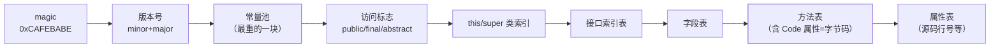

## Class 文件：一张"严格的表"

[类加载](/java/advanced/jvm/01-class-loading/)篇说加载的输入是一段
字节流——本篇拆开这段字节流。Class 文件没有任何随机对齐，**每个
字节什么含义、占多长，全是规定死的**（所以叫"字节码"）：



两个高频问题直接落在结构上：

- **为什么 52.0 = Java 8**：`major_version` 是文件属性——`52.0`
  表示这份 class 需要 ≥ 8 的 JVM；低版本 JVM 加载高版本 class 报
  `UnsupportedClassVersionError`，这就是"同一个 class 不同 JDK 跑法
  不同"的根源。字节码版本也是老版 ASM/cglib 崩溃的原因
  （见[版本演进](/java/intermediate/version/02-java9-11/)）。
- **常量池是全文件的地址簿**：字符串字面量、类/方法/字段的**符号
  引用**（全限定名描述，运行期解析成直接引用——即类加载"解析"阶段
  的对象）都编号存放，后续结构全靠索引指回常量池。

## javap：官方解码器

```bash
javac Main.java
javap -v Main.class    # -v 全量：常量池、版本、栈帧信息
javap -c Main.class    # -c 反汇编字节码指令
```

```java
// 源码：int c = a + b;
// 字节码（0: iload_1  1: iload_2  2: iadd  3: istore_3）
```

对照[栈帧](/java/advanced/jvm/02-memory/)：`iload_1` 把局部变量表
1 号槽压操作数栈，`iadd` 弹两个相加结果压回，`istore_3` 存回 3 号
槽——**字节码就是围绕"局部变量表 ↔ 操作数栈"搬数的指令流**。

## invoke 五兄弟：方法调用与分派

| 指令 | 调用目标 | 分派依据 |
|---|---|---|
| `invokestatic` | 静态方法 | 编译期定死（静态分派） |
| `invokespecial` | 构造器、私有方法、super 调用 | 编译期定死 |
| `invokevirtual` | 普通实例方法 | **运行期按实际类型**（动态分派 → 重写） |
| `invokeinterface` | 接口方法 | 同上，但查表结构不同 |
| `invokedynamic` | 由调用点约定（Bootstrap 方法）动态落地 | 完全推迟到运行期（**Lambda、字符串拼接**） |

"重载看编译期（静态分派，invokestatic/special）、重写看运行期
（动态分派，virtual/interface）"这句八股的物理出处就是指令族。
`invokedynamic` 是 [Java 8 Lambda](/java/intermediate/version/01-java8/)
的实现地基：首次执行由 Bootstrap Method 决定"这个调用点到底调谁"，
之后 JVM 直接固化，比匿名内部类少生成类。

## 反编译看语法糖

字节码是语法糖的照妖镜，`javap -c` 前后对比：

- **`+` 字符串拼接**：JDK 8 编译成 `StringBuilder.append` 链；JDK 9+
  改成 `invokedynamic makeConcatWithConstants`（策略可换，是[版本
  演进](/java/intermediate/version/02-java9-11/)的实证）。循环里
  `+` 拼接每圈 new StringBuilder 的老问题依然在——看字节码就懂。
- **foreach** = `iterator()` + `hasNext/next`；所以并发遍历才会
  fail-fast（[ArrayList](/java/basic/collection/01-arraylist/)）。
- **try-with-resources** = 编译器生成的 `addSuppressed` + 关闭倒序
  finally。
- **自动装箱** = `Integer.valueOf()`，缓存池逻辑在方法里
  （见[包装类型缓存](/java/basic/syntax/09-object-copy/)）。

## 与反射/JIT 的关系

- 反射拿到的 `Class` 对象、`Method`，就是常量池符号引用解析后的
  运行期形态（见[反射与注解](/java/basic/syntax/06-reflection-annotation/)）；
  `Method.invoke` 热点后会被生成 `GeneratedMethodAccessor` 走
  [JIT 路线](/java/advanced/jvm/06-jit/)，这就是反射"第 15 次调用后
  变快"的出处。
- JIT 的内联、逃逸分析都作用在字节码 → 机器码这段；字节码越直白
  （小方法），优化越有利。

## 小结

- Class 文件是严格排版的表：CAFEBABE → 版本 → 常量池（符号引用
  地址簿）→ 字段方法表；major_version 决定能被谁加载。
- 字节码 = 局部变量表与操作数栈之间的搬数指令；`javap -c/-v` 是
  官方照妖镜。
- invoke 五兄弟对应"重载编译期定、重写运行期找"；invokedynamic
  撑起 Lambda 与字符串拼接的现代化。
- 语法糖、反射、反射加速——都在字节码层露出真相。
