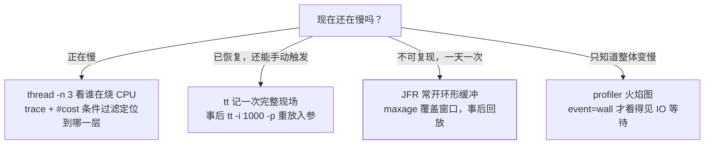

## 问题：接口每天偶发慢 3 秒，你只有一次机会

[线上故障排查实战](/java/advanced/jvm/08-troubleshooting/)给的是**现场还在**时的
动作链（`top -Hp` → `printf %x` → `jstack` 按 nid 找栈），末尾附了一张 Arthas
命令速查表。本篇解决它没覆盖的两件事：

1. **现场不在**——慢只发生了一次，等你连上服务器它好了，怎么拿到证据；
2. **增类型命令的代价与卸载**——`trace`/`watch` 不是免费的，用完不撤干净，
   排查动作本身会变成第二次故障。

教学主线固定为一个场景：**不能重启、不能加日志、每天凌晨慢 3 秒一次**。

## 一、attach 之前先认清边界

```bash
# 默认 telnet 3658 / HTTP 8563；选进程后注入 agent
java -jar arthas-boot.jar

# 容器里两步常见坑：镜像通常没带 arthas，且 shell 用户不是应用用户
# 关键：要用启动该 Java 进程的那个用户（镜像无用户名时按 uid）执行 attach
kubectl -n prod cp arthas-boot.jar app-7d9-abcde:/tmp/
kubectl -n prod exec -it app-7d9-abcde -- \
  su -s /bin/sh -c 'java -jar /tmp/arthas-boot.jar --select OrderApp' 1000
```

三条边界：

- **用户必须一致**。attach 走目标进程的同机通道，root 开的 shell 去 attach
  uid 1000 的进程会失败——容器里尤其常见。
- **增强是有成本的**（下一节量化）。attach 上去什么都不做没问题，
  挂一个不限次的 `trace` 到高 QPS 方法上，就是给自己造故障。
- **`quit` 不撤销增强**。`quit`/`exit` 只离开当前会话，字节码改动还在进程里；
  要 `stop`（reset 所有增强类并卸载 agent）。这是"线上为什么变慢了"的常见答案。

## 二、命令分两类，代价完全不同

| 类别 | 常用命令 | 机制 | 开销 |
|---|---|---|---|
| 只读观测 | `dashboard` `thread` `jvm` `memory` `sysprop` `vmoption` `logger` `sc` `sm` `jad` | 读现成的运行时信息 | 基本可忽略 |
| **字节码增强** | `trace` `watch` `stack` `tt` `monitor` `retransform` | Instrumentation + ASM 改类，每次调用多一层拦截 | **与该方法 QPS 成正比** |
| 采样型 | `profiler` | async-profiler 安全点采样 | 低，但产物大 |

增强类的三个通用参数，是控制开销的全部手段：

```bash
trace com.x.OrderService create '#cost > 500' -n 5
#    类             方法     条件表达式         ↑ 命中 5 次自动停止增强

watch com.x.OrderService create '{params,returnObj,throwExp}' \
  -n 3 -x 2 -e          # -x 展开深度（别对大对象开深）；-e 只记异常分支
```

`trace` 默认 `--skipJDKMethod true`，看不到 JDK 内部调用；关掉它能看到更多层，
但增强范围变大、开销更高——**只在明确怀疑 JDK 侧时临时关**。

## 三、主线答案：四种取证姿势按"能否复现"选



三条判据值得记住：

- **`trace` 每一层耗时都不高、但总耗时爆掉** → 时间花在看不见的地方：
  GC 停顿、锁等待、CPU 被抢。**这就是该转 JFR / profiler 的信号**，
  不是继续加 `trace` 层级。
- **`tt` 的重放是真实调用**（`tt -i 1000 -p` 会真的再执行一次方法）。
  查询方法随便重放，写方法绝对不行——这条没有灰色地带。
- **CPU 火焰图看不到等待**。IO 密集、锁竞争导致的慢要用 `wall` 或 `lock`
  事件，`--event cpu` 只告诉你谁在跑。

```bash
profiler start --event wall       # 墙钟：含阻塞与 IO 等待
profiler stop --format html       # 产出火焰图文件
tt -t com.x.OrderService create   # 开始录制调用现场
tt -l                             # 列出已录条目（拿到 index）
tt -i 1002 -w 'params[0].getUserId()'   # 只对第 1002 条求值
```

## 四、`sc -d`：把"依赖冲突"和"类加载器问题"落成证据

```bash
sc -d com.x.Foo     # 打印 class-info + code-source + classLoaderHash
```

同一接口出现两份实现、或 `ClassCastException` 说"类型不兼容但名字一样"，
`sc -d` 直接给出**每个版本来自哪个 jar、被哪个 ClassLoader 加载**。
这是[依赖冲突与构建治理](/java/intermediate/build/01-dependency-conflict/)
那条"运行期只有一句话：classpath 第一个命中即加载"的现场版；
类加载器分层本身见[类加载机制与双亲委派](/java/advanced/jvm/01-class-loading/)。

## 五、改配置而不重启：`logger` 与 `vmoption`

```bash
logger --name ROOT --level info      # 运行期调日志级别
vmoption                             # 列出所有旗标当前值
vmoption MaxHeapFreeRatio 60         # 只支持 manageable 的那一部分
```

与 [门面绑定、MDC 与异步日志](/java/intermediate/log/01-logging-system/)
里 Actuator 的动态调级相比，区别在**不依赖应用暴露端点**：进程没接
Actuator、或端点被网关挡了，`logger` 仍能用。`vmoption` 要守住边界——
GC 参数这类启动即固定的值改不了，能改的只是 manageable 子集。

## 六、热修复的边界（能止血，不是修法）

```bash
jad --source-only com.x.Foo > /tmp/Foo.java   # 反编译线上真实代码
mc -c <classLoaderHash> /tmp/Foo.java -d /tmp  # 内存编译
retransform /tmp/Foo.class                       # 热替换
```

四条硬限制，任一踩中就换路子（走发布）：

1. **只能改方法体**：不能增删字段/方法、不能改签名、不能改注解和继承；
2. 涉及 lambda、内部类的改动行为不直观，别赌；
3. **重启即失效**——改完必须同步提修复版本，否则下一次发布静默回退；
4. 生产执行要走审批与留痕（谁、哪个类、什么时候），否则复盘时
   会出现"代码和线上不一致但没人知道"。

同类红线：`ognl` 与 `vmtool --action getInstances` 能拿到 Spring 单例 bean
并调用它的方法——这是**真实执行**，用它读状态可以，用它写数据等同于
绕过所有业务校验。

## 七、JFR：为"事后取证"设计的常开记录器

JFR（JDK Flight Recorder）的关键属性是**为长期开启而设计**：事件先进内存里的
环形缓冲（circular buffer），只保留最近一段历史。JEP 328 给它的验收指标是
"out-of-the-box 在 SPECjbb2015 上不超过 1% 开销"——**量级上是"可以常开"，
不是"零成本"**，你自己的负载能不能常开仍要在压测环境对比一次。
它补上了 `trace` 的短板：**现场过去之后还能回放**。

```bash
# ① 启动参数方式（推荐：常开 + 有界，不占满磁盘）
-XX:StartFlightRecording=maxage=4320s,maxsize=200m,\
disk=true,dumponexit=true,filename=/log/app.jfr

# ② 已经起来了、没加参数：用 jcmd 运行期开，不重启
jcmd <pid> JFR.start name=probe settings=profile \
  duration=120s filename=/tmp/probe.jfr

jfr summary /tmp/probe.jfr        # 各类事件计数与总字节
jfr print --events jdk.JavaMonitorEnter /tmp/probe.jfr
```

`maxage=4320s`（3.6 小时）意味着**环形缓冲保留最近这段时间**——每天凌晨
慢一次，只要窗口盖得住，第二天就能回放。常用事件族：

| 事件 | 回答的问题 |
|---|---|
| `jdk.ExecutionSample` | CPU 时间花在哪些栈上 |
| `jdk.GCPhasePause` | 那 3 秒是不是停顿 |
| `jdk.JavaMonitorEnter` / `jdk.JavaWait` | 谁在等锁、等了多久 |
| `jdk.ObjectAllocationInNewTLAB` | 分配速率与大头对象 |
| `jdk.SocketRead` / `jdk.FileRead` | 慢是不是下游 IO |
| `jdk.ClassLoad` / `jdk.CompilerPhase` | 元空间涨、预热与去优化 |

读法：`jfr summary` 先看哪类事件字节最多（带着方向的怀疑），再 `jfr print`
或丢进 JDK Mission Control 按时间轴对齐 GC、编译与业务事件。`jfr` 命令行工具
在较新的 JDK 里才自带，缺它时用 JMC 打开同一个文件，或 `jcmd <pid> JFR.dump`
把运行中记录先落盘。
**JFR 与 async-profiler 不是替代关系**：前者给事件语义和时间轴，后者给
最细的火焰图（含 native 栈）。基准测试是改代码之前的另一件事，
见 [JIT 与逃逸分析](/java/advanced/jvm/06-jit/) 里的 JMH。

## 八、jcmd：JDK 自带、不装 agent 也能拿到的那一套

```bash
jcmd <pid> help                 # 先问这个进程支持哪些命令（版本相关）
jcmd <pid> Thread.print         # 全线程栈
jcmd <pid> GC.heap_info         # 各代用量与提交量
jcmd <pid> GC.class_histogram   # 类直方图（比 jmap -histo 更官方收口）
jcmd <pid> GC.heap_dump /tmp/h.hprof
jcmd <pid> VM.native_memory summary   # 需启动时 -XX:NativeMemoryTracking
```

第一条 `jcmd <pid> help` 是最该记住的——可支持命令随 JDK 版本变化，
列出来的才是这台机器真能用的。`VM.native_memory` 需要启动时就带
`-XX:NativeMemoryTracking=summary`（[调优篇](/java/advanced/jvm/07-tuning/)
的常备参数之一），堆外内存归因离不开它。

## 九、五分钟取证 SOP

1. **判现场**：还在慢 → `dashboard` + `thread -n 3`；已恢复 → 第 4 步。
2. **可复现**：`trace <类> <方法> '#cost > 500' -n 5`，逐层收敛到一次调用；
   需要看入参 → `watch`（`-x` 浅一点）或 `tt -t` 录一次。
3. **各层都不慢但整体慢** → 停止加 `trace`，转 `profiler --event wall`
   或回放 JFR 看 `jdk.GCPhasePause` / `JavaMonitorEnter`。
4. **不可复现**：JFR 已开 → `jfr summary` + `print` 对齐那一刻；
   没开 → 立刻 `jcmd JFR.start duration=...` 等下一次，同时补启动参数。
5. **确认卸载干净**：`stop`（不是 `quit`），并记录本次改过哪些类。
6. **收尾**：把结论写进预案——监控项、现场采集脚本、SOP
   （对应[排查篇](/java/advanced/jvm/08-troubleshooting/)的"方法论收束"）。

## 小结

- 命令分两类：**只读观测**几乎无代价，**增类型**（trace/watch/tt/stack）
  按方法 QPS 收成本，必须带 `-n` 与条件表达式。
- `quit` 不撤销增强，`stop` 才 reset + 卸载——线上排查完没 `stop`
  是最典型的"排查引发二次故障"。
- `tt -p` 是真实调用重放：读方法可用，写方法禁用。
- 不可复现的现场交给 **JFR 环形缓冲**（`maxage` 盖住周期）或
  `profiler --event wall`；`trace` 各层都不慢而整体慢就是转它们的信号。
- `retransform` 只改方法体、重启即失效，定位为止血手段，正式修复走发布。
- 没装 agent 时 `jcmd` 是兜底：先 `jcmd <pid> help` 看这台机器支持什么。

## 延伸阅读

- [Arthas 官方文档：命令列表与增强原理](https://arthas.aliyun.com/doc/commands.html)
- [JEP 328: Flight Recorder](https://openjdk.org/jeps/328)——JFR 的设计目标与「out-of-the-box ≤1% 开销（SPECjbb2015）」的验收指标
- [JDK Tool `jfr` 用法（Oracle JDK Tools Reference）](https://docs.oracle.com/en/java/javase/17/docs/man/1/jfr.html)
- [async-profiler：事件类型（cpu/wall/alloc/lock）](https://github.com/async-profiler/async-profiler)
