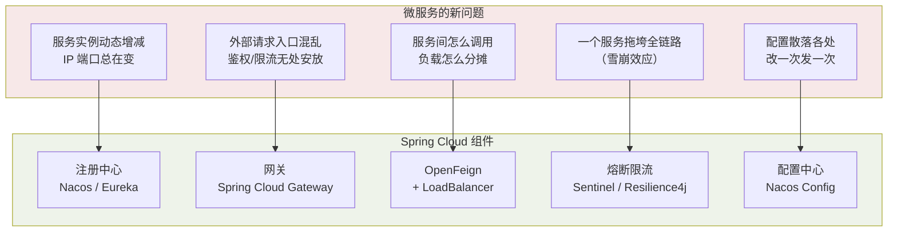
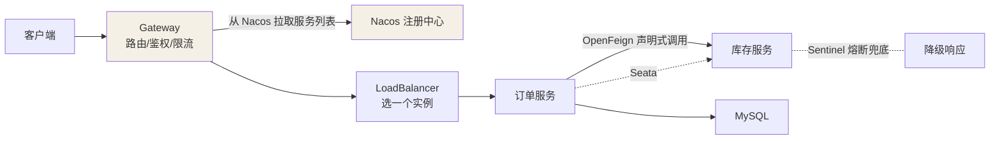

## 什么时候该拆微服务

微服务不是银弹，它**用运维复杂度换研发并行度**：

| 维度 | 单体架构    | 微服务架构              |
| -- | ------- | ------------------ |
| 部署 | 一个包，简单  | N 个服务 + 编排（K8s）    |
| 故障 | 一损俱损    | 可隔离（前提：做好熔断）       |
| 扩容 | 整体复制    | 按热点服务精准扩           |
| 数据 | 一个库一个事务 | 库随服务拆，跨服务一致性是难题    |
| 排查 | 一个进程内看栈 | 全链路追踪（Trace）才能拼出真相 |

**拆分标准**：团队规模（两三个pizza团队）、模块间耦合能否一刀两断、
是否真的有差异化扩容需求。小团队硬拆微服务 = 自己给自己上刑。

## 微服务带来的新问题 → Spring Cloud 的答案

Spring Cloud 本体只是**规范 + 集成胶水**（BOM、抽象接口），具体组件是
可插拔的实现——这是它和"一整套全家桶"框架的根本区别。

## 两代技术栈

| 代际             | 代表组件                                                                                  | 现状                   |
| -------------- | ------------------------------------------------------------------------------------- | -------------------- |
| Netflix 栈（第一代） | Eureka（注册）、Ribbon（LB）、Hystrix（熔断）、Zuul（网关）                                            | **全线维护模式/停更**，新项目不要选 |
| Alibaba 栈（主流）  | **Nacos**（注册+配置）、**Sentinel**（熔断限流）、Seata（分布式事务）、RocketMQ                             | 文档齐全，国内事实标准          |
| 官方/社区          | Spring Cloud Gateway、OpenFeign、LoadBalancer、Resilience4j、**Spring Cloud Alibaba** 胶水层 | 长期演进方向               |

常见的混搭：Gateway（官方网关）+ Nacos（注册与配置）+ OpenFeign（调用）

+ Sentinel（防护）+ Seata（事务）——取各家之长。

## 一个请求的完整旅程

## 版本号的小知识

Spring Cloud 版本名是**伦敦地铁站名按字母序**（Hoxton → Ilford → Jubilee
...→ 2023.x 起改日历版本）；Spring Cloud Alibaba 版本号独立
（如 2023.0.1.x），三者（Boot / Cloud / Alibaba）版本必须查**官方对照表**，
瞎组合启动就报错——这是新手第一大坑。

## 小结

+ 微服务换的是"并行研发 + 精准扩容"，付的是"分布式一切成本"。

+ Spring Cloud = 规范 + 胶水，组件可插拔；新项目绕开 Netflix 全家桶。

+ 核心四件套：注册中心（找得到）、网关（进得来）、Feign（调得动）、
  熔断（挂得起）——后续四篇逐一拆解。

 
