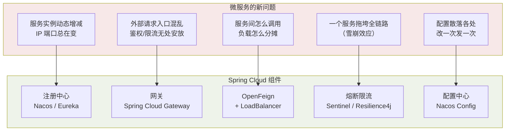
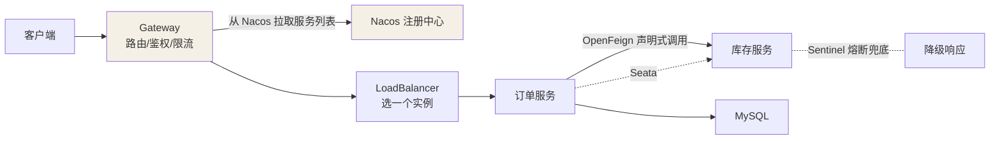

## 什么时候该拆微服务

微服务不是银弹，它**用运维复杂度换研发并行度**：

| 维度 | 单体架构    | 微服务架构              |
| -- | ------- | ------------------ |
| 部署 | 一个包，简单  | N 个服务 + 编排（K8s）    |
| 故障 | 一损俱损    | 可隔离（前提：做好熔断）       |
| 扩容 | 整体复制    | 按热点服务精准扩           |
| 数据 | 一个库一个事务 | 库随服务拆，跨服务一致性是难题    |
| 排查 | 一个进程内看栈 | 全链路追踪（Trace）才能拼出真相 |

**拆分标准**：团队规模（两三个pizza团队）、模块间耦合能否一刀两断、
是否真的有差异化扩容需求。小团队硬拆微服务 = 自己给自己上刑。

## 微服务带来的新问题 → Spring Cloud 的答案



Spring Cloud 本体只是**规范 + 集成胶水**（BOM、抽象接口），具体组件是
可插拔的实现——这是它和"一整套全家桶"框架的根本区别。

## 两代技术栈

| 代际             | 代表组件                                                                                  | 现状                   |
| -------------- | ------------------------------------------------------------------------------------- | -------------------- |
| Netflix 栈（第一代） | Eureka（注册）、Ribbon（LB）、Hystrix（熔断）、Zuul（网关）                                            | **全线维护模式/停更**，新项目不要选 |
| Alibaba 栈（主流）  | **Nacos**（注册+配置）、**Sentinel**（熔断限流）、Seata（分布式事务）、RocketMQ                             | 文档齐全，国内事实标准          |
| 官方/社区          | Spring Cloud Gateway、OpenFeign、LoadBalancer、Resilience4j、**Spring Cloud Alibaba** 胶水层 | 长期演进方向               |

常见的混搭：Gateway（官方网关）+ Nacos（注册与配置）+ OpenFeign（调用）

+ Sentinel（防护）+ Seata（事务）——取各家之长。

## 一个请求的完整旅程



## 版本号的小知识

Spring Cloud 版本名是**伦敦地铁站名按字母序**（Hoxton → Ilford → Jubilee
...→ 2023.x 起改日历版本）；Spring Cloud Alibaba 版本号独立
（如 2023.0.1.x），三者（Boot / Cloud / Alibaba）版本必须查**官方对照表**，
瞎组合启动就报错——这是新手第一大坑。

## 一个真实的服务怎么拆（深入）

先别急着画架构图。用"**从哪个实体能独立演化**"这个判据，走一遍电商案例。

**第 1 步：找边界候选** —— 按"变化频率 + 归属域"聚类：

```text
用户登录/积分/收货地址   → 用户域
商品/类目/库存           → 商品域
下单/购物车/支付回调     → 交易域
优惠/营销               → 营销域（变化最快，最该独立）
```

**第 2 步：用"能不能独立发布"筛** —— 一个模块是否值得拆成服务，看它是否
满足三条：**独立进程可部署、独立数据可自治、独立团队可并行**。营销活动
每周更新、而钱包接口一年不变，两者拆开；反过来"购物车"和"订单"共享同款
库存扣减，拆了天天跨服务事务。

**第 3 步：交易事务的边界（最难的取舍）** —— 拆之前"下单 + 扣库存 +
减积分"是一个本地事务 `@Transactional` 就能原子完成；拆之后它们分属三个
服务、三个库，**本地事务失效**，只能退而求其次用**最终一致**（本地消息表、
TCC、SEATA）。所以判断标准是：

```
问：这个动作拆开后，跨服务的"补偿逻辑"比"单体事务"好维护吗？
答：NO → 先别拆，宁可做成一个聚合内的高内聚服务（如：订单+库存合并为
     "交易服务"），等流量/团队逼你拆了再拆。
```

推荐演进路径永远是 **模块化单体 → 按痛点多带走的服务拆**，而不是首版直接
微服务。原因很现实：微服务的网络延迟、序列化、分布式事务、链路追踪——每
一项都要用研发时间去填。

### 反模式自查表

| 反模式 | 一眼识破 | 正解 |
|---|---|---|
| 数据库仍共享一张大表 | 多个"服务"操作同一个库 | 先拆库再拆服务，或保持单体 |
| 服务间同步调用成链 | `A→B→C→D` 一圈回来 | 引入 MQ 解耦/异步化 |
| 为"备案"而拆 | 没有差异化扩容/并行需求 | 模块化单体更省 |
| 分布式事务铺天盖地 | 配置里一堆 Seata/TCC | 反思边界是否切错了 |

## 版本 BOM 对齐：新手第一大坑（深入）

三层组件（Spring Boot / Spring Cloud / Spring Cloud Alibaba）版本必须靠
**官方 BOM 钉死**，否则启动即崩。给你可以直接照抄的装法：

```xml
<dependencyManagement>
  <dependencies>
    <!-- ① Spring Boot：语义化版本，如 3.2.x -->
    <dependency>
      <groupId>org.springframework.boot</groupId>
      <artifactId>spring-boot-dependencies</artifactId>
      <version>3.2.0</version>
      <type>pom</type><scope>import</scope>
    </dependency>
    <!-- ② Spring Cloud：一套 BOM 统管 Cloud 全家桶版本 -->
    <dependency>
      <groupId>org.springframework.cloud</groupId>
      <artifactId>spring-cloud-dependencies</artifactId>
      <version>2023.0.0</version>
      <type>pom</type><scope>import</scope>
    </dependency>
    <!-- ③ Alibaba 组件：需与上面两套兼容的配套版本 -->
    <dependency>
      <groupId>com.alibaba.cloud</groupId>
      <artifactId>spring-cloud-alibaba-dependencies</artifactId>
      <version>2023.0.1.0</version>
      <type>pom</type><scope>import</scope>
    </dependency>
  </dependencies>
</dependencyManagement>
```

**为什么必须三条都写**：Spring Cloud 只管官方组件（Gateway/OpenFeign），
Alibaba 管它的那一套（Nacos/Sentinel/Seata）。只引了 Cloud BOM 却没引
Alibaba BOM，`nacos-client-spring-cloud` 的版本就是"飘的"。

**对齐三字口诀：查对照表，不猜**。官方 release note 里每行是
`Boot x.y.z ↔ Cloud ABC ↔ Alibaba a.b.c`，照着填。装完后**启动首屏若报
`NoSuchMethodError` / `ClassNotFoundException`，先把三处版本回退到对照表
一行再往下查**——九成是这个没对齐，不是代码问题。

一个篱笆三根桩：BOM 定版本、不手动逐组件写版本、升级一次动统一处。

## 小结

+ 微服务换的是"并行研发 + 精准扩容"，付的是"分布式一切成本"。

+ Spring Cloud = 规范 + 胶水，组件可插拔；新项目绕开 Netflix 全家桶。

+ 核心四件套：注册中心（找得到）、网关（进得来）、Feign（调得动）、
  熔断（挂得起）——后续四篇逐一拆解。

<br />
