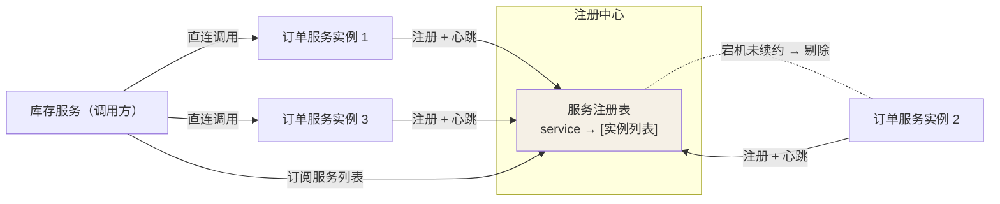
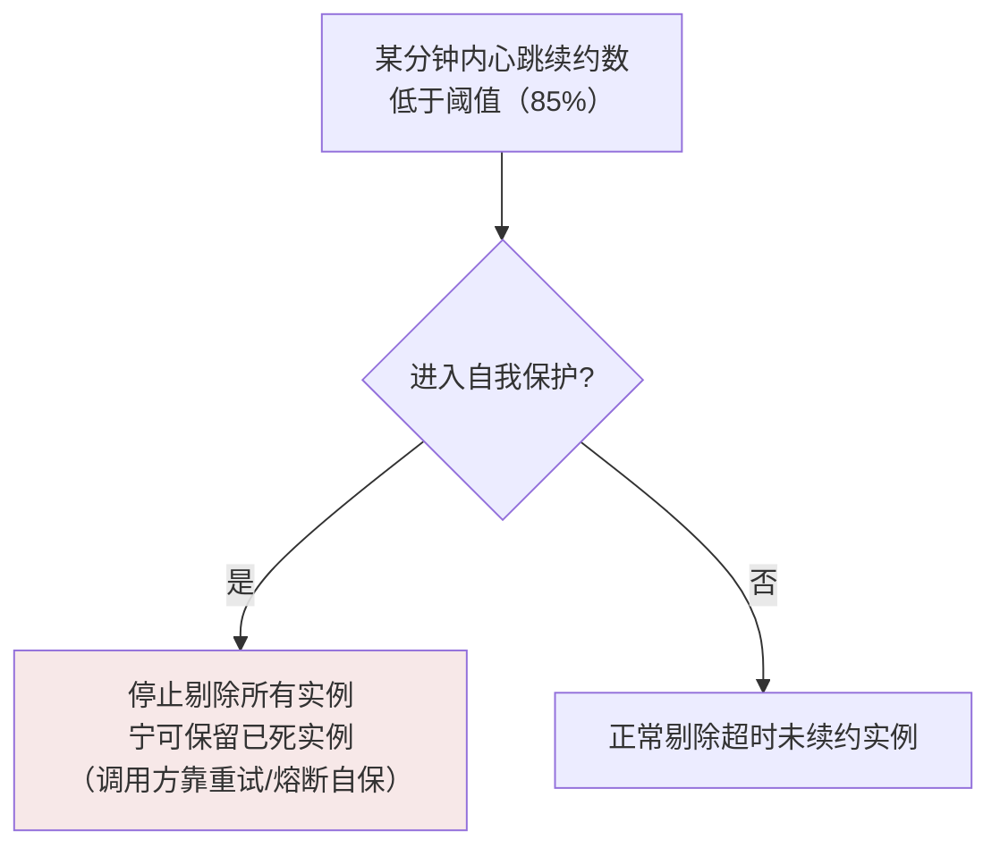
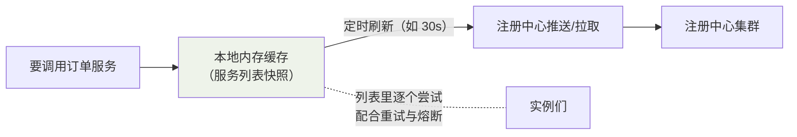

## 解决什么问题

订单服务 3 个实例，IP 随时可能变（发布重建、弹性扩缩容）。调用方**硬编码
地址列表**必然过时。解法：把"谁在线"这件事交给一个所有实例都信任的
第三方——注册中心。



三个动作：

1. **注册**：实例启动时上报 `服务名 + IP + 端口 + 元数据`。
2. **心跳续约**：定时（Eureka 默认 30s）证明自己活着。
3. **发现**：调用方拉取/订阅服务列表，本地缓存后直连调用——调用链路上
   **没有注册中心**，它只做"通讯录"。

## Eureka：AP 的教科书案例

Eureka Server 集群是**对等复制**（Peer to Peer）：任意节点收到注册信息
异步复制给其他节点——宁可各节点短暂不一致（Availability），也不因
同步阻塞拒绝注册（放弃 CP）。

它的自我保护机制是 AP 哲学的极致：



为什么这么做：心跳大面积消失大概率是**网络分区**而不是实例全死。此时
若照常剔除，网络恢复后 Eureka 里将没有任何可用实例——整站瘫痪。两害
相权：把"不存在但还在表里"的问题交给调用方处理（配合熔断），比"表空了"
温和得多。这是 **CAP 选 A 舍 C** 的工程落地（理论细节见分布式理论篇）。

## Nacos：AP/CP 可切换

Nacos 把两种模式做成开关（按 service 维度）：

| 模式 | 底层 | 语义 | 适用 |
|---|---|---|---|
| 临时实例（默认） | Distro 协议（对等异步复制） | AP：心跳保活，挂了自动剔除 | 微服务节点（生死由心跳判定） |
| 永久实例 | Raft 协议（多数派提交） | CP：状态由 Raft 写入，宕机不剔除 | DB、Redis 这类"必须始终在场"的基础设施 |

```yaml
spring:
  cloud:
    nacos:
      discovery:
        ephemeral: true   # true=临时(AP) false=永久(CP)
```

一台普通业务服务实例，用 AP；一个 MySQL 主库地址挂到注册中心（罕见但
存在的运维用法），用 CP——**按业务对"短暂不一致"和"不可用"的容忍度选**。

## 调用方的三级缓存

生产上调用方不会每次都问注册中心（把它打挂了大家都完），而是层层缓存：



这带来一个必答面试题：**实例刚下线，调用方多久感知？** 答案 = 注册中心
剔除延迟（心跳超时，Eureka 默认 90s）+ 缓存刷新间隔（30s）的叠加——
所以必须配合**重试 + 熔断**，不能裸奔（"通讯录"永远有滞后，通信要
容错）。

## Eureka vs Nacos vs ZooKeeper vs Consul

| | Eureka | Nacos | ZooKeeper | Consul |
|---|---|---|---|---|
| CAP | AP | AP + CP 可切 | **CP**（过半不可写） | CP（可配） |
| 健康检查 | 客户端心跳 | 心跳/主动探测 | 会话保持 | agent 探测 |
| 控制台 | 弱 | **好**（中文） | 无 | 好 |
| 一站式 | 只做注册 | **注册 + 配置中心** | 需自建 | 有 KV |
| 适用 | 学习原理 | 国内主流 | 已有 ZK 生态 | 多语言/Golang 栈 |

ZK 的 CP 在注册场景反而是缺点：网络分区时**少数派拒绝注册**，分区那侧
的服务全变"孤儿"。Spring Cloud 官方早期甚至为此专门写文章解释为什么
选 Eureka 而不是 ZK。

## 一次下线的完整时间线（深入）

这是"服务列表滞后"的具象化推演，也是注册中心最常见面试的完整答案。
以 Nacos 临时实例为例，逐步放大镜走一遍：

**场景：2:00:00.000，`order-service` 的实例 `:8081` 被 kill 掉。**

| 时刻 | 事件 | 谁在做 |
|---|---|---|
| 2:00:00 | 进程终止，心跳停发 | 实例 |
| 2:00:00 ~ 2:00:15 | Nacos 仍未发现异常（读音服务端按"最后一次心跳 + 间隔"判断） | Nacos Server |
| 2:00:15 | 距上次心跳超时（默认 15s 保活阈值），实例标记"不健康" | Nacos Server |
| 之后 30s 内的拉取 | client 端能拿到列表，但该实例已标记 unhealthy | 调用方 |
| 2:01:45 | 健康检查超过 `preserved.heart.beat.timeout`，从服务列表剔除 | Nacos Server |
| 2:02:00~ | 调用方本地**缓存**（默认缓存下发的服务列表，带过期兜底 1h）里的
 `:8081` 仍未清空 → 依然会尝试路由到它 | 调用方 |

**结论不是"多久删干净"，而是"调用方要容错到什么时候"**：
剔除要 45s+ 级，缓存更久——所以把 `:8081` 已死当**常态**来设计：

```java
// 铁律：调用必须带重试，且别只重试同一个坏实例
Retryer.Default retryer = new Retryer.Default(100, MILLISECONDS, 3);
```

配合负载均衡器"把连续失败实例临时摘除"（Nacos LoadBalancer 自带故障规避），
而不是指望注册中心秒级干净。

### 注册中心自身的坑

| 现象 | 根因 | 处理 |
|---|---|---|
| 控制台有实例，调用方 404 | 调用方缓存未刷新 / 路由到脏实例 | 缩小缓存刷新周期 + 重试 |
| 上线了新实例但流量没分过去 | 权重=0 或注册延迟/缓存 | 检查权重配置与刷新间隔 |
| 大量 503 服务不可用 | 自我保护触发，部分实例已死仍在表 | 合理心跳阈值 + 熔断兜底 |

## 小结

- 注册中心 = 分布式通讯录：注册、心跳续约、发现三动作，调用路径不经过它。
- Eureka 自我保护是 AP 取舍的活教材；Nacos 用临时/永久实例切 AP/CP。
- 列表有滞后是常态，重试 + 熔断才是调用方的安全带。
