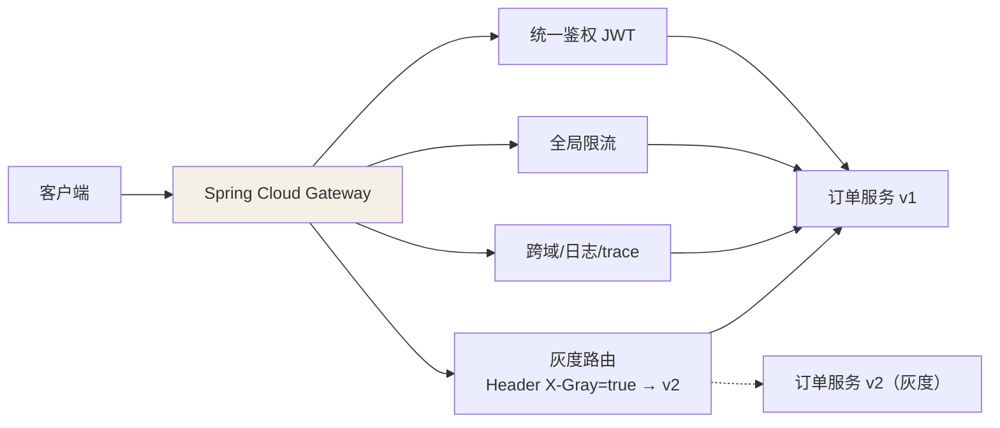
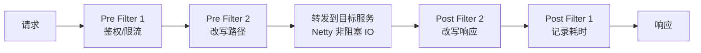

## 为什么需要网关

没有网关时，每个服务都要自己处理：跨域、鉴权、限流、日志、灰度路由……
这些**横切关注点**重复 N 遍。网关把它们收拢到**唯一入口**：



它与 Nginx/LVS 的层次差异：LVS 是四层负载（转发 TCP 包）、Nginx 是
七层通用网关（静态资源 + 反代 + 转发），Spring Cloud Gateway 是**离
业务最近的微服务网关**——能用 Java 写过滤器、直接读注册中心做服务发现
级路由、与 Sentinel 联动做业务维度限流。生产常见组合：**外层 Nginx
（TLS 终止、静态资源）→ 内层 Gateway（业务路由与鉴权）**。

## 三层模型：Route / Predicate / Filter

```java
// 配置式（等价于 application.yml 的 spring.cloud.gateway.routes）
@Bean
public RouteLocator routes(RouteLocatorBuilder builder) {
    return builder.routes()
        .route("order-service", r -> r
            .path("/api/order/**")                       // 断言：路径匹配
            .filters(f -> f.stripPrefix(1)                 // 过滤器：去掉 /api 前缀
                            .addRequestHeader("X-Trace", traceId()))
            .uri("lb://order-service"))                   // lb:// = 走注册中心负载均衡
        .build();
}
```

| 层 | 职责 | 例子 |
|---|---|---|
| Route（路由） | 一条转发规则的完整定义 | id + uri + 断言组 + 过滤器组 |
| Predicate（断言） | **要不要匹配这条路由** | Path / Method / Header / Query / 时间段 |
| Filter（过滤器） | 匹配后**怎么加工请求响应** | 改 header、鉴权、限流、重写路径 |

处理模型是个双端过滤器链（Servlet Filter 的响应式版）：



- **GlobalFilter**：全局生效（鉴权、trace），有序（@Order）。
- **GatewayFilter**：绑定在具体路由上（改路径、重试）。

自定义全局鉴权过滤器（最常见考点）：

```java
@Component
public class AuthGlobalFilter implements GlobalFilter, Ordered {
    @Override
    public Mono<Void> filter(ServerWebExchange exchange, GatewayFilterChain chain) {
        String token = exchange.getRequest().getHeaders().getFirst("Authorization");
        if (!JwtUtil.verify(token)) {
            exchange.getResponse().setStatusCode(HttpStatus.UNAUTHORIZED);
            return exchange.getResponse().setComplete();     // 直接拒绝，不进链
        }
        return chain.filter(exchange);                        // 放行到下一个过滤器
    }
    @Override
    public int getOrder() { return -100; }   // 越小越先执行（pre 阶段）
}
```

## 为什么是 WebFlux + Netty

网关的本质是**IO 密集**（转发、转发、还是转发），几乎零计算：

| | Servlet/Tomcat | WebFlux/Netty |
|---|---|---|
| 线程模型 | 一请求一线程（200 线程上限） | **少量 EventLoop 线程**，非阻塞多路复用 |
| 万级并发 | 线程耗尽排队 | 少量线程撑住 |
| 代码约束 | 同步阻塞随便写 | **不能阻塞 EventLoop**（不能写 JDBC！） |

代价：过滤器链全链路 `Mono/Flux` 响应式，`ThreadLocal` 失效（上下文要
靠 Reactor Context）——网关里做验证这种纯内存运算没问题，接数据库这种
阻塞操作就是事故。所以网关通常**无状态、无本地存储**，只做"门卫"。

## 与 Zuul 的对比（为什么淘汰它）

| | Zuul 1 | Gateway |
|---|---|---|
| 模型 | Servlet 阻塞，一请求一线程 | Netty + Reactor 非阻塞 |
| 性能 | 一般 | 高吞吐低资源 |
| 长连接 | 弱 | WebSocket 友好 |
| 生态 | 停止演进 | Spring 官方亲儿子 |

## 过滤器链的真实时序与阻塞陷阱（深入）

很多人背熟了"pre → 转发 → post"，但没意识到 Gateway 的过滤器链是一个
**围绕 `chain.filter(exchange)` 的嵌套链**——`return chain.filter(exchange)`
之后写的代码，是在**下游全部处理完后**才执行的（等价于后置逻辑）。

```java
@Component
public class TimingGlobalFilter implements GlobalFilter, Ordered {
    @Override
    public Mono<Void> filter(ServerWebExchange exchange, GatewayFilterChain chain) {
        long start = System.nanoTime();
        return chain.filter(exchange)                       // 交给下一个过滤器
            .doFinally(sig ->                               // 全部 filter 走完后回到这里
                System.out.println("耗时 " + (System.nanoTime() - start)));
    }
    public int getOrder() { return -1; }                    // 越靠前 → 越先 pre、越后 post
}
```

**两条实战规则由此得出：**

1. **用 `-` 或 `doFinally` 包"后置/计时"**，而不是在 `filter(...)` 返回前直接
   打印——那样打印的只是"交给下家"的时刻，不是真实耗时。
2. **越小的 `getOrder()` 越先进入 pre 阶段、越靠后收尾 post 阶段**——所以
   鉴权要小 Order（先挡），耗时统计要小 Order（后收尾），两者不冲突。

### 阻塞陷阱：为什么网关里不能跑 JDBC

WebFlux 跑在**少量 EventLoop 线程**上，一个请求被阻塞会占住整条线程池：

```java
// ❌ 反例：在 Filter 里同步查库，EventLoop 卡住 → 所有请求排队
.jdbcTemplate.queryForObject(...)   // 线程阻塞，非阻塞模型失效

// ✅ 正解：把阻塞调用丢到专门的"受限线程池"（boundedElastic）
Mono.fromCallable(() -> jdbc.query(...))
    .subscribeOn(Schedulers.boundedElastic())
    .flatMap(...)
```

症状特征：**某个请求慢，其他无关请求全部跟着变慢**——这就是 EventLoop
被阻塞的典型信号。所以网关保持无状态、不做本地存储、不碰阻塞 IO，并非
作者保守，而是非阻塞模型的硬性约束。

### 生产排查二连

| 现象 | 排查路径 |
|---|---|
| 网关 504、后端明明正常 | 先查是不是 GlobalFilter 里包了阻塞操作拖垮 EventLoop |
| 某些路径能通、某些 404 | 断言没匹配上 → 逐个 `curl -H` 验证 Predicate，别猜 |

## 一个可跑的 JWT 鉴权 GlobalFilter（深入）

前面是概念与坑，这里给一个**能直接粘进项目**的最小鉴权过滤器，顺带演示
GlobalFilter + 白名单 + 响应式回调拒绝三个姿势：

```java
@Component
public class JwtAuthFilter implements GlobalFilter, Ordered {

    private final ReactiveStringRedisTemplate redis;   // 用 Redis 做失效名单

    @Override
    public Mono<Void> filter(ServerWebExchange exchange, GatewayFilterChain chain) {
        String path = exchange.getRequest().getURI().getPath();

        // ① 白名单：登录、健康检查直接放行
        if (path.startsWith("/api/auth/") || path.equals("/actuator/health")) {
            return chain.filter(exchange);
        }

        // ② 取 token，空则直接 401 结束（不再进链）
        String token = exchange.getRequest().getHeaders().getFirst("Authorization");
        if (token == null || token.isBlank()) {
            exchange.getResponse().setStatusCode(HttpStatus.UNAUTHORIZED);
            return exchange.getResponse().setComplete();
        }

        // ③ 校验签名（纯内存运算，允许在 EventLoop 上）
        Claims claims = JwtUtil.parse(token);
        // ④ 查"是否已被强制下线"（用 tokenId 走 Redis，属 IO → 得切线程池）
        return redis.hasKey("jwt:black:" + claims.get("jti"))
            .defaultIfEmpty(false)
            .flatMap(blacklisted -> {
                if (blocklisted) {                         // 黑名单 → 403
                    exchange.getResponse().setStatusCode(HttpStatus.FORBIDDEN);
                    return exchange.getResponse().setComplete();
                }
                exchange.getRequest().mutate()              // 把用户身份传给下游
                    .header("X-UserId", claims.get("uid").toString()).build();
                return chain.filter(exchange);              // 放行
            })
            .subscribeOn(Schedulers.boundedElastic());      // Redis IO 走受限线程池
    }

    @Override
    public int getOrder() { return -100; }                  // 尽量先执行
}
```

**这个例子里最容易被忽略的约束**：第④步碰了 Redis（阻塞 IO），所以必须
`.subscribeOn(Schedulers.boundedElastic())`——否则又掉进"EventLoop 被阻塞"
的坑。**纯内存的 JWT 校验直接写，IO 一律丢线程池**，这是网关过滤器的铁律。

### 白名单放行为什么在过滤器里最早判

白名单放行意味着**后续过滤器全部不执行**、也不需要 token——把它判最前，
既省解析又避免"健康检查"这类入口被误挡。顺序由 `@Order` 排序 + 流程内分支
共同保证，别只依赖注解。

## 小结

- 网关收拢横切关注点：鉴权、限流、跨域、灰度，是微服务唯一流量入口。
- 三层模型：断言决定匹配、过滤器决定加工；lb:// 让路由直接对接注册中心。
- 非阻塞模型换吞吐，代价是全链路响应式 + 禁阻塞操作——门卫不能干
  保姆的活。

## 延伸阅读

- [Apache ShenYu（官方文档）](https://shenyu.apache.org/zh/docs/index/)——国产开源高性能网关，多协议（HTTP/WebSocket/gRPC/Dubbo）、插件化鉴权限流，同样走响应式（WebFlux）路线；SCG 之外的多协议/多注册中心场景可对比选型。
