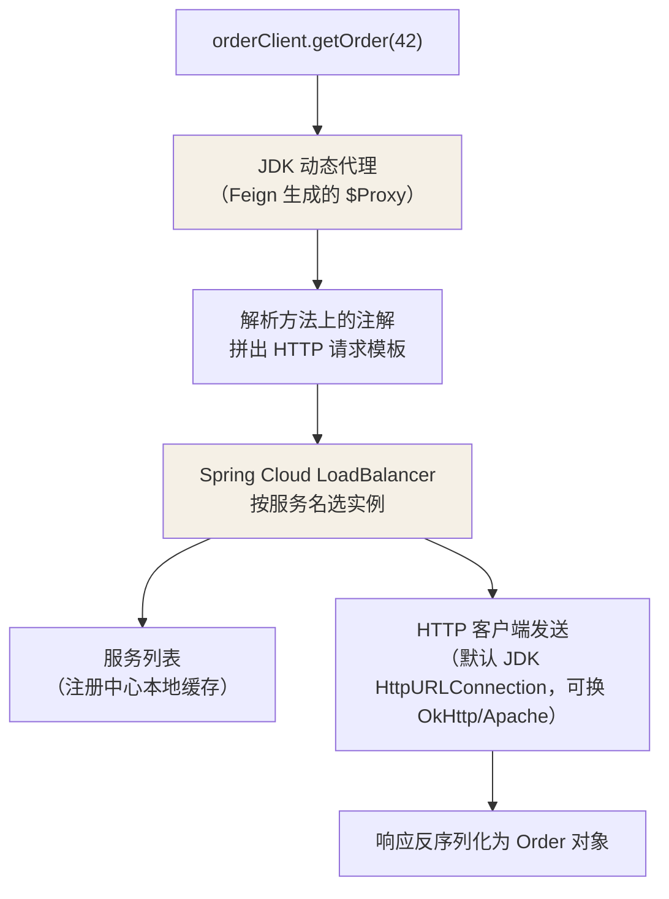
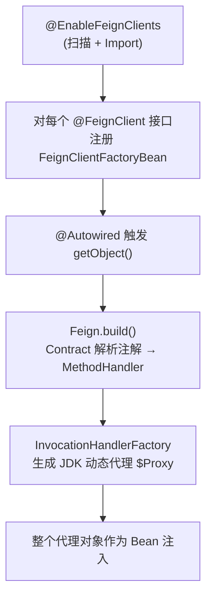

## 从 RestTemplate 到声明式调用

```java
// 手写版：URL 硬编码、参数拼接、异常处理、负载均衡全要自己来
restTemplate.getForObject("http://order-service/api/order/" + id, Order.class);

// OpenFeign：像调用本地方法一样调远程
@FeignClient(name = "order-service")     // 服务名 = 注册中心里的 key
public interface OrderClient {
    @GetMapping("/api/order/{id}")
    Order getOrder(@PathVariable("id") Long id);
}

@Autowired OrderClient orderClient;     // 注入的是动态代理
Order order = orderClient.getOrder(42L); // 底层发 HTTP
```

接口即契约：注解直接复用 Spring MVC 语义（@GetMapping/@RequestBody），
服务端 Controller 和客户端 Feign 接口甚至可以共用同一个 API 模块。

## 底层：动态代理 + 负载均衡



与 Java 基础篇反射与注解遥相呼应：**@FeignClient 的本质 = 注解元数据 +
JDK 动态代理 + 注册中心服务发现**——框架三板斧（注解描述意图、代理拦截
调用、注册中心寻址）在这里集齐。

## 负载均衡策略

Ribbon 已进入维护模式，Spring Cloud 官方继任者 LoadBalancer 精简了
策略，常用三种（`ReactorLoadBalancer` 实现类）：

| 策略 | 规则 | 适用 |
|---|---|---|
| RoundRobinLoadBalancer（默认） | 轮询 | 实例配置相近 |
| RandomLoadBalancer | 随机 | 简单兜底 |
| NacosLoadBalancer | **权重 + 同集群优先**（按 Nacos 元数据） | 机房就近 + 灰度权重 |

按权重路由是灰度发布的基础：新版本实例设低权重（Nacos 控制台直接改），
流量先小后大。

自定义策略只需注册一个 Bean：

```java
public class CustomLoadBalancerConfig {
    @Bean
    ReactorLoadBalancer<ServiceInstance> randomLoadBalancer(
            Environment env, LoadBalancerClientFactory factory) {
        String name = env.getProperty(LoadBalancerClientFactory.PROPERTY_NAME);
        return new RandomLoadBalancer(
            factory.getLazyProvider(name, ServiceInstanceListSupplier.class), name);
    }
}
// @LoadBalancerClient(value = "order-service", configuration = CustomLoadBalancerConfig.class)
```

## 超时与重试：调用方的安全带

注册中心篇说过：**服务列表永远有滞后**（下线实例还在列表里）。所以每次
调用都要带超时和重试：

```yaml
spring:
  cloud:
    openfeign:
      client:
        config:
          default:
            connect-timeout: 2000    # 连接超时 2s
            read-timeout: 5000       # 读超时 5s
          order-service:            # 按服务覆盖
            read-timeout: 3000
      okhttp:
        enabled: true               # 换更快的 HTTP 客户端（可选）
```

重试的**幂等约束**是铁律：

| 请求性质 | 可否重试 |
|---|---|
| 查询、删除（幂等） | ✅ |
| 创建订单（非幂等） | ❌ 超时后盲目重试 = 重复下单 |

```java
// 默认 Retryer.NEVER_RETRY；需要时才显式开启，且只对幂等接口
@Bean
public Retryer retryer() {
    return new Retryer.Default(100, TimeUnit.MILLISECONDS, 3);  // 间隔100ms，最多3次
}
```

非幂等接口要安全重试得靠**请求携带唯一业务号 + 服务端去重表**（本地
消息表思想，见分布式事务篇）。

## Feign 整合：日志与降级

```yaml
spring:
  cloud:
    openfeign:
      client:
        config:
          default:
            logger-level: basic     # NONE/BASIC/HEADERS/FULL（FULL 别在生产开）
```

```java
@FeignClient(name = "order-service",
             fallback = OrderClientFallback.class)   // Sentinel 熔断触发时走这里
public interface OrderClient { ... }

@Component
public class OrderClientFallback implements OrderClient {
    @Override
    public Order getOrder(Long id) {
        return Order.degraded(id);   // 降级数据：缓存/默认值/友好提示
    }
}
```

fallback 与 Sentinel/Resilience4j 联动（下一篇展开）：熔断打开后不再
发起真实调用，直接进 fallback——**降级是设计出来的，不是报错兜出来的**。

## @FeignClient 是怎么变成一个 Bean 的（深入）

"注入的是动态代理"这句话背后是一整套 Bean 生命周期。逐层拆：

1. **扫描**：`@EnableFeignClients` 里 `@Import(FeignClientsRegistrar.class)`，
   registrar 用 `ClassPathScanningCandidateComponentProvider` 扫所有带
   `@FeignClient` 的接口。
2. **注册**：对每个接口注册一个 **`FeignClientFactoryBean`**。
3. **工厂化**：真正 `@Autowired OrderClient orderClient` 时，Spring 调用这个
   FactoryBean 的 `getObject()`——**接口本身没有实现类，Bean 是这个工厂临时
   造的**。



关键点：**这是"工厂 Bean + 动态代理"的设计样本**——`@FeignClient` 只是把
"让接口变成可调用 Bean"这件事的交给了工厂，代理在 `getObject()` 时才生成，
接口本身从不被实例化。

**一次调用在代理里的展开：**

```text
orderClient.getOrder(42)
→ InvocationHandler.invoke
   → 解析 @GetMapping("/api/order/{id}") + @PathVariable
   → 拼出 URL：/api/order/42
   → LoadBalancer 从服务列表选实例 → 组装 http://ip:port/api/order/42
   → 默认 feign.Client（可配 OkHttp/Apache）发请求
   → Decoder 把返回 JSON 反序列化为 Order
```

生产里"Feign 报找不到服务/404"往往是拼 URL 那一步和 Controller 的
`@RequestMapping` 路径**没对齐**，直接在代理展开的第 3 步打日志最容易定位。

### 为什么常配 OkHttp/Apache

Feign 默认 `feign.Client.Default` 走 JDK `HttpURLConnection`：**每次新建连接，
无连接池**，高并发时握手开销明显。换 OkHttp/Apache 得到连接池 + HTTP/2
支持，冷启动和高吞吐场景收益大——配置就一行 `okhttp.enabled: true`。

## 拦截器透传 traceId 与登录态（深入）

Feign 一个极易踩又极常见的问题是：**网关/调用方带的 token、traceId 到了
Feign 这就断了**。OpenFeign 提供 `RequestInterceptor`，在每次真实请求发出
前统一给**带上当前上下文**：

```java
@Component
public class PropagateHeaderInterceptor implements RequestInterceptor {
    @Override
    public void apply(RequestTemplate template) {
        // ① 透传链路追踪 id：取 MDC 里当前请求的 traceId
        String traceId = MDC.get("traceId");
        if (traceId != null) {
            template.header("X-Trace-Id", traceId);
        }

        // ② 透传登录态：从 Spring Security / ThreadLocal 取当前用户 token
        String token = StpUtil != null ? (String) StpUtil.getTokenValue() : null;
        if (token != null) {
            template.header("Authorization", "Bearer " + token);
        }
    }
}
```

**为什么必须靠拦截器而不是手动传参**：token、traceId 是**跨服务通用**的横切
属性，用拦截器统一注入，调方代码零侵入；手动传参则每个方法都要加个无关参数，
极易遗漏。这和大方向一篇说的"横切关注点抽成切面"是同一个思想。

### 两个高频坑

| 现象 | 根因 | 处理 |
|---|---|---|
| 下游拿不到当前用户 | 拦截器没生效，或 `MDC`/安全上下文清空 | 确认拦截器被扫描到、上下文在同一调用链 set 了 |
| 拦截器能写 header 但某请求没透传 | 用的模板方法与拦截器分支没覆盖（如 FormBody） | 在 `apply` 里 `debug` 打印 template，别猜 |
| traceId 每跳变化 | 只透传没在下游重新设 `MDC` | 下游按 `X-Trace-Id` 重建 MDC，链路才"连续" |

链路追踪的"连续"除了头透传，还要求**下游把收到的 traceId 写回自己的 MDC**
再继续往下带——只做一半就出现"中间一段 traceId 一样、再往后就断了"。

## 小结

- OpenFeign = 注解契约 + JDK 动态代理 + 注册中心寻址，声明式让远程调用
  退化成本地方法。
- LoadBalancer 接棒 Ribbon，默认轮询，Nacos 策略支持权重灰度。
- 超时重试必配，重试只属于幂等操作；fallback 提前设计，别让用户看堆栈。
