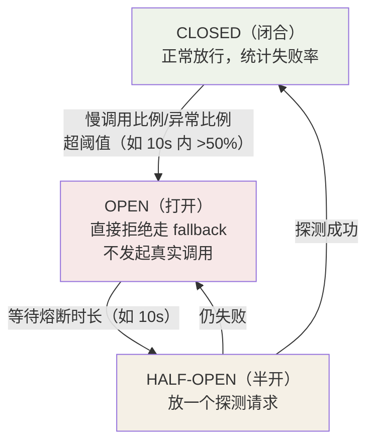
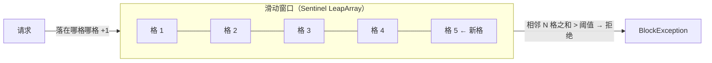
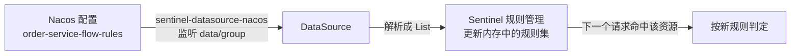

## 雪崩效应：一个服务怎么拖垮全站


传导机制：**同步调用 + 无界等待**——下游变慢（不是挂，挂了还能快速失败），
上游每个请求都吊着线程干等，线程池被慢请求灌满，上游自己也"假死"。
所以防护有两个抓手：**限制并发量（限流）**和**切断慢依赖（熔断）**。

## 熔断器：三态循环

家喻户晓的 Circuit Breaker 模式（Sentinel / Resilience4j / 已故的
Hystrix 同源）：



- **CLOSED**：正常工作，同时滑动窗口统计失败率/慢调用比例。
- **OPEN**：阈值击穿，直接拒绝所有请求（走 fallback）——**给下游喘息，
  给上游止损**。
- **HALF-OPEN**：冷却期满后放行少量探测请求，成功则闭合、失败则继续打开。

Sentinel 熔断规则三选一（按场景选统计维度）：

| 策略 | 统计的是 | 适用 |
|---|---|---|
| 慢调用比例（RT） | 响应超过阈值的请求占比 | 依赖变慢（DB 慢查询） |
| 异常比例 | 抛异常的比例 | 依赖报错 |
| 异常数 | 异常次数 | 低流量冷门接口 |

## 限流算法四种形态

| 算法 | 思路 | 问题 |
|---|---|---|
| 固定窗口计数 | 每分钟一个计数器 | **窗口边界突刺**：59s + 61s 交界处可过 2 倍流量 |
| 滑动窗口 | 窗口切成小格子滚动 | 平滑，Sentinel 默认（LeapArray） |
| 漏桶 | 恒定速率流出 | 绝对均匀，**无法应对突发**（削峰填谷） |
| 令牌桶 | 按速率投币，拿到币才走 | 允许攒令牌的突发流量（Guava RateLimiter） |



Sentinel 默认窗口 1s 切 2 格（500ms/格），统计近 1s 内的总通过数——
边界突刺被格子粒度抹平。

## Sentinel 实战

```java
// 代码式（@SentinelResource 定义资源 + blockHandler 处理被限流的请求）
@SentinelResource(value = "getOrder",
                  blockHandler = "getOrderBlocked",     // 限流/熔断时
                  fallback = "getOrderFallback")        // 业务异常时
public Order getOrder(Long id) { ... }

public Order getOrderBlocked(Long id, BlockException ex) {
    return Order.degraded(id);    // 触发流控/熔断 → 返回降级数据
}
```

Nacos 持久化规则（内存规则重启即失，生产必须外置）：

```yaml
spring:
  cloud:
    sentinel:
      datasource:
        flow:
          nacos:
            server-addr: nacos:8848
            data-id: order-service-flow-rules
            rule-type: flow        # flow/degrade/param-flow/system...
```

**热点参数限流**（电商秒杀的精准武器）：对"参数值"维度限流——

```java
// 只有 itemId=10086 这个爆款被限到 QPS 1000，其他商品不受影响
@SentinelResource(value = "getItem", blockHandler = "getItemBlocked")
public Item getItem(Long itemId) { ... }
// 规则：paramIdx=0, 单机阈值=1000, 参数例外项 {itemId:10086 → 阈值 100}
```

**系统自适应限流**（Load 自适应）：根据机器 Load1 / CPU 使用率 / 平均 RT
整体入口限流——给机器本身装保险丝，防止过载死亡螺旋。

## Sentinel vs Hystrix vs Resilience4j

| | Hystrix（停更） | Sentinel | Resilience4j |
|---|---|---|---|
| 隔离方式 | **线程池隔离**（每依赖一线程池） | **信号量隔离**（并发线程数计数） | 信号量 |
| 熔断策略 | 异常比例 | 慢调用比例/异常比例/异常数 | 慢调用/失败率 |
| 流量整形 | 无 | **有**（QPS/并发/热点/系统自适应） | 基础 RateLimiter |
| 控制台 | 弱 | **实时规则动态下发**（Nacos 持久化） | 无 |
| 模型 | 同步 | 同步/异步 | 响应式友好 |

线程池隔离 vs 信号量隔离：前者真换线程执行（开销大但可强杀），后者只
计数（便宜但慢调用仍占着调用线程）——Sentinel 认为配合熔断器切慢依赖
后，计数已够用。

## 滑动窗口的内部实现：LeapArray（深入）

"滑动窗口"四个字背后是 Sentinel 的 **LeapArray（环形数组）**：用固定长度
数组 + 环形复用，O(1) 统计任意滑动区间。核心：

```java
public class LeapArray<T> {
    private final AtomicReferenceArray<WindowWrap<T>> array;  // 环形数组
    private final int windowLengthInMs;   // 每格时长，如 500ms
    private final int sampleCount;        // 格数，如 2 → 总窗口 1s
    private final int intervalInMs;       // 总窗口 = 格数 × 每格
}
```

**取格子时为什么是"环形"**：时间戳对总窗口取模定位下标，格子复用、不重建。
每次新请求进来：

```text
now / windowLength → 目标下标
重复命中同一格子 → 同格的 atomic 计数 +1（无需锁）
时间跨进下一格 → 新格覆盖复用，旧窗口的"最老一格"自然被丢弃
```

这就是"滑动"的真相——**不是真的平移，而是环形复用 + 丢弃最老格**，所以
无论统计"近 1s 还是近 10s"，都是常数级开销。

**为什么这样设计能解决固定窗口的突刺**：固定窗口是"整分钟一个计数器"，
边界处（59s↔61s）两个相邻窗口各自都能放过一个满阈值的流量，瞬时 2 倍。
滑动窗口把窗口切成小格、以格子为粒度滚动，统计的是"跨越边界时相邻格
之和"，突刺被格子粒度抹平。

## 熔断状态机的触发时序（深入）

三态不是"魔法"，是**时间 + 统计驱动**的判定链。以慢调用比例为例：

```text
CLOSED
  ├─ 每个请求记录 RT，落到滑动窗口
  ├─ 需求条件：窗口数 ≥ minRequestAmount(默认5) 且 慢调用比例 > 阈值(默认0.8)
  └─ 满足 → CircuitBreaker 置 OPEN，丢出一个 DegradeException（由 blockHandler 处理）

OPEN
  ├─ 记录开启时刻 statStartTime
  └─ 每次请求判断 now < statStartTime + 熔断时长 → 直接拒绝（不再测量）

HALF_OPEN
  ├─ 熔断时长到 → 放行最大 halfOpenMaxAllowedQps(默认10) 个"探测请求"
  ├─ 探测成功数达标 → 状态回 CLOSED（先睡 1s 不让连续探测）
  └─ 任一探测失败 → 立刻回 OPEN，并重置计时
```

**两个实战结论：**

1. **OPEN 态从来不再测量**——它只"看时间到了没有"，所以熔断是**即时止损**
   而不是"每次再统计确认一遍"。
2. `minRequestAmount` 太大会导致**流量小的接口永远不触发熔断**（样本不足）
   而失控，冷门接口要调小它；反之高流量接口抢 CPU 时它反而是保护。

## 规则为何要外置：从 Nacos 落到内存的链路（深入）

Sentinel 的规则**默认只存在 JVM 内存**，重启即失。生产用
`sentinel-datasource-nacos` 把它拉到 Nacos。很多人配了却摸不清"改了何时生效"，
把链路拆开：



**四个必懂的点：**

1. **数据源是"监听 + 拉取"，不是"只读一次"**：Nacos 里改规则，数据源推新的
   `List<...>` 给 Sentinel，内存规则立刻更新——所以**改规则不用重启**。
2. **重启后规则哪来**：应用启动 → 数据源从 Nacos 拉一次 → 规则重建。
   **内存与 Nacos 的"当前值"由数据源负责对齐**，这正是不外置就"重启丢规则"的原因。
3. **`rule-type` 决定解析器**：`flow`（限流）、`degrade`（熔断）、`param-flow`
   （热点）…… 规则 JSON 的字段随类型不同，`rule-type` 配错会解析失败。
4. **规则下发是"覆盖式"**：一次拉起的就是该资源规则集的全量，Nacos 里删掉
   某条，内存里也会少——不是只增量。

**排障 "改了规则但没生效"：**

| 现象 | 排查 |
|---|---|
| 控制台能看到、运行不按新规则 | DataSource 没连上 Nacos（server-addr/data-id/group 错一个都不行） |
| 日志报 rule-type 解析异常 | `rule-type` 与实际 rules JSON 的类型对不上 |
| 重启后规则又变默认 | 数据源没配或没扫到，回退了纯内存 |
| 改了限流阈值没变化 | 确认改的是**同一 data-id/group**，且资源名 `value` 一致 |

## 小结

- 雪崩机制 = 慢依赖 + 同步无界等待 → 线程池耗尽；限流管入口量，熔断
  切慢依赖。
- 熔断三态：CLOSED 统计 → OPEN 拒绝 → HALF-OPEN 探测循环。
- 限流首选滑动窗口；热点参数限流按"爆款 id"精准打击；规则放 Nacos 才能
  重启存活。
