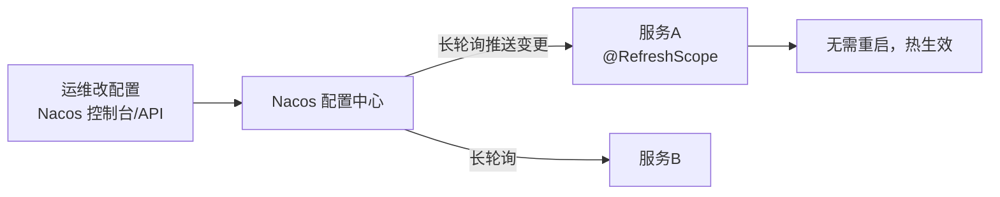

## 配置中心解决什么问题

微服务一多，配置就散落在每个 jar 里：改一个公共配置要**全量重启 + 重新发版**，
环境隔离（dev/test/prod）靠打不同包。配置中心把配置收拢到一处、支持**动态刷新**：



## Nacos 配置的数据模型

- **DataId**：一份配置的唯一标识，命名如 `user-service.yaml`。
- **Group**：分组，默认 `DEFAULT_GROUP`（常拿来做环境/租户隔离）。
- **Namespace**：最外层的命名空间，一套 Nacos 多租户共用。

```yaml
spring:
  config:
    import: "optional:nacos:user-service.yaml"   # 云原生缺省 import 写法（Boot 2.4+）
  cloud:
    nacos:
      config:
        server-addr: localhost:8848
        group: DEFAULT_GROUP
        refresh-enabled: true
```

## @RefreshScope：动态刷新的关键

配置 Bean 默认是单例，改配置不会重造。加上 `@RefreshScope`，Spring Cloud
会在收到变更时**销毁旧的 Bean 并重建**（通过代理按需重建，不是真的替换引用）：

```java
@RefreshScope
@Component
@ConfigurationProperties(prefix = "order")
public class OrderProperties {
    private int maxRetry;      // 改配置后自动拿新值
    // getter/setter...
}
```

## 失效场景（配置动态刷新排查）

| 场景 | 表现 | 根因 |
|---|---|---|
| 类没标 @RefreshScope | 改配置不生效 | 默认单例根本没重建 |
| 用 @Value 且类没 @RefreshScope | 值还是旧的 | @Value 注入到普通 Bean |
| 引用的 Bean 不是 refresh 链上 | 部分对象旧值 | 依赖图未一起重建 |
| import 用旧版 bootstrap.yml | 读不到 Nacos | Boot 2.4 起默认走 spring.config.import |

排查口诀：**改没通知到（长轮询）、类有没有 @RefreshScope、依赖它的 Bean 要不要
一起刷新、import 方式对不对**。想在启动后验证，可调用 **Nacos 的发布接口**
或直接改配置页观察日志中的 `Refresh scope 'default'`。

## 小结

- 配置中心收拢配置 + 动态刷新，免去微服务全量重启发版。
- Nacos 靠 Namespace/Group/DataId 三级组织配置；刷新依赖 @RefreshScope。
- 刷新失效先看四件事：通知、@RefreshScope、依赖链、import/bootstrap 方式。