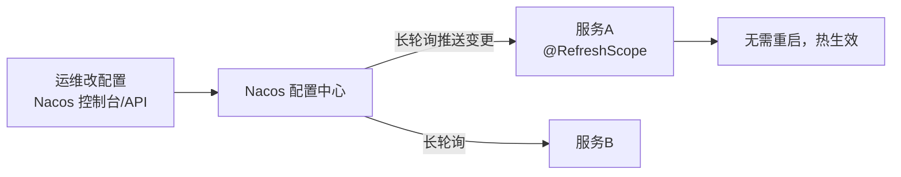
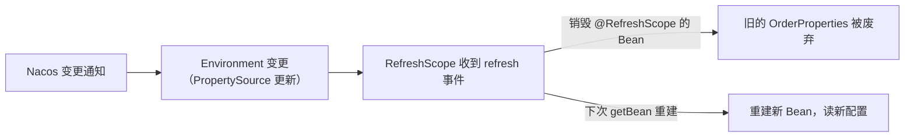

## 配置中心解决什么问题

微服务一多，配置就散落在每个 jar 里：改一个公共配置要**全量重启 + 重新发版**，
环境隔离（dev/test/prod）靠打不同包。配置中心把配置收拢到一处、支持**动态刷新**：



## Nacos 配置的数据模型

- **DataId**：一份配置的唯一标识，命名如 `user-service.yaml`。
- **Group**：分组，默认 `DEFAULT_GROUP`（常拿来做环境/租户隔离）。
- **Namespace**：最外层的命名空间，一套 Nacos 多租户共用。

```yaml
spring:
  config:
    import: "optional:nacos:user-service.yaml"   # 云原生缺省 import 写法（Boot 2.4+）
  cloud:
    nacos:
      config:
        server-addr: localhost:8848
        group: DEFAULT_GROUP
        refresh-enabled: true
```

## @RefreshScope：动态刷新的关键

配置 Bean 默认是单例，改配置不会重造。加上 `@RefreshScope`，Spring Cloud
会在收到变更时**销毁旧的 Bean 并重建**（通过代理按需重建，不是真的替换引用）：

```java
@RefreshScope
@Component
@ConfigurationProperties(prefix = "order")
public class OrderProperties {
    private int maxRetry;      // 改配置后自动拿新值
    // getter/setter...
}
```

## 失效场景（配置动态刷新排查）

| 场景 | 表现 | 根因 |
|---|---|---|
| 类没标 @RefreshScope | 改配置不生效 | 默认单例根本没重建 |
| 用 @Value 且类没 @RefreshScope | 值还是旧的 | @Value 注入到普通 Bean |
| 引用的 Bean 不是 refresh 链上 | 部分对象旧值 | 依赖图未一起重建 |
| import 用旧版 bootstrap.yml | 读不到 Nacos | Boot 2.4 起默认走 spring.config.import |

排查口诀：**改没通知到（长轮询）、类有没有 @RefreshScope、依赖它的 Bean 要不要
一起刷新、import 方式对不对**。想在启动后验证，可调用 **Nacos 的发布接口**
或直接改配置页观察日志中的 `Refresh scope 'default'`。

## 长轮询与 @RefreshScope 刷新的完整链路（深入）

"改配置秒级生效"不是轮询拉取，而是 **Nacos 长轮询（Long-Polling）**。
把链路拆开，你才知道缺失哪一环会导致"改了半天不生效"。

**服务端变更如何触达客户端：**

```text
客户端需要配置
  → 发起长轮询请求，服务端【hold 住响应 30s】并不立刻返回
  → 期间配置无变化：30s 超时返回"空"，客户端马上再发起下一轮（续航）
  → 期间配置有变化：服务端立刻返回变更，客户端收到后重建连接重拉
```

这就是"秒级生效"的真相——**不是每 30s 拉一次，而是服务端有变更就主动
断开让客户端立刻重拉**，长轮询把它近似成"即时"。

**客户端拿到新配置后怎么热更新 Bean：**



## 失效排查的完整复现（深入）

先造一个能稳定复现"改了不生效"的最小装置，再逐环排查：

```java
@Component                    // ❌ 没加 @RefreshScope
@ConfigurationProperties(prefix = "order")
public class OrderProperties {
    private int maxRetry;
}
```

| # | 你改的是 | 表现 | 卡在哪一环 |
|---|---|---|---|
| 1 | Nacos 里 `order.max-retry=5` | 永不生效 | 长轮询没连上（address/namespace 配错） |
| 2 | 同上 | 日志有 `Refresh range` 但值没变 | 类没有 **@RefreshScope**，Bean 没重建 |
| 3 | 生产改了 | 只有个别节点生效 | 多实例里一部分连的不是同一 namespace |
| 4 | 想刷 `@Value` | 仍旧旧值 | @Value 注入的类未在 refresh 链上，或类非 refresh scope |

**两个压箱底排查命令：**

- 看有没有触发刷新：日志搜 `Refresh scope 'default'`、`refreshable context`。
- 直连 Nacos 验证配置真的在：`curl http://{nacos}:8848/nacos/v1/cs/configs?` 带
  dataId/group/namespace 拉一下，先排除"配置压根没发布成功"这一环。

## 多环境隔离与配置灰度/回滚（深入）

配置中心不只是"收拢配置"，更是**环境与发布策略的载体**。两套常用隔离维度：

```text
① Namespace = 环境大隔离
   namespace: dev / test / prod
   └─ 各自独立 set 配置，互不可见（适合"环境彻底分隔"）

② Group / DataId 后缀 = 应用维度
   group: DEFAULT_GROUP（默认）
   dataId: user-service.yaml / user-service-gray.yaml
   └─ 同一环境里按应用/灰度区分
```

**一个生产常用组合**：Namespace 切环境（dev/test/prod 不串）、Group 或
DataId 后缀切灰度。给"灰度版本"单独一个 `-gray` 配置，只有灰度节点指向它，
就能做到**配置灰度**（新配置先给小流量验证）。

```yaml
spring:
  config:
    import: "optional:nacos:user-service.yaml"      # 正式
  cloud:
    nacos:
      config:
        server-addr: nacos:8848
        group: DEFAULT_GROUP
        # 灰度节点覆盖到这里（或单独一个 `-gray.yaml`）
```

**灰度/回滚怎么操作（要点）：**

1. **灰度**：先发一条新配置给灰度 dataId，验证通过再同步/升级为正式，别一上来
   覆盖正式配置。
2. **回滚**：Nacos 配置页带**历史版本**，能 diff 并一键回退到上一版——出问题
   时这是最快救法（比多实例改代码快得多）。
3. **回归纪律**：任何重要配置改动留"旧值可查"，用版本号对齐"哪个实例用的哪版"，
   否则多实例 + 灰度混用时，追责全靠猜。

### 环境易混的坑

| 现象 | 根因 |
|---|---|
| 测试环境连到了 prod 的配置 | `namespace` 没配，默认 namespace 大家共用 |
| 灰度上了实际全量生效 | 灰度节点没单独 namespace/group，和正式读的是同一份 |
| 回滚了仍旧旧值 | 实例的 `@RefreshScope` 没触发，或回滚的是别的分组 |

## 小结

- 配置中心收拢配置 + 动态刷新，免去微服务全量重启发版。
- Nacos 靠 Namespace/Group/DataId 三级组织配置；刷新依赖 @RefreshScope。
- 刷新失效先看四件事：通知、@RefreshScope、依赖链、import/bootstrap 方式。