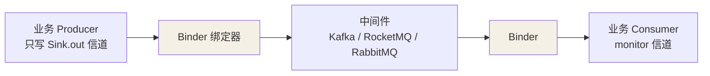
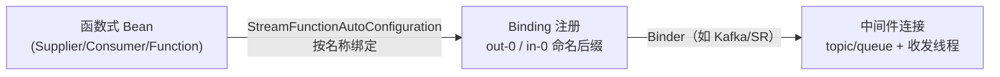

## 消息驱动的痛点

微服务里发消息常直接用 Kafka/RocketMQ 原生客户端。问题是：`@KafkaListener`
与 `@RocketMQListener` 注解互不相通，**换中间件就要重写一套收发代码**。
Spring Cloud Stream 在中间件之上做一层抽象，让生产者/消费者只跟自己的
"信道"打交道，底层换 Binder 即可。



## 三个概念串起来

| 概念 | 含义 | 例子 |
|---|---|---|
| **Binder** | 对接具体中间件的适配层 | `kafka` / `rocketmq` |
| **信道（Channel）** | 生产者/消费者侧的抽象出入口 | `Supplier`、`Consumer`（函数式） |
| **绑定（Binding）** | 信道 ←→ 中间件 destination 的映射 | `monitor-in-0` → topic `monitor` |

## 函数式定义（现代推荐）

```yaml
spring:
  cloud:
    stream:
      bindings:
        monitor-out-0: { destination: monitor, binder: kafka }
        monitor-in-0:   { destination: monitor, group: monitor-group, binder: kafka }
      binders:
        kafka: { type: kafka, environment: { spring.cloud.stream.kafka.binder.brokers: localhost:9092 } }
```

```java
@Component
public class MonitorStream {
    @Bean
    public Supplier<Monitor> publish() {       // 生产者：定时/事件发到 monitor-out-0
        return () -> new Monitor(...);
    }

    @Bean
    public Consumer<Monitor> consume() {       // 消费者：从 monitor group 消费
        return msg -> { /* 处理 */ };
    }
}
```

消费者侧的关键是 **group**：同一个 group 内的实例**负载分担**（一条只被一个消费），
不同 group 各自拿到一份——这就是"广播 vs 集群消费"的声明式开关。

## 失效场景（消息不消费/重复消费排查）

| 现象 | 根因 |
|---|---|
| 消息没到业务逻辑 | 绑定里 destination/group 配错；Binder 类型对不上中间件 |
| 消费者重复收到 | 没配/配错 group，或用错提交模式 |
| 换中间件后行为变了 | Binder 配置（brokers/ack 语义）未同步调整 |

## 与原生客户端的分工

- **要底层精细控制**（精确位点、事务、端到端时序）→ 用原生客户端。
- **要多中间件可切换、业务与中间件解耦** → 用 Spring Cloud Stream。

同一个项目常混用：框架接入走 Stream，性能敏感或强语义走原生。选型不讲绝对
优劣，讲**这一层抽象值不值**。

## 绑定生命周期与消费组/背压（深入）

**绑定不是"启动就有"**，它的生命周期是：应用启动 → 扫描函数式 Bean →
转换成 Binding → 建立中间件连接。缺了任一环，消息就进不来/出不去。



- **命名约定**：`xxx-out-0`、`xxx-in-0` 的末尾 `-0` 是"绑定序号"——一个
  Supplier 只能有一个输出，所以永远是 `-0`；`xxx` 是 Bean 方法名。yaml 里
  `bindings.xxx-out-0` 要和它严格对应，拼错最常见的结果就是**消息进了默认
  topic 而你监听根本不在那**。
- **消费组（group）复数**：同 group 的多个实例**负载分担**（一条消息只被一
  个实例消费）；不同 group 是**各自的副本**。如果 Consumer 没配 group，每次
  实例重启都会被当成新的 group（自动生成随机 group）——**重启后重复消费旧
  消息**就是没配/配错 group 的经典症状。

**背压：消费太慢会怎样**

Stream（尤其 Kafka Binder）有自动背压：`Consumer` 处理不过来时，Binder
会**暂停拉取**（paused 状态），不会无限灌爆内存；恢复后自动续拉。所以：

- 消费者处理函数里**别做长阻塞**——它表现为"消息堆积但消费线程 idle（在
  等某个同步操作）"，是排查积压的第一步。
- 需要调吞吐去提高 `maxPollRecords`/并发消费者数，而不是赌中间件自动喂饱。

### 三句排查口诀

| 现象 | 先查 |
|---|---|
| 发出去消费不到 | `bindings` 的 destination/group 与名字是否对齐 |
| 重启后重复消费 | 是否配了稳定的 group |
| 消息积压但消费者空闲 | 处理函数里是不是卡在阻塞 IO |

## 小结

- Stream 用 Binder 抽象掉具体 MQ，业务只依赖信道/绑定。
- 函数式 Supplier/Consumer + yaml 绑定，group 决定集群消费还是广播。
- 追求解耦可切换用 Stream，追求强控制/性能用原生客户端。