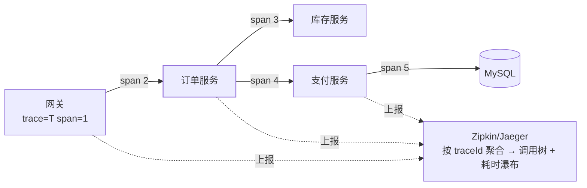

## 单机 MDC 不够用了

[日志体系](/java/intermediate/log/01-logging-system/)里 MDC 让一条
请求的日志带上 traceId——但请求一旦跨服务（网关 → 订单 → 库存 →
支付），**每个服务的 traceId 各写各的**，你只能看到四段互相不认识的
日志。链路追踪补的就是这一块：让同一个 traceId 贯穿全部服务，
还能画出调用树与耗时瀑布。

## 核心概念：trace 与 span

| 概念 | 含义 |
| --- | --- |
| trace | 一次请求的全局编号（128bit），全链路唯一 |
| span | 一次调用的工作区间：**有名字、有起止时间、有父子关系** |
| spanId / parentSpanId | 当前段标识 + 父段标识，构成调用树 |
| baggage | 随链路传递的业务字段（如 userId，可进日志） |

网关收到请求生成 traceId 与根 span；每次跨服务调用把
（traceId, spanId, parentSpanId）注入 HTTP 头（标准是
**W3C Trace Context** 的 `traceparent`，B3 是 Zipkin 系旧标准），
下游解出来续写——**上游是"我"从哪来，span 时间戳叠加成瀑布图**。

## Spring 侧的落地

- 老工具链 **Spring Cloud Sleuth** 已停止演进，能力并入
  **Micrometer Tracing**（Boot 3.x 起官方路线，与 Actuator 的
  Micrometer 指标同源，见[Actuator](/java/intermediate/spring-boot/05-actuator/)）；
- 上报后端选 Zipkin（轻）或 Jaeger/Tempo（生态重），引入对应
  reporter starter 即可；
- **自动埋点范围**：RestTemplate/RestClient、OpenFeign（见
  [OpenFeign 与负载均衡](/java/advanced/springcloud/04-openfeign-loadbalancer/)）、
  WebFlux/MVC、JDBC、Kafka/RabbitMQ——HTTP 头注入与解出都自动完成；
- 日志联动：traceId/spanId 自动进 MDC，pattern 里 `%X{traceId}`
  全链路可查——**这就是单机 MDC 方案的全局版**，自己 Filter 里
  put 的逻辑可以退休了。

## 采样与性能

全量上报在高 QPS 下是灾难，生产标准姿势是**采样**：头部采样
（按百分比/按 traceId 哈希）或尾部采样（全量收集、按"有错误的链路"
优先保留）。排查线上问题时想要特定请求的完整链路，配合
**请求头强制采样**（debug 标记）精准抓取。

## 老坑依旧：异步线程丢上下文

和 MDC 一样，**线程池里的任务拿不到父线程的 trace 上下文**
（ThreadLocal 不跨界）。Micrometer Tracing 提供上下文传播包装
（`ContextPropagatingTaskDecorator`，或 Reactor 的 context 机制），
自建线程池记得装饰（线程池语境见
[线程池详解](/java/intermediate/concurrent/02-thread-pool/)）——
"瀑布图里某段耗时为 0、日志也对不上"多半是这里断了。

## 与分布式联调的组合拳

一次慢查询的完整排查路径：**Grafana 看指标异常（Actuator 出数）→
Zipkin 按 traceId 定位慢 span → span 定位到 SQL/MQ/外部调用 →
按 traceId 拉全量日志**——指标告诉你"哪里不对"，链路告诉你
"具体哪一步"，日志告诉你"那一行长什么样"。

## 小结

- trace 全链路唯一、span 构成调用树；上下文走 W3C traceparent
  请求头，自动埋点覆盖 Feign/RestTemplate/JDBC/MQ。
- Boot 3.x 用 Micrometer Tracing 取代 Sleuth，traceId 自动进 MDC，
  单机 MDC 方案顺势升级为全局版。
- 采样控制成本，异步线程要显式传播上下文；指标→链路→日志三段式
  是线上排查的固定套路。
