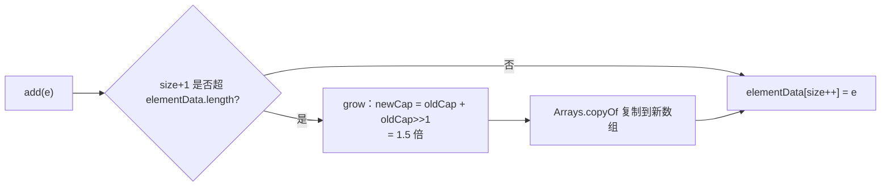

## 底层结构

ArrayList 就是**可扩容的对象数组**：

```java
transient Object[] elementData;   // 真正存数据的地方，transient 不参与默认序列化
private int size;                  // 已存元素个数（不等于 elementData.length）
```

无参构造默认指向 `DEFAULTCAPACITY_EMPTY_ELEMENTDATA`（一个空数组，JDK 8
延迟到首次 add 才扩容到 10）：

```java
public ArrayList() { elementData = DEFAULTCAPACITY_EMPTY_ELEMENTDATA; }
```

## 1.5 倍扩容流程

```java
public boolean add(E e) {
    ensureCapacityInternal(size + 1);      // 1. 确认容量
    elementData[size++] = e;                 // 2. 写入并自增
    return true;
}

private void grow(int minCapacity) {
    int oldCap = elementData.length;
    int newCap = oldCap + (oldCap >> 1);     // 1.5 倍（oldCap + oldCap/2）
    if (newCap < minCapacity) newCap = minCapacity;   // 边界：刚构造时为 0 走默认 10
    elementData = Arrays.copyOf(elementData, newCap);  // 复制到新数组
}
```



为什么是 1.5 倍而不是 2 倍：

- **摊还成本**：每次扩容 N 后的 N 次 add 摊销下来是 O(1)，1.5 倍够用。
- **内存浪费可控**：2 倍容易留出大段空闲堆，1.5 倍更折中。
- **可重用**：缩小规模时旧数组可被 GC，留余地利于复制重用。

实际工程中**已知大概容量时直接预分配**——`new ArrayList<>(expectedSize)`
能避免多次扩容与数组复制。

## 随机访问与中间插入

```java
@Override public E get(int index) {
    rangeCheck(index);
    return elementData(index);    // 数组下标，O(1)
}

@Override public void add(int index, E e) {
    rangeCheckForAdd(index);
    System.arraycopy(elementData, index, elementData, index + 1, size - index);
    elementData[index] = e;
    size++;
}
```

- `get(i)` 是 `O(1)`：数组下标直接访问。
- `add(i, e)` 是 `O(n)`：要把 index 之后的元素整体后移（arraycopy 是本地
  方法但仍然是线性搬运）。
- 遍历用 Iterator / for-each，频繁中间插入用 `LinkedList`（虽然实际工程
  里几乎总是 ArrayList 更快，因为 CPU 缓存对连续数组友好）。

## 序列化的特殊处理

`elementData` 标 `transient`——不直接走默认序列化，而是 `writeObject`
里只拷贝 `size` 个元素：

```java
private void writeObject(java.io.ObjectOutputStream s) throws IOException {
    int expectedModCount = modCount;
    s.defaultWriteObject();
    s.writeInt(size);                          // 写数量
    for (int i = 0; i < size; i++)            // 只写有效元素
        s.writeObject(elementData[i]);
}
```

原因：`elementData.length` 经扩容后比 `size` 大，默认序列化会把后面的
`null` 也写出去浪费空间。

## Fail-Fast

```java
protected transient int modCount;   // 结构性修改计数（增/删/扩容都 +1）

private void checkForComodification() {
    if (modCount != expectedModCount)
        throw new ConcurrentModificationException();
}
```

迭代器开始遍历时记下 `expectedModCount`，遍历中只要别的线程或递归调用
动到了 `modCount`，下一次 `next()` 直接抛 `ConcurrentModificationException`。

注意：这是**尽力而为**的快速失败——不保证看到最新值，更不能作为线程安全
的依据。并发场景用 `CopyOnWriteArrayList`（写时复制，读不加锁）。

## ArrayList vs LinkedList

| 维度 | ArrayList | LinkedList |
|---|---|---|
| 底层 | 数组 | 双向链表 |
| 随机访问 | O(1) | O(n) |
| 中间插入 | O(n) | O(1)（已知节点） |
| 内存 | 紧凑 | 每节点额外 prev/next 指针 |
| CPU 缓存 | 连续，缓存友好 | 节点分散，缓存不友好 |

**实战结论**：99% 场景优先 ArrayList。链表的 O(1) 插入仅在已经持有 Node
引用时成立，按索引遍历到节点本身就是 O(n)，加上缓存不友好——实际几乎
没有跑赢 ArrayList 的场景。

## 小结

- ArrayList = 对象数组 + 1.5 倍扩容 + Fail-F fast 迭代器，transient 让
  序列化只拷贝有效元素。
- 已知容量就 `new ArrayList<>(n)`，能省掉多次扩容与复制。
- 中间频繁插入选 LinkedList 的"教科书答案"在生产环境常被缓存不友好打脸。
