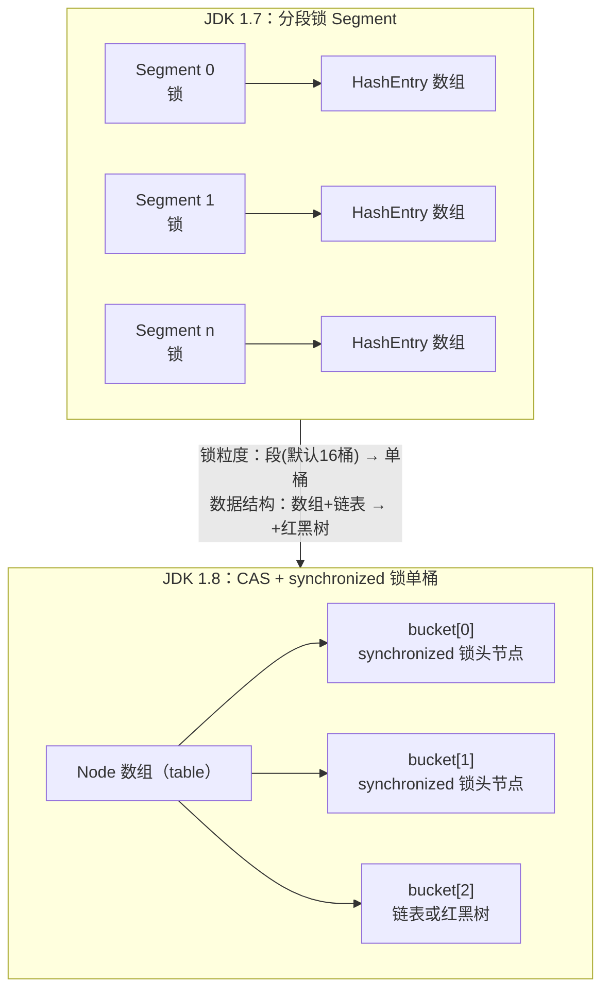
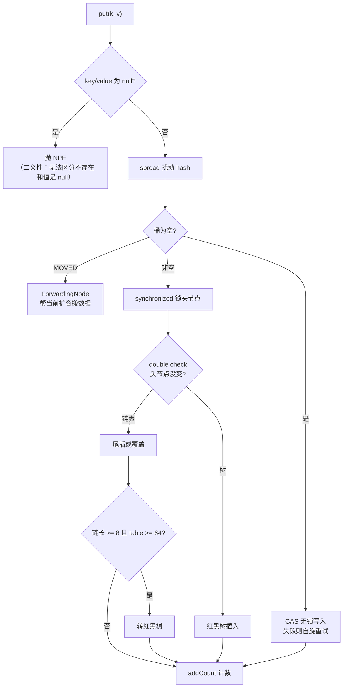

## 为什么不用 HashMap / Collections.synchronizedMap

- **HashMap 多线程并发写**可能成环导致 get 死循环（JDK 7 resize 头插法），
  或数据覆盖丢失（JDK 8 也有丢失更新问题）。

- **synchronizedMap / Hashtable** 全表一把锁，读写全部串行，性能崩塌。

目标：读不加锁、写只锁住"小范围"。

## 1.7 → 1.8 的结构演进



| 维度    | JDK 1.7                   | JDK 1.8          |
| ----- | ------------------------- | ---------------- |
| 锁粒度   | Segment（默认 16 段）          | 单个桶头节点           |
| 数据结构  | Segment\[] + HashEntry 链表 | Node\[] + 链表/红黑树 |
| 并发度   | 固定 16（初始化后不可扩段）           | 随 table 扩容增长     |
| 查询复杂度 | O(n) 链表                   | O(log n) 红黑树     |

## 1.8 put 全流程

```java
final V putVal(K key, V value, boolean onlyIfAbsent) {
    if (key == null || value == null) throw new NullPointerException();  // 不允许 null
    int hash = spread(key.hashCode());          // 扰动：高低位异或，再与 HASH_BITS 相与
    for (Node<K,V>[] tab = table;;) {            // 自旋：失败重试
        Node<K,V> f; int n, i, fh;
        if (tab == null || (n = tab.length) == 0)
            tab = initTable();                   // 惰性初始化
        else if ((f = tabAt(tab, i = (n - 1) & hash)) == null) {
            if (casTabAt(tab, i, null, new Node<>(hash, key, value)))
                break;                            // ① 空桶：CAS 放入，无锁成功
        }
        else if (f.hash == MOVED)
            tab = helpTransfer(tab, f);           // ② ForwardingNode：正在扩容，去帮忙
        else {
            V oldVal = null;
            synchronized (f) {                    // ③ 非空桶：synchronized 锁头节点
                if (tabAt(tab, i) == f) {        // double check：锁住后确认头节点没变
                    if (fh >= 0) { /* 链表：遍历尾插/更新 */ }
                    else if (f instanceof TreeBin) { /* 红黑树插入 */ }
                }
            }
            if (binCount != 0) {                  // 链表过长 → 树化
                if (binCount >= TREEIFY_THRESHOLD) treeifyBin(tab, i);
                if (oldVal != null) return oldVal;
                break;
            }
        }
    }
    addCount(1L, binCount);   // 计数（也可能触发扩容检查）
    return null;
}
```



关键点：

- **空桶优先 CAS**，冲突才 synchronized——锁粒度从"段"缩到"桶头节点"，
  且 CAS 路径完全无锁。

- **double check**：拿到锁后再确认头节点未被并发替换（防止锁错对象）。

- **不允许 null 键值**：并发下 `get(k) == null` 无法区分"不存在"与"存了
  null"，干脆禁止。

## get 为什么可以不加锁

```java
public V get(Object key) {
    Node<K,V>[] tab; Node<K,V> e, p; int n, eh; K ek;
    int h = spread(key.hashCode());
    if ((tab = table) != null && (n = tab.length) > 0 &&
        (e = tabAt(tab, (n - 1) & h)) != null) {     // tabAt 用 Unsafe.getObjectVolatile
        if ((eh = e.hash) == h) { /* 头节点命中 */ }
        else if (eh < 0)  return (p = e.find(h, key)) != null ? p.val : null;  // 树或迁移中
        while ((e = e.next) != null) { /* 沿链表找 */ }
    }
    return null;
}
```

- `val` 和 `next` 都声明为 **volatile**，写线程的修改对读线程立即可见。

- `tabAt` 用 `Unsafe.getObjectVolatile` 读取数组元素，保证读到最新引用
  （数组元素本身没有 volatile 语义）。

## size 怎么统计：baseCount + CounterCell

多线程并发 addCount 如果只改一个共享 long，CAS 失败率会很高。1.8 仿照
LongAdder 的思路**分摊热点**：

```java
private transient volatile long baseCount;              // 无竞争时用它
private transient volatile CounterCell[] counterCells;  // 有竞争时各改各的格子

public int size() {
    long n = baseCount;
    if (counterCells != null)
        for (CounterCell c : counterCells)
            if (c != null) n += c.value;    // 最终一致性：求和瞬间可能不是精确值
    return (int) n;
}
```

先 CAS baseCount，失败说明有竞争 → 放弃，转去 CAS 自己的 CounterCell 格子。
size() 是**弱一致**的——并发写时数值可能瞬间对不上。

## 多线程协助扩容

transfer 时每个线程认领一段桶区间（stride），搬完的桶放
**ForwardingNode**（hash = MOVED）。其他线程 put 碰到 MOVED 就调用
helpTransfer 一起搬；get 碰到则通过 find 转发到新表查询。扩容期间读写
都不被阻塞——这是 1.8 相比 1.7 最优雅的改进之一。

## 小结

- 1.7 分段锁 → 1.8 CAS + synchronized 锁桶头，锁粒度降到单桶。

- put 三条路径：空桶 CAS / MOVED 帮扩容 / 锁头节点 double check。

- get 无锁靠 volatile；size 靠 LongAdder 思路分摊热点，接受弱一致。

