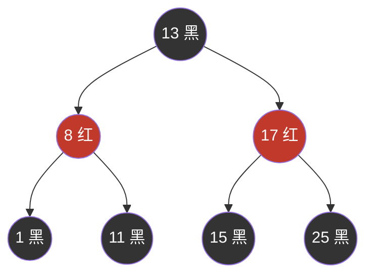
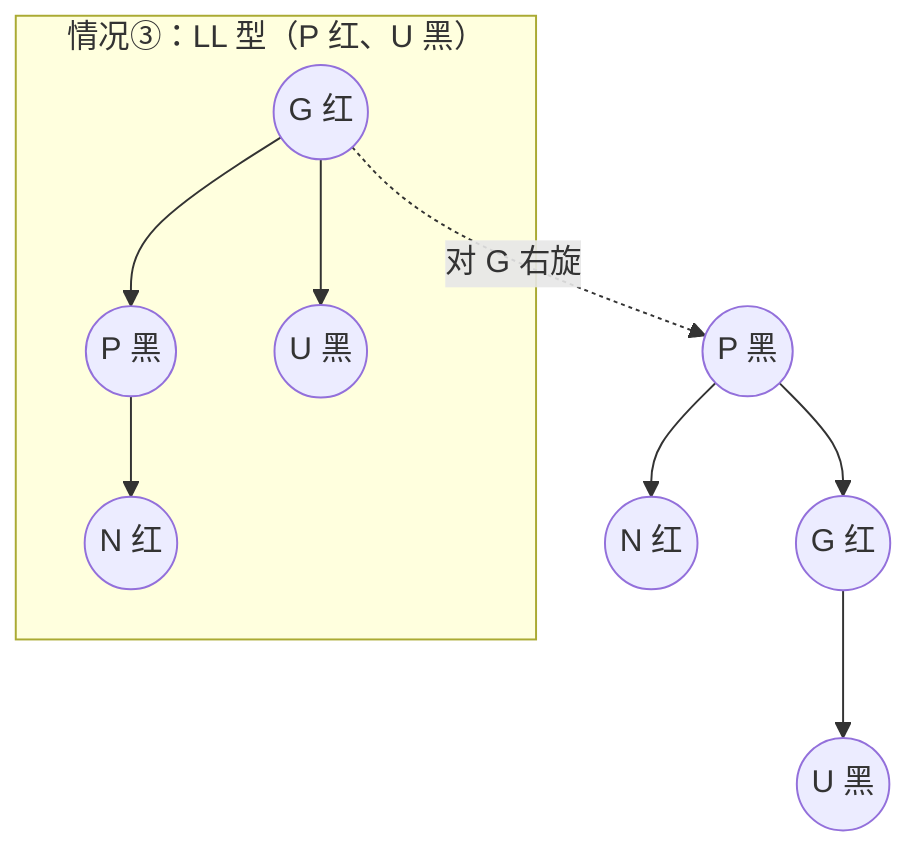

## 从二叉查找树说起

二叉查找树（BST）：左子树 < 根 < 右子树，中序遍历即有序。查找/插入/
删除平均 O(log n)——**前提是树长得平衡**。

```text
插入序列 1,2,3,4,5：
  1                    3
   \                  / \
    2    ← 退化成链   2   4    ← 平衡
     \              /     \
      3            1       5
       \
        4
         \
          5
```

最坏退化成链表 O(n)。AVL 树用严格平衡（左右子树高度差 ≤ 1）解决，
但插入/删除要频繁旋转，**读多写少才合适**。工业界更常用的是放宽平衡
要求的红黑树：最长路径不超过最短的 2 倍，换更少的调整次数。

## 红黑树五条性质

1. 每个节点非红即黑；
2. 根节点是黑色；
3. 叶子（NIL）是黑色；
4. **红节点的两个子节点必黑**（红红不相邻）；
5. 任一节点到其所有叶子的路径含相同数量的黑节点（黑高相同）。

由 4+5 可推出：最长路径（红黑相间）≤ 2 × 最短路径（全黑）——这就是
"近似平衡"的量化含义，保证查找 O(log n)。



## 等价视角：红黑树 = 拍扁的 2-3-4 树

理解红黑树最省力的方式：把**红节点向上融合进父节点**，红节点与其黑
父构成一个 3 节点或 4 节点——整棵树变成一棵 2-3-4 树（B 树的特例）。

- 黑高相同 ⇔ 2-3-4 树所有叶子同层；
- 红黑相间上限 ⇔ 节点最多挂 3 个键。

旋转与变色不过是"节点分裂/合并"在二叉表示下的局部动作。记住这个
等价，五条性质就不再是死记的咒语。

## 插入与修复

新节点染**红**（不破坏黑高），再按三种情况修复（设新节点 N，父 P，
叔 U，祖 G）：

| 情况 | 特征 | 动作 |
|---|---|---|
| ① | 父红、**叔红** | P 与 U 变黑、G 变红，N 上移到 G 继续修复 |
| ② | 父红、叔黑、N 是"内侧"子（LR/RL） | 先对 P 旋转变为情况 ③ |
| ③ | 父红、叔黑、N 是"外侧"子（LL/RR） | G 变红、P 变黑，对 G 旋转（左旋/右旋） |



修复最多 O(log n) 次变色 + **至多 2 次旋转**（情况③终止）；对照 AVL
插入最多 O(log n) 次旋转——这是红黑树写性能占优的根源。删除修复
更繁琐（关注"双黑"节点），但工业实践中会写就行，不必背全表。

## Java 里的红黑树

| 场景 | 用法 |
|---|---|
| `TreeMap` / `TreeSet` | 整棵树即红黑树，按 key 排序、范围查询（`headMap`/`tailMap`） |
| `HashMap` 桶内树化 | 链表长度 ≥ 8 且数组 ≥ 64 时转红黑树，把桶内查找从 O(n) 压到 O(log n)——见 [HashMap 源码分析](/java/basic/collection/02-hashmap/) |
| `ConcurrentHashMap` | 同样支持树化，配合 CAS/synchronized 保证并发安全 |

为什么 HashMap 树化选红黑树而不是 AVL：桶内节点随扩容不断增删，
红黑树的低调整成本比 AVL 的严格平衡更划算。

## 小结

- BST 退化 O(n)；AVL 严格平衡但旋转频繁；红黑树"最长 ≤ 2×最短"，
  用近似平衡换低调整成本。
- 五条性质的核心是 4（红红不相邻）+ 5（黑高相同）；等价于拍扁的
  2-3-4 树。
- 插入修复：叔红变色上移、叔黑旋转收尾——至多 2 次旋转。
- Java 三大落点：TreeMap 整树、HashMap/CHM 桶内树化。

## 延伸阅读

- [深入学习二叉树（一）二叉树基础（简书）](https://www.jianshu.com/p/bf73c8d50dc2)
- [红黑树（一）之 原理和算法详细介绍（博客园）](https://www.cnblogs.com/skywang12345/p/3245399.html)
- [浅析红黑树（RBTree）原理及实现（CSDN）](https://blog.csdn.net/tanrui519521/article/details/80980135)——含完整 Java 实现，配本篇的修复表食用
