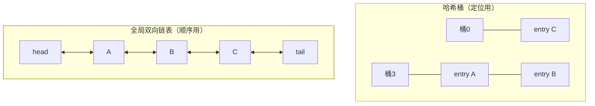

## 定位：HashMap + 一条全局双向链表

[HashMap](/java/basic/collection/02-hashmap/) 里 entry 的遍历顺序是
哈希位置决定的"乱序"；`LinkedHashMap` 在每个 entry 上加 **before/after
两个指针**，把所有 entry 串成一条**独立于桶结构的全局双向链表**——
哈希表负责 O(1) 定位，链表负责**记住先后顺序**：



内存代价：每 entry 多 2 个引用（64 位 + 压缩指针 8B）；换来的是
**遍历恒定按链表序**、顺序操作 O(1)。

## 两种顺序：accessOrder 一字之差

```java
new LinkedHashMap<K,V>(16, 0.75f, false);  // insertion-order（默认）：按插入序
new LinkedHashMap<K,V>(16, 0.75f, true);   // access-order：读/写过的挪到链表尾
```

accessOrder 模式下每次 `get/put` 都把该节点移到链表**尾部**（最近的
在尾，最久未用的在头）——这一步靠钩子方法 `afterNodeAccess()` 完成
（HashMap 里是空实现，LinkedHashMap 覆写），是"访问即续命"的物理
实现。

## LRU：覆写一个方法就够了

JDK 作者预留的扩展点：`removeEldestEntry` 在每次插入后被询问
（`afterNodeInsertion` 触发），返回 true 就淘汰链表**头部**（最久未
访问的）。三行实现一个生产级 LRU：

```java
public class LruCache<K, V> extends LinkedHashMap<K, V> {
    private final int maxEntries;

    public LruCache(int maxEntries) {
        super(16, 0.75f, true);                       // true：访问序
        this.maxEntries = maxEntries;
    }

    @Override
    protected boolean removeEldestEntry(Map.Entry<K, V> eldest) {
        return size() > maxEntries;                   // 超容量淘汰链表头
    }
}
```

配合 `Collections.synchronizedMap(...)` 加线程安全，就是老项目里
随处可见的本地缓存。**注意两类坑**：get 也要写操作（accessOrder
挪链），只读高并发场景同样有并发问题；没有过期时间与容量权重，
现代方案请看 Caffeine（W-TinyLFU 淘汰策略比纯 LRU 抗扫描污染）。

## 手写 LRU（面试白板版）

LeetCode 146 要求 O(1) 的 get/put，标准解就是复刻上面的结构：
**哈希表（O(1) 定位）+ 双向链表（O(1) 移动/删除）**——两个数据
结构各补另一个的短板，与[红黑树](/java/basic/collection/04-red-black-tree/)
"搜索树 + 平衡约束"是同一种复合思维。

```java
// 骨架：Map<K, Node> + 双向链表（头淘汰/尾续命）
// get:  map 找节点 → unlink → appendTail → 返回
// put:  命中则更新并挪尾；未满则头插；满了先删 head 再插
```

## 顺带对比：保序家族

| 实现 | 保什么序 | 底层 | 场景 |
|---|---|---|---|
| LinkedHashMap | 插入序 / 访问序 | 哈希 + 双链 | 保序去重、LRU |
| TreeMap | key 排序 | 红黑树 | 范围查询、排序遍历 |
| ArrayDeque | 队头队尾 | 循环数组 | 滑动窗口、栈队列 |

## 小结

- LinkedHashMap = HashMap 桶结构 + 全局双向链表，`accessOrder` 切换
  插入序/访问序，钩子 `afterNodeAccess/Insertion` 是顺序魔法的落点。
- LRU = accessOrder + 覆写 `removeEldestEntry` 淘汰链头，三行成一个
  缓存；生产环境缺过期时间与抗污染，升级选 Caffeine。
- 手写 LRU 的套路是"哈希 + 双链"复合结构，两端操作都 O(1)。
