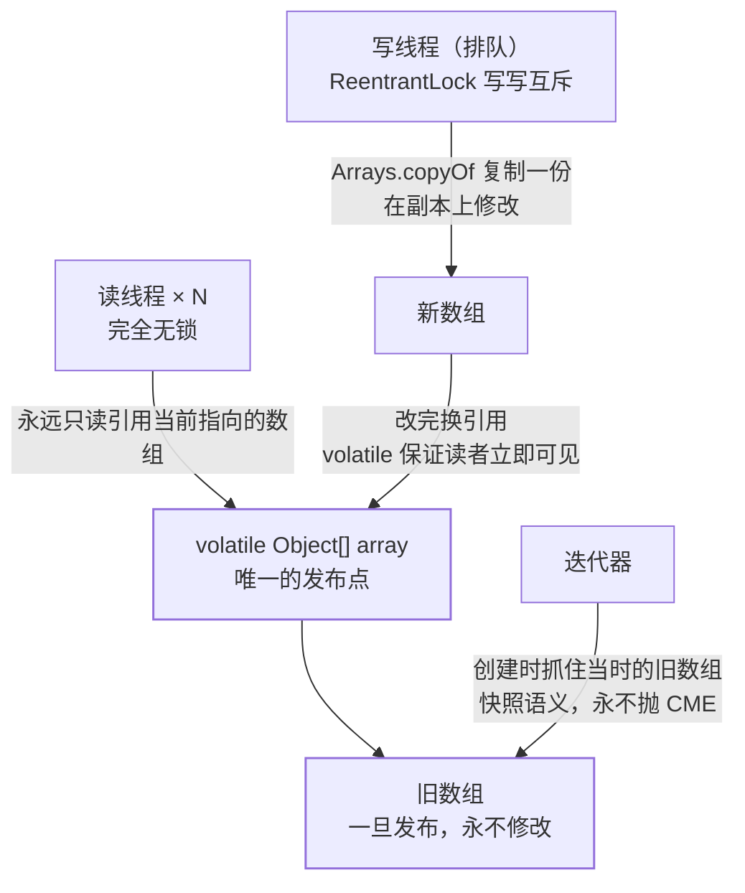

## 一句话定位

`CopyOnWriteArrayList`（COW）：**读完全不加锁，写的时候复制一份新
数组改完再换引用**。它回答的问题是——有一个**读极多、写极少**的
列表（监听器列表、配置白名单、路由表），`Vector` 那种一把锁全串行化
太亏，能不能让读路径零开销？

## 源码骨架：一个 final 数组 + 一把写锁

```java
public class CopyOnWriteArrayList<E> {
    private transient volatile Object[] array;  // volatile：换引用读者立即可见
    private final transient ReentrantLock lock = new ReentrantLock();

    public E get(int index) {  // 读：无锁，直接读当前数组
        return get(array, index);
    }

    public boolean add(E e) {
        lock.lock();  // 写：先拿锁（写写互斥）
        try {
            Object[] es = array;
            int len = es.length;
            es = Arrays.copyOf(es, len + 1);  // 复制整个数组
            es[len] = e;  // 在副本上改
            array = es;  // 换引用（原子性的发布点）
            return true;
        } finally { lock.unlock(); }
    }
}
```

三个设计要点：

1. **写写互斥、读写不互斥**：写者们在锁上排队；读者永远只摸
   `array` 引用指向的那个数组，而旧数组一旦发布就**永不修改**——
   读者拿着它随便读，天然安全。
2. **`volatile` 引用是关键**：写完换引用让新数组对读者立即可见
   （见[volatile 与 JMM](/java/intermediate/concurrent/03-volatile/)）；
   如果数组内容可变，volatile 也救不了中间状态。
3. **不可变对象 + 引用替换**与 [CAS](/java/intermediate/concurrent/09-cas-atomics/)
   是同一种思想的两条路：**不改旧值，只发布新值**——COW 用锁保证
   发布不丢，CAS 用重试保证发布不丢。

读写两条路径与唯一的发布点：



## 迭代器：快照语义

```java
List<String> list = new CopyOnWriteArrayList<>();
list.add("a");
Iterator<String> it = list.iterator();
list.add("b");                    // 迭代中修改
while (it.hasNext()) {
    System.out.println(it.next()); // 只会打印 a——遍历的是创建时刻的旧数组
}
```

迭代器创建时**抓住当前数组引用**（快照），之后写操作的复制都发生
在新数组上，互不干扰——因此**永不抛 `ConcurrentModificationException`**
（对比 [ArrayList 的 fail-fast](/java/basic/collection/01-arraylist/)）。
代价是**读不到刚写入的数据**：这是"最终一致"换"遍历安全"。

## 账本：什么该用，什么不该用

| 维度 | 表现 |
|---|---|
| 读性能 | 无锁无阻塞，优于读写锁 |
| 写性能 | O(n) 复制整组 + 内存翻倍瞬时峰值；**写多 = 灾难** |
| 内存 | 新旧数组并存，大列表写入瞬时内存 ×2 |
| 实时性 | 弱一致：迭代器看不到新写，`get` 可以看到 |

**适用**：元素少、读占绝对多数、写入低频（事件监听器注册表、
`System.getProperty` 类配置、Sentinel/Netty 内部的一些元数据表）。
**不适用**：大集合高频写（复制风暴 + GC 压力）、需要强实时读
（写完立刻必须读到且不允许多副本并存心智）。

同门兄弟 `CopyOnWriteArraySet` 就是包了一层 COW List 的 `addIfAbsent`。

## 与 ConcurrentHashMap 的取舍对照

同样是并发容器，两家的取舍方向相反：

| | ConcurrentHashMap | CopyOnWriteArrayList |
|---|---|---|
| 策略 | 读不加锁 + 写**精细加锁**（桶级） | 读完全无锁 + 写**全局复制** |
| 写成本 | O(1) 级 | O(n) 级 |
| 一致性 | 写完立刻可见（强） | 迭代快照弱一致 |
| 场景 | 高读写并存 | 读爆表写稀疏 |

（CHM 细节见[ConcurrentHashMap 详解](/java/basic/collection/03-concurrenthashmap/)。）

## 小结

- COW = volatile 引用 + 写时复制换引用：读无锁、写互斥、旧数组
  不可变，是"发布不可变对象"思想的容器化。
- 迭代器是快照：不抛 CME，但也看不到新写入——弱一致是明确的设计
  抉择而非缺陷。
- 只在**小集合 + 读多写少**下用；写多选 CHM 式的精细锁或读写锁
  （见[并发工具类](/java/intermediate/concurrent/10-concurrent-tools/)）。
