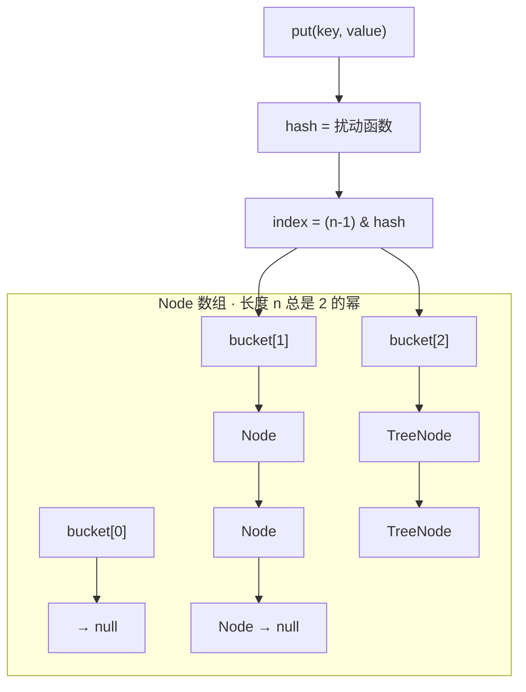
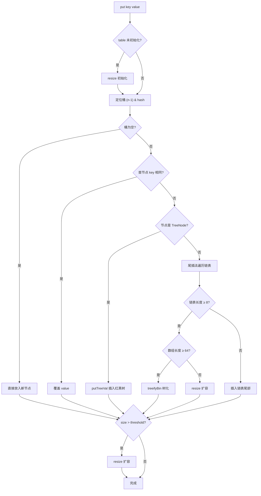

***

title: HashMap 源码分析
description: 数组+链表+红黑树的演进、扰动函数、put/get/resize 全流程
level: basic
core: true
----------

## 简介

HashMap 基于哈希表的 Map 接口实现，存放键值对，**非线程安全**。可以存储 null
的 key 和 value，但 null 作为键只能有一个。

## 底层结构：从拉链法到红黑树

JDK 1.8 之前：数组 + 链表（"拉链法"解决冲突）——数组是主体，冲突的元素
挂在同一格的链表上。JDK 1.8 之后：链表长度超过阈值时转为红黑树，把桶内
查找从 O(n) 降到 O(log n)。



关键设计：`(n - 1) & hash` 定位桶下标。因为 n 是 2 的幂，n - 1 的二进制
是全 1 的掩码，与运算等价于取模但更快——这也是容量必须取 2 的幂的根本原因。

## 扰动函数：hash() 为什么右移 16 位

```java
static final int hash(Object key) {
    int h;
    // key.hashCode() 与其高 16 位异或
    return (key == null) ? 0 : (h = key.hashCode()) ^ (h >>> 16);
}
```

原因：定位桶只用低几位（容量 16 时只看低 4 位），高位完全不参与。如果两个
key 的 hashCode 只在高位不同，必然冲突。高 16 位异或到低位，让高位信息也
参与桶定位，减少碰撞。

对比 JDK 1.7 的 4 次扰动（性能略差），1.8 简化为 1 次但原理不变：防止实现
差的 hashCode() 导致过多碰撞。

## put 流程



putVal 源码要点（对照上图）：

```java
final V putVal(int hash, K key, V value, boolean onlyIfAbsent, boolean evict) {
    // 1. table 未初始化或为空 → resize
    if ((tab = table) == null || (n = tab.length) == 0)
        n = (tab = resize()).length;
    // 2. 桶为空 → 直接放入
    if ((p = tab[i = (n - 1) & hash]) == null)
        tab[i] = newNode(hash, key, value, null);
    else {
        // 3. 首节点 key 相同 → 覆盖
        // 4. TreeNode → putTreeVal
        // 5. 链表尾插，binCount >= TREEIFY_THRESHOLD - 1 时 treeifyBin
        ...
    }
    // 6. ++size > threshold → resize
}
```

JDK 1.7 头插 vs 1.8 尾插：1.7 在扩容时头插法会反转链表顺序，并发
扩容可能形成环形链表导致 CPU 100%；1.8 改为尾插，保持顺序。（HashMap 依然
不是线程安全的——并发写本身就会丢数据，需要 ConcurrentHashMap。）

## get 流程

- `(n - 1) & hash` 定位桶，首节点命中直接返回

- 首节点是 TreeNode → 红黑树查找 getTreeNode

- 否则 do-while 遍历链表，hash 相等且 key equals 的节点即目标

注意查找条件是 `hash == h && (k == key || key.equals(k))`——先比 hash 再
equals，这是重写 equals 必须同时重写 hashCode 的直接原因：hash 不同
的 key 根本走不到 equals 那一步。

## resize 扩容

threshold = capacity × loadFactor，size 超过 threshold 就扩容：

- 容量翻倍（oldCap << 1），超过 MAXIMUM\_CAPACITY（2^30）后不再扩容

- 扩容时遍历所有元素，利用节点 hash 与旧容量的与运算结果判断新位置——
  要么在原下标，要么在原下标 + oldCap，无需重算 hash

- 迁移所有节点非常耗时，写代码时应预估容量，尽量避免运行中 resize

构造函数陷阱：`new HashMap<>(9)` 传入的 9 不是最终容量——tableSizeFor()
会向上取整为 16（大于等于该值的最小 2 的幂），真正的 table 在第一次
resize() 时才按此初始化。

## 关键参数源码

```java
static final int DEFAULT_INITIAL_CAPACITY = 1 << 4;   // 16
static final int MAXIMUM_CAPACITY = 1 << 30;           // 2^30
static final float DEFAULT_LOAD_FACTOR = 0.75f;
static final int TREEIFY_THRESHOLD = 8;                // 链表 → 树
static final int UNTREEIFY_THRESHOLD = 6;              // 树 → 链表
static final int MIN_TREEIFY_CAPACITY = 64;            // 树化的最小数组长度
```

- loadFactor 太大：数组更满、链表更长，查找效率低；太小：数组利用率
  低、数据分散，扩容频繁。0.75 是官方权衡后的临界值

- 树化双重条件（长度 ≥ 8 且容量 ≥ 64）意味着：数组还小时优先扩容而不是树化

## 要点备忘

- 容量总是 2 的幂 → (n-1) & hash 位运算代替取模

- 扰动函数 = hashCode 高 16 位异或低 16 位，让高位参与桶定位

- 树化是兜底而非常态：先扩容缓解冲突，容量到 64 才谈树化

- 查找先比 hash 再 equals → equals/hashCode 必须成对重写

- 1.7 头插并发死循环、1.8 尾插修复，但线程安全仍需 ConcurrentHashMap

## 延伸阅读

- JavaGuide · HashMap 源码分析（本文素材出处，含完整源码）

- JavaGuide · Java 集合常见面试题

