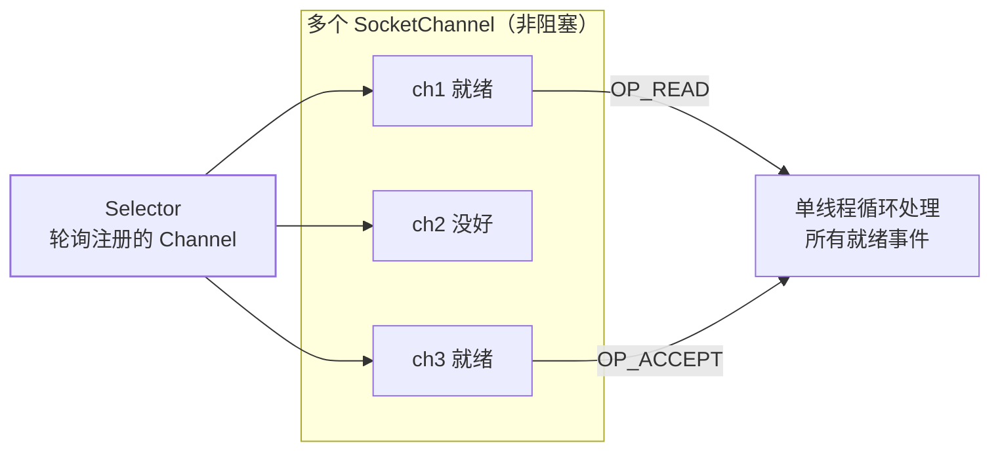

import AlgorithmVizIsland from '../../../../../components/viz/AlgorithmVizIsland.astro';

## 先分清两组词

| 维度 | 问的问题 | 取值 |
|---|---|---|
| 阻塞 / 非阻塞 | **等待数据期间，线程让不让出 CPU** | 阻塞：干等；非阻塞：先干别的、轮询或事件通知 |
| 同步 / 异步 | **数据从内核到用户空间的搬运，谁来做** | 同步：自己读（Reactor）；异步：内核搬好再通知你（Proactor） |

 BIO/NIO/AIO 的完整名字是同步阻塞、同步非阻塞、异步——**NIO 的"非阻塞"
指的是连接建立后 read 不再死等，而不是"没有等待"**。

## BIO：一连接一线程

```java
ServerSocket ss = new ServerSocket(8080);
while (true) {
    Socket s = ss.accept();            // 阻塞等连接
    new Thread(() -> handle(s)).start();  // 每个连接占一个线程
    // handle 里 inputStream.read() 又阻塞等数据
}
```

两个线程都在"傻等"：accept 等 TCP 握手，read 等对端发数据。1000 个
连接 = 1000 个线程（每个约 1MB 栈，见[JVM 数据区](/java/advanced/jvm/02-memory/)），
内存和上下文切换双双爆炸——线程只能服务**活跃连接**的世界里，BIO
撑不起长连接海量场景。补救姿势是接[线程池](/java/intermediate/concurrent/02-thread-pool/)
（伪异步），只是把爆炸阈值往后推，慢连接照样占死池子。

## NIO：多路复用，一个线程管一片连接

思路反转：**别让线程等连接，让连接排队报告"我好了"**。NIO 三大件：



| 组件 | 角色 | 关键点 |
|---|---|---|
| Channel | 双向数据通道（替代单向流） | `SocketChannel`/`ServerSocketChannel`/`FileChannel` |
| Buffer | 数据容器，读写共用 | `flip()` 切换读写位；position/limit/capacity 三指针 |
| Selector | 事件多路复用器 | `select()` 返回就绪集合，一个线程监管上千连接 |

底层依赖 OS 的多路复用系统调用，三代演进：

| 实现 | 每次调用 | 复杂度 | 瓶颈 |
|---|---|---|---|
| select | 把全量 fd 集合拷进内核，线性扫描 | O(n) | 1024 上限、集合反复拷贝 |
| poll | 同 select，链表去上限 | O(n) | 仍是全量拷贝 + 扫描 |
| **epoll** | 注册一次（红黑树），就绪 fd 由回调挂到就绪链表 | O(1) | 事件就绪才返回，Linux 主流 |

`Selector` 在 Linux 上就是 epoll 的封装——"Java NIO 快"的本质是
**把"谁就绪"的判断下放给内核，且只处理就绪的**。

## Reactor：NIO 的工程化骨架

裸 NIO 代码难写（事件分发、半包粘包、业务阻塞事件循环），Netty 把
它收成 **Reactor 反应器模式**：

- **单 Reactor 单线程**（Redis 6 前的命令处理）：一个线程既管事件又
  干活，简单但业务一慢全卡。
- **单 Reactor + 工作线程池**：事件循环只做 IO，业务丢池子。
- **主从 Reactor**（Netty 默认形态、Tomcat NIO 同构）：主 Reactor 专职
  `accept`，从 Reactor 一组线程管已建连接的读写——连接海量增长
  不拖累收连接。

**事件循环铁律：Reactor 线程里不能跑慢业务**，否则这条线程上的全部
连接陪葬（Netty 业务Handler 里 `eventLoopGroup` 与 `businessGroup`
分离的原因）。

## AIO：内核搬完再叫我

`AsynchronousSocketChannel` + CompletionHandler：发起 read 后立即返回，
内核把数据**搬进你给的 Buffer 后**才回调——连"拷贝到用户空间"都不用
应用做（Proactor 模式）。理论最优，但没火：

1. Linux 的原生 AIO（io_submit）对网络套接字支持残缺，JVM 底层仍
   用 epoll 模拟"异步"。
2. 回调风格代码难写，Netty 2.x 后**删掉了 AIO 支持**。
3. 多路复用 + Reactor 已能把 IO 线程压到个位数，AIO 收益不显著。

结论：**生产上的"Java 异步网络"就是 NIO + Reactor（Netty）**，AIO
停在八股层面。

## 呼应 Tomcat：连接器就是 IO 模型史

Tomcat 三代连接器正是上面三条路：BIO 连接器（一连接一线程）→
**NIO 连接器（8 起，默认；Poller 线程即 Reactor）→ APR**。细节见
[Web 容器的本质](/java/basic/tomcat/01-web-container/)。

## 小结

- 阻塞/非阻塞看"等的时候让不让出 CPU"；同步/异步看"谁把数据搬进
  用户空间"——NIO 是同步非阻塞（Reactor），AIO 才是真异步（Proactor）。
- BIO 一连接一线程撑不起长连接；NIO 靠 Selector 多路复用，Linux 底座
  epoll：注册一次、回调挂就绪链表、O(1)。
- Reactor 是 NIO 的工程骨架：主从 Reactor + 业务线程池分离，事件循环
  里禁跑慢业务。
- AIO 理论美但生态弱（Netty 已移除），实战选 NIO。

三种模型最后同框对比一遍：

<AlgorithmVizIsland demo="io-models" />
