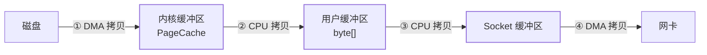

## 为什么会有"拷贝税"

一次最朴素的文件发送（读文件 → 发网络）：

```java
byte[] data = Files.readAllBytes(file);     // read()
socket.getOutputStream().write(data);        // write()
```

看似两行，内核里走了 **4 次数据拷贝 + 4 次用户态/内核态上下文切换**：



四步里 **②③两次 CPU 拷贝是纯浪费**——数据进用户空间转了一圈什么
都没变，又搬回内核。上下文切换还让 CPU 频繁"换脑子"。零拷贝的
目标：**数据不进用户空间，CPU 不参与无意义搬运**。

> "零"指的不是零次拷贝，而是**零次 CPU 拷贝数据的进出用户空间**；
> DMA 拷贝（外设与内存直接搬运，不占 CPU）始终存在。

## 三代优化

| 方案 | 系统调用 | CPU 拷贝 | DMA 拷贝 | 切换 | 思路 |
|---|---|---|---|---|---|
| 传统 | read + write | 2 | 2 | 4 | 全走一遍 |
| mmap | mmap + write | 1 | 2 | 4 | 文件映射进用户空间，省掉页缓存→用户的拷贝 |
| sendfile | sendfile | 0 | 2 | 2 | 数据全程内核里从 PageCache 搬到 Socket 缓冲区 |
| **sendfile + gather** | sendfile | 0 | 2（仅描述符进 Socket 缓冲区） | 2 | 只把**位置和长度**追加到 socket 缓冲区，DMA 直接从 PageCache 取 |

mmap 的定位：省一次 CPU 拷贝，但映射有缺页与 TLB 成本，适合"要改
数据/随机访问"；纯转发场景直接 sendfile。

## Java 落点

```java
// FileChannel.transferTo：JVM 层直接映射到 sendfile
try (FileChannel in = FileChannel.open(path, READ)) {
    in.transferTo(0, in.size(), socketChannel);
}

// MappedByteBuffer：mmap 映射，按页懒加载
MappedByteBuffer buf = fileChannel.map(
    MapMode.READ_ONLY, 0, fileChannel.size());
```

框架层的同款思想（用户态零拷贝）：

- **Netty**：`CompositeByteBuf` 合并多缓冲区不复制、`Unpooled.wrappedBuffer`
  包装不复制、`FileRegion` 包 transferTo；堆外内存（PooledByteBuf）
  省掉 socket 写出前的堆→堆外拷贝（呼应[直接内存](/java/advanced/jvm/02-memory/)）。
- **Kafka**：消费者拉取消息走 sendfile——磁盘日志 → 网卡全程不进
  用户态，这是 Kafka 高吞吐的招牌菜之一。
- **RocketMQ**：混合存储用 mmap（CommitLog 映射读写），与 Kafka 的
  sendfile 各选一派。

## 什么场景真正受益

零拷贝的红利出现在**大块数据的"搬运工"路径**：文件服务/网关转发/
消息消费/静态资源。而小对象、要加工（改数据）的路径收益有限——
反正都要改，先进用户空间也无妨。

## 小结

- 传统 read+write：4 拷贝 4 切换，其中 2 次 CPU 拷贝纯属路过。
- 演进主线：mmap 省一次拷贝 → sendfile 全程内核 → gather 连 socket
  缓冲区都不放数据，只放位置。
- Java 里 `transferTo` = sendfile、`MappedByteBuffer` = mmap；Kafka
  靠 sendfile、RocketMQ 靠 mmap。
- 零拷贝优化的是"原样搬运"，需要改数据时它帮不上忙。
