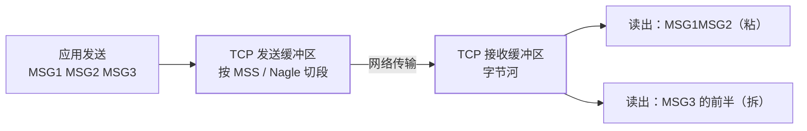

## 先纠偏：粘包不是 TCP 的 bug

TCP 是**字节流协议**——它只保证字节按序、可靠到达，**从不维护"消息"
边界**。发 100 次的字节，对端看来只是一条连续的字节河。"包"是应用层
的概念（你想发的一个业务报文），TCP 根本不知道它的存在：



成因三件套：

| 因素 | 说明 |
|---|---|
| 发送端 | 多次小写可能被 **Nagle 算法**攒包合并后一次发出（粘） |
| 接收端 | 应用**没及时读**，多条消息在接收缓冲区排队，一次 read 全带出（粘）；缓冲区比消息大（粘）、比消息小（拆） |
| 传输层 | 报文长度受 **MSS** 限制，超长消息被切段（拆） |

结论：**消息边界必须由应用层自己定义**。UDP 天然面向报文（一次发送
= 一个 datagram），不存在这个问题（但会丢包、乱序）。

## 应用层三大分界方案

| 方案 | 规则 | 优缺点 |
|---|---|---|
| **定长** | 每条固定 N 字节，不够补齐 | 实现最傻；带宽浪费、长度难定 |
| **分隔符** | 以特定串结尾（如 `\r\n`、`$`） | 可变长友好；正文出现分隔符需转义 |
| **长度域（主流）** | 头部带长度字段：`length(4B) + body` | 精确高效；是 RPC/消息队列的事实标准 |

长度域方案还能扩展出协议头（魔数、版本、序列化类型、请求 ID——
Dubbo/Motan 的协议头都是这个套路）。

## Netty 的四种解码器

Netty 把"切消息"固化成可插拔解码器，粘在 pipeline 里自动生效：

| 解码器 | 对应方案 |
|---|---|
| `FixedLengthFrameDecoder` | 定长 |
| `LineBasedFrameDecoder` / `DelimiterBasedFrameDecoder` | 行/自定义分隔符 |
| `LengthFieldBasedFrameDecoder` | **长度域（重点）** |

`LengthFieldBasedFrameDecoder` 五参数是高频考题，用一个协议实例背下来：

```java
// 协议：2B 魔数 + 2B 类型 + 4B 长度 + body（长度字段值只算 body）
new LengthFieldBasedFrameDecoder(
        1024 * 1024,  // maxFrameLength：单包上限，防恶意大包
        4,            // lengthFieldOffset：长度字段从第 4 字节开始
        4,            // lengthFieldLength：长度字段本身占 4 字节
        0,            // lengthAdjustment：长度值 = body 长，无需修正
        8);           // initialBytesToStrip：向下游剥离前 8 字节头
```

`lengthAdjustment` 的口诀：**净数据起点 = 长度字段偏移 + 长度字段
本身长 + adjustment**。头里还有别的内容、长度值不含它们时，用
adjustment 补偿。

## 与 HTTP 的对照

HTTP/1.1 解决同一个问题的两副面孔：有 `Content-Length` 时按长度切；
没有（流式）时用 `Transfer-Encoding: chunked` 的**块长度行**自描述——
本质还是"长度域"方案。HTTP/2 直接引入帧（frame）+ 帧头长度字段，
在协议层把这事彻底收编。

## 小结

- TCP 只管字节流，消息边界是应用层责任；粘拆包成因 = Nagle 攒包 +
  缓冲区时机 + MSS 切段，是特性不是缺陷。
- 三大方案定长/分隔符/长度域，长度域是主流；Netty 四解码器一一对应，
  `LengthFieldBasedFrameDecoder` 的 adjustment 口诀要会推。
- 自定义协议头（魔数+长度+类型+ID）就是 RPC 框架的通用骨架；
  网络模型底座见[IO 模型](/java/basic/io/01-io-model/)。
