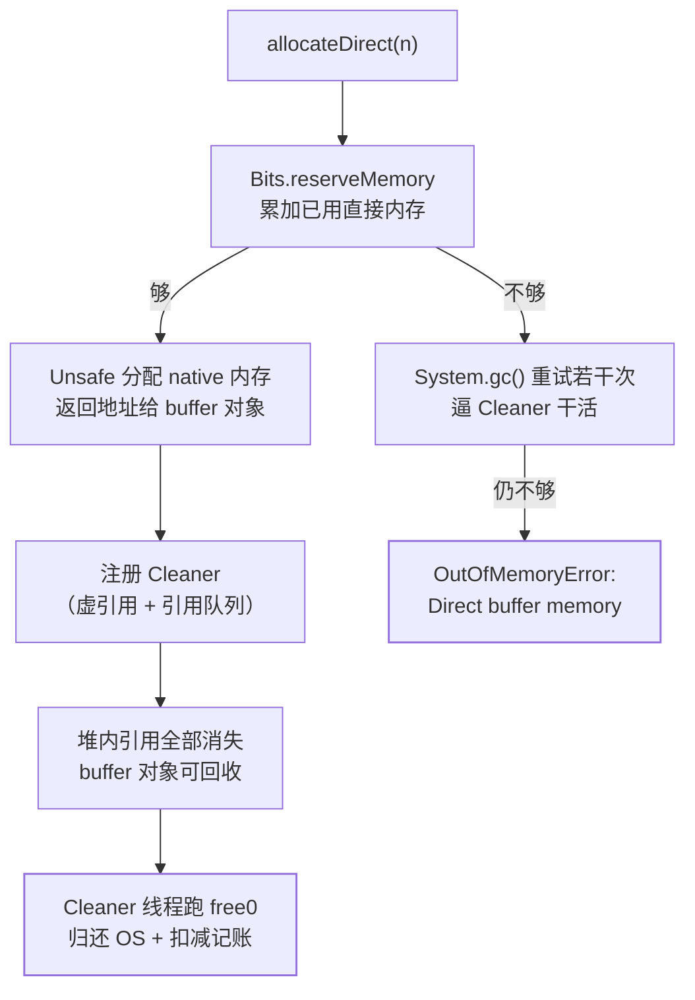

## 问题：Xmx 4G 只用了 2.8G，容器却因为 6.2G RSS 被杀掉

[运行时数据区](/java/advanced/jvm/02-memory/)列过进程的账本：
堆之外还有元空间、线程栈、直接内存、JIT 代码缓存与 native 分配；
[零拷贝](/java/basic/io/02-zero-copy/)用 `MappedByteBuffer` 演示了 mmap 的
省拷贝收益。**本篇讲这本账的暗面**：谁在申请堆外、什么时候才还、
还不上时以什么姿势炸。

三个高频症状各对应一段：

```text
java.lang.OutOfMemoryError: Direct buffer memory   ← 第三节
GC 日志里出现没有业务触发点的 Full GC，堆占用很低   ← 第三节因果
Xmx 远没用满，但容器 RSS 一路上涨直到 OOMKilled     ← 第五、六节
```

## 一、堆外有哪几扇门

| 入口 | 记账者 | 受谁限制 | 回收方式 |
|---|---|---|---|
| `ByteBuffer.allocateDirect(n)` | `Bits.reserveMemory` | `-XX:MaxDirectMemorySize` | 引用消失后由 **Cleaner** 释放 |
| `FileChannel.map(...)` → `MappedByteBuffer` | mmap 计数，**不走** `reserveMemory` | 地址空间 + 内核 | 同样等 Cleaner `unmap` |
| `Unsafe.allocateMemory` / JNI | 无 JDK 层记账 | 只有 OS | 必须自己 `free` |
| Netty 池化 direct buf | 池自己记账 | 池配置 | `release()` 引用计数归零 |
| 元空间 / 代码缓存 / 线程栈 | JVM 自己 | `MaxMetaspaceSize` 等 | 类卸载 / 线程结束 |

一句判断口诀：**只有走 `Bits` 的那部分会在你越界时主动报错**，
其余都是"沉默地吃进 RSS"，最后由 OS 或容器来收账。

`MaxDirectMemorySize` **不设时的默认值与最大堆同量级**——这正是容器里的
陷阱：堆按 `MaxRAMPercentage` 吃掉 75%，直接内存又允许申请到接近 Xmx，
两项各满就必然超过 limit（容器参数三件事见
[JVM 参数与调优](/java/advanced/jvm/07-tuning/)）。

## 二、DirectByteBuffer 的真实生命周期



关键在右下角那条边：**堆外内存的释放依赖 GC 先回收那个壳对象**。
`DirectByteBuffer` 本身只是几十堆内字节，真正的内存在 native 侧，
靠一个 `Cleaner`（本质是 `PhantomReference` 的子类）挂在那儿；
壳不被回收，`free` 就永远不发生。四种引用与 `ReferenceQueue`
的分工见[四种引用](/java/advanced/jvm/04-references/)——
**虚引用的"只在你被回收时告诉我一声"正是为这类资源清理设计的**。

## 三、那条因果链：堆外 OOM 前一定有莫名 Full GC

`Bits.reserveMemory` 拿不到空间时，不会立刻抛 OOM，而是**反复
`System.gc()` 并睡眠重试**——目的是逼 JVM 处理引用队列、把可回收的
buffer 的 Cleaner 跑掉，腾出额度。于是出现这条固定组合：

> **GC 日志里有一次没有任何业务来源的 Full GC，紧接着堆外 OOM。**

反过来用它做诊断：看到"堆很低却频繁触发整堆回收"，
先怀疑堆外快满了，而不是调 GC 参数。这个现象在老系统上尤其明显，
也是 `-XX:+DisableExplicitGC` 会把事情搞坏的地方——**关掉显式 GC 之后，
堆外释放只剩下"等壳对象自然被回收"一条路**，Netty 等组件正是靠
显式触发来兜底的，所以更常见的正确做法是
`-XX:+ExplicitGCInvokesConcurrent`（让 `System.gc()` 走并发周期而不是
整堆 STW），而不是粗暴禁用。

## 四、想立刻还，就自己释放

```java
// 前提：确认没有任何线程还在用这个 buffer
((sun.nio.ch.DirectBuffer) buf).cleaner().clean();     // JDK 8
((DirectBuffer) buf).cleaner().clean();          // JDK 9+：Cleanable
```

显式 `clean()` 会立即 `free` 并扣减记账，**但对象还在**——之后再碰它就
是踩已释放内存，表现为随机的数据错乱或直接 `SIGSEGV` 崩进程，
而不是一个好读的异常。所以规则很硬：**要么全靠 GC，要么集中在一处
显式释放并保证之后无人引用**。

自己管资源也可以用 `Cleaner.create(...)`（`java.lang.ref.Cleaner`，
JDK 9+）注册清理动作：它由一个独立的清理线程执行，语义就是
"被清理对象不可触及之后、终结之前跑这段动作"，比 `finalize` 可预期得多
（四种引用篇里对比过 `finalize` 的代价）。

## 五、mmap 那一类：不 unmap 就一直占着

`FileChannel.map()` 的返回类型是 `MappedByteBuffer`，它**不经过
`reserveMemory`**，所以两个后果：

1. **`MaxDirectMemorySize` 完全管不住它**——监控里的 `mapped` 池
   与 `direct` 池是两个独立计数器；
2. **解除映射同样等 Cleaner**，也就是说：大量"小文件各 map 一次"的写法
   会同时挂着许多映射与文件句柄，还可能在 Windows 上把文件锁住删不掉。

日志分析场景里常见这个形状：每来一个文件就 `map()` 一个、方法返回后
再不引用，看似没问题，实际映射要等到下一次 GC 才解除。**要么控制并发
映射数量并周期性制造回收点，要么显式 unmap**。

## 六、定位与归因：三步从"RSS 高"走到"谁占的"

```bash
# ① 启动就要带上，事后加不上（这是它唯一的麻烦）
-XX:NativeMemoryTracking=summary

jcmd <pid> VM.native_memory summary        # 分类账：Internal/Other/Symbol
jcmd <pid> VM.native_memory detail scale=MB

# ② 两个缓冲池的实时计数（Arthas 里就是 memory 命令的输出）
#    direct: count / memory used / capacity；mapped: 同理
jcmd <pid> VM.info | grep -i maxdirectmemory

# ③ OS 侧看进程真实占用形态
pmap -x <pid> | sort -k3 -n | tail -20     # 找异常大的匿名映射
```

`jcmd` 与 Arthas 的完整配方见
[Arthas、JFR 与 jcmd 在线诊断](/java/advanced/jvm/10-arthas-jfr/)。
判读要点：

| NMT/pmap 形态 | 大概率原因 |
|---|---|
| `Internal` 持续增长、buffer count 同步涨 | DirectBuffer 泄漏（壳对象被什么持住了） |
| `mapped` count 很高 | mmap 没解除，见第五节 |
| NMT 合计远小于 RSS | **不是 JVM 记账的内存**：JNI/malloc 碎片 |
| 单块几百 MB 的匿名映射 | glibc arena 或某池的 chunk |

倒数第二行是最容易被误判的一类：**NMT 只能看到 JVM 自己记账的部分**，
glibc 的 `malloc` 会按 CPU 数开多个 arena（默认上限 `8×核数`），
每 arena 独立持有已 `free` 但未归还 OS 的空闲块——表现为
"Java 侧查不到泄漏、NMT 也正常，但 RSS 就是高"。Netty 官方博客专门
写过这个现象，缓解手段是限 `MALLOC_ARENA_MAX` 或换分配器。

数 DirectBuffer 实例个数可以直接上 Arthas：
`vmtool --action getInstances --className java.nio.DirectByteBuffer --limit 5`
——**只用来数个数和看字段，别调它的方法**（诊断篇里写过这条红线）。

## 七、监控与预防

```java
// 两个池都要采：Micrometer 自带 jvm.buffer.* 指标
// id="direct" / id="mapped"：count、memory_used_bytes、total_capacity_bytes
```

四条纪律按性价比排序：

1. **常开 `-XX:NativeMemoryTracking=summary`**：它有额外开销
   （`detail` 比 `summary` 更贵），先在压测环境量一次再决定线上开哪档，
   但**必须启动时带上**——运行中加不上；同时把两个 BufferPool 指标
   上监控，**直接内存告警看 capacity 用量而不是 count**；
2. 显式设 `-XX:MaxDirectMemorySize`，且它与 `MaxRAMPercentage` 之和
   要给容器 limit 留出栈、元空间与 native 的余量；
3. 大文件读写**优先复用 buffer**，别在循环里 `allocateDirect`；
   需要池化就用 Netty 的 `PooledByteBufAllocator`，
   并严格遵守 `release()` 配对（引用计数与泄漏检测见
   [ByteBuf 与引用计数](/netty/intermediate/core/02-refcount-leak/)）；
4. `-XX:+ExplicitGCInvokesConcurrent` 而不是 `DisableExplicitGC`，
   保住第三节那条兜底通路。

## 小结

- 堆外不是一个东西：走 `Bits` 的直接内存有额度和报错，mmap 只被计数
  管不到，`Unsafe`/JNI/glibc 更是完全沉默——**能报错的只是少数**。
- `DirectByteBuffer` 的释放**依赖 GC 回收壳对象后跑 Cleaner**
  （虚引用 + 引用队列的经典用途）；因此"壳被长生命周期集合持住"
  就是标准泄漏形状。
- **堆外 OOM 前必有莫名 Full GC**：`reserveMemory` 会先 `System.gc()`
  重试。反过来看到无业务来源的整堆回收，先查堆外。
- `MaxDirectMemorySize` 默认与最大堆同量级，容器里和 `MaxRAMPercentage`
  一起算，否则必然 OOMKilled。
- mmap 不计入直接内存额度、也不即时解除，`mapped` 与 `direct`
  是两个池；NMT 合计远小于 RSS 时往 native 与 glibc arena 想。
- 预防三件套：常备 NMT、显式设额度、复用/池化 + `release()` 配对。

## 延伸阅读

- [`ByteBuffer.allocateDirect` Javadoc（含"由 GC 在对象变不可触及后释放 native 内存"的说明）](https://docs.oracle.com/en/java/javase/17/docs/api/java.base/java/nio/ByteBuffer.html)
- [`java` 命令文档：`-XX:MaxDirectMemorySize` 与 `-XX:NativeMemoryTracking` 的官方释义](https://docs.oracle.com/en/java/javase/17/docs/specs/man/java.html)
- [`java.lang.ref.Cleaner` Javadoc：`create` 与 `register` 的清理线程语义](https://docs.oracle.com/en/java/javase/17/docs/api/java.base/java/lang/ref/Cleaner.html)
- [`PhantomReference` Javadoc：为什么"虚引用不影响生命周期、只用于回收后清理"](https://docs.oracle.com/en/java/javase/17/docs/api/java.base/java/lang/ref/PhantomReference.html)
