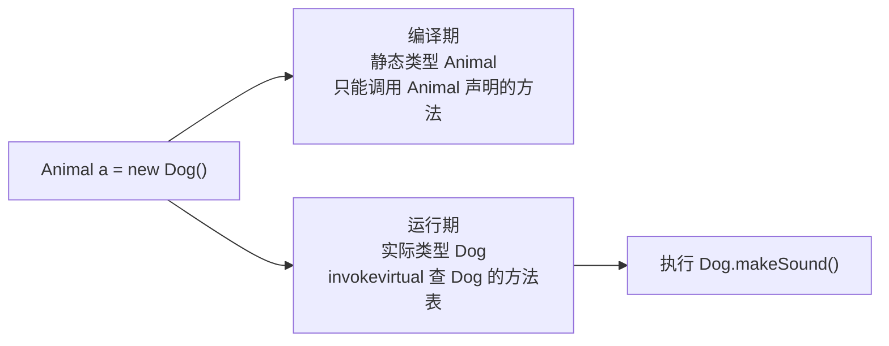
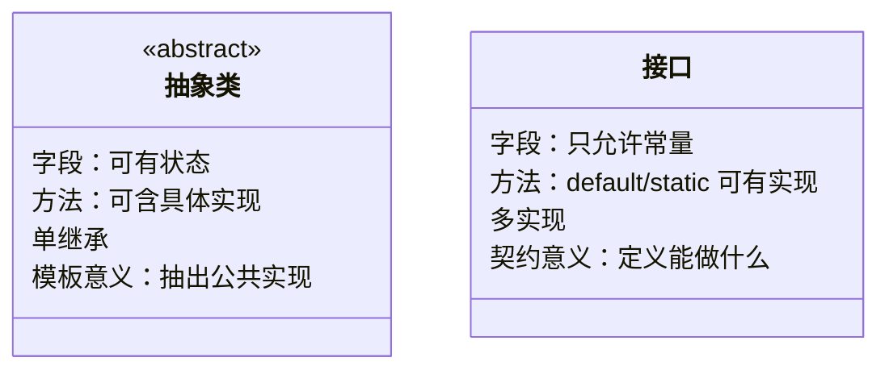

## 封装：隐藏实现，暴露契约

封装不是"把字段私有再加 getter/setter"这么机械——它的本质是**把数据和操作
数据的行为绑定在一起，对外只暴露稳定契约**，内部实现可以随时重构。

```java
public class Account {
    private long balance;          // 余额对外不可直接访问

    public void withdraw(long amount) {
        if (amount <= 0 || amount > balance) {   // 不变量在类内部维护
            throw new IllegalArgumentException("非法取款金额");
        }
        this.balance -= amount;
    }
    public long getBalance() { return balance; }
}
```

如果 `balance` 是 public，"余额不能为负"这个约束就得靠每个调用方自觉——
封装把约束收拢到一处。**判断封装好坏的标准：改内部字段时有多少外部代码要跟着改**。

## 继承：复用的代价

继承实现代码复用，但耦合了父类实现细节。两条纪律：

- **is-a 关系才用继承**（猫 is a 动物）；has-a / can-do 用组合或接口。

- **复合优先于继承**：Java 集合的 `Stack extends Vector` 是经典反面教材，
  继承把 Vector 的所有方法（如按索引插入）都暴露给栈，破坏了后进先出语义。

## 多态：运行时绑定

多态 = 父类引用指向子类对象 + 运行时根据**实际类型**决定调用哪个方法。

```java
Animal a = new Dog();
a.makeSound();   // 输出"汪"——调的是 Dog 的实现
```



多态的底层是 `invokevirtual` 指令：运行期按对象头的实际类型查虚方法表
（vtable），找到的才是真正执行的方法版本。

## 重载与重写

| 维度   | 重载 Overload       | 重写 Override   |
| ---- | ----------------- | ------------- |
| 发生位置 | 同一个类              | 父子类之间         |
| 方法签名 | 同名不同参（参数类型/个数/顺序） | 完全相同          |
| 绑定时机 | **编译期**（静态分派）     | **运行期**（动态绑定） |
| 返回类型 | 可不同               | 相同或协变返回       |
| 访问权限 | 无限制               | 不能比父类更严格      |

一个易错点——重载是编译期按**静态类型**选方法：

```java
class Parent { void hello() {} }
class Child extends Parent { void hello() {} }

Parent p = new Child();
p.hello();   // 调 Child.hello()：重写，看运行期实际类型
```

## 接口与抽象类



| 维度   | 抽象类         | 接口                        |
| ---- | ----------- | ------------------------- |
| 关键字  | extends     | implements                |
| 数量   | 单继承         | 一个类可实现多个                  |
| 成员变量 | 任意          | 只能 public static final 常量 |
| 构造器  | 有           | 无                         |
| 语义   | "是什么"（is-a） | "能做什么"（can-do）            |

选择标准：**要在多个不相关类间共享同一份实现代码 → 抽象类；只定义行为
契约、让实现各玩各的 → 接口**。JDK 8 给接口加了 default 方法后，两者在
语法上的差距缩小，但"状态 + 构造器 + 单继承"仍是抽象类的专属。

接口多继承冲突的规则：类中的方法优先级最高；否则最具体实现的接口（子接口
覆盖父接口）优先；否则必须显式 `接口名.super.method()` 指定。

## 组合优于继承的实战形态

```java
// 继承：Stack 被迫继承 Vector 的全部方法（反面教材）
// 组合：包装既有能力，只暴露需要的接口
public class BetterStack<E> {
    private final ArrayList<E> list = new ArrayList<>();   // 组合

    public void push(E e) { list.add(e); }
    public E pop()      { return list.remove(list.size() - 1); }
    public boolean isEmpty() { return list.isEmpty(); }
    // 不暴露 list 的 insert/remove(index)——栈语义不会被破坏
}
```

## 小结

- 封装维护不变量，继承慎用（is-a + 复合优先），多态靠虚方法表在运行期绑定。

- 重载编译期静态分派、重写运行期动态绑定——两者唯一的共同点是名字像。

- 接口定义契约可多实现，抽象类承载公共状态与模板逻辑，只能单继承。

