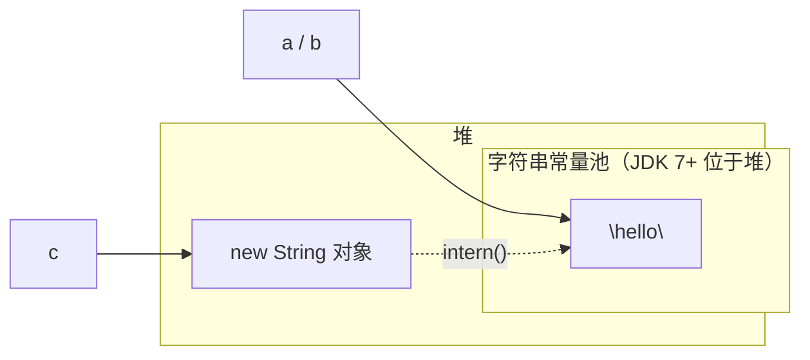

## String 为什么不可变

JDK 9 起 String 内部是 `final byte[] value`（JDK 8 及以前是 `final char[]`），
类本身也被 final 修饰，无法继承篡改：

```java
public final class String implements java.io.Serializable, Comparable<String>, CharSequence {
    private final byte[] value;   // final 引用 + 私有 + 不提供修改入口
    private final byte coder;     // LATIN1 或 UTF16
}
```

三大设计动机：

1. **字符串常量池的前提**：内容不变，才能放心让多个引用指向同一份对象，
   否则一处修改全局遭殃。
2. **线程安全**：不可变对象天然线程安全，无需同步。
3. **hashCode 缓存**：String 极常作为 HashMap 的 key，hash 算一次缓存后
   可反复使用（`private int hash` 字段）。

## 字符串常量池

常量池在 JDK 7 从方法区（永久代）挪到了**堆**中。字面量赋值时，JVM 先查池：

```java
String a = "hello";              // 池中没有 → 创建并入池，a 指向池对象
String b = "hello";              // 池中已有 → b 直接指向同一对象
String c = new String("hello");  // 无论池中有没有，堆里必然新建一个对象

System.out.println(a == b);        // true：同一池对象
System.out.println(a == c);        // false：c 在堆中新开的对象
System.out.println(a == c.intern()); // true：intern 返回池中对象
```



拼接的坑——`+` 拼接两个字面量在**编译期**合并，含变量的拼接在**运行期**
新建对象：

```java
String s1 = "he" + "llo";        // 编译期常量折叠 → "hello"，入池
String s2 = "he"; String s3 = s2 + "llo";   // 运行期 StringBuilder 拼接
System.out.println(s1 == "hello");          // true
System.out.println(s3 == "hello");           // false：堆中新对象
// s3.intern() == "hello" → true
```

## String / StringBuilder / StringBuffer

| 类             | 可变性 | 线程安全                 | 场景          |
| ------------- | --- | -------------------- | ----------- |
| String        | 不可变 | 安全                   | 少量、不变的字符串   |
| StringBuilder | 可变  | 不安全                  | **单线程拼接首选** |
| StringBuffer  | 可变  | 安全（方法加 synchronized） | 多线程拼接（罕见）   |

循环里用 `+` 拼接是经典反模式——每轮都 new 一个 StringBuilder 并生成新
String，产生大量临时对象：

```java
// 反面：循环内 + 拼接，O(n²) 级对象创建
String result = "";
for (int i = 0; i < 1000; i++) result += i;

// 正面：单个 StringBuilder 串联
StringBuilder sb = new StringBuilder();
for (int i = 0; i < 1000; i++) sb.append(i);
String result = sb.toString();
```

`sb.append(i)` 源码返回 `this`，支持链式调用；扩容策略与 ArrayList 类似
（容量翻倍，见 ArrayList 一篇）。

## JDK 9 紧凑字符串

`char` 固定 2 字节，但多数字符串只有 Latin-1 字符（1 字节足够）。JDK 9 起
按内容自动选择 `byte[]` + `coder`：纯 Latin-1 时每字符省一半内存，含中文等
非 Latin-1 字符时退回 UTF-16。对绝大多数业务堆内存是净收益，且对开发者
完全透明——这是"内部实现可变、对外契约不变"的封装范例。

## 小结

- 不可变性换来了常量池、线程安全、hash 缓存三件套。

- 字面量进池、`new String` 必建新对象、含变量的拼接在运行期建新对象。

- 单线程循环拼接用 StringBuilder；StringBuffer 只服务真正的多线程场景。

