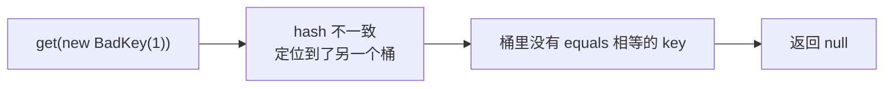

## == 与 equals

- `==`：基本类型比较**值**；引用类型比较**内存地址**（是否同一个对象）。

- `equals`：Object 默认实现就是 `==`，是否比较内容取决于类有没有重写。

```java
Integer a = 127, b = 127;
System.out.println(a == b);    // true：IntegerCache 缓存 -128~127
Integer c = 128, d = 128;
System.out.println(c == d);    // false：超出缓存范围，各自 new 对象
System.out.println(c.equals(d)); // true：Integer 重写了 equals 比较值
```

IntegerCache 的存在正是"包装类 `==` 不可靠"的经典面试题来源——**包装类
之间的比较永远用 equals**。

## equals 的五大约定

重写 equals 必须同时满足（来自 Object Javadoc）：

| 约定  | 含义                             |
| --- | ------------------------------ |
| 自反性 | x.equals(x) 为 true             |
| 对称性 | x.equals(y) 与 y.equals(x) 结果一致 |
| 传递性 | a=b 且 b=c，则 a=c                |
| 一致性 | 未修改前提下多次调用结果不变                 |
| 非空性 | x.equals(null) 恒为 false        |

对称性最容易在**继承体系**中被破坏：Point 重写 equals 只看坐标，ColorPoint
加颜色维度后，`colorPoint.equals(point)` 为 false 而反向为 true。工程解法
是用组合代替继承（ColorPoint 持有一个 Point），或 equals 只认运行时类
（`getClass() != obj.getClass()`）。

## 为什么重写 equals 必须重写 hashCode

**约定：equals 相等的两个对象，hashCode 必须相等。** 反过来不要求（冲突
是允许的）。

违反后果以 HashMap 为证——先按 hash 定位桶，再在桶内用 equals 精确比对：

```java
class BadKey {
    final int id;
    BadKey(int id) { this.id = id; }
    @Override
    public boolean equals(Object o) {
        return o instanceof BadKey k && k.id == id;
    }
    // 没重写 hashCode：用的是 Object 的身份 hash
}

Map<BadKey, String> map = new HashMap<>();
map.put(new BadKey(1), "v");
System.out.println(map.get(new BadKey(1)));   // null！equals 相等但 hash 不同
```



两个 `BadKey(1)` equals 相等，但身份 hash 不同 → 落进不同桶 → get 时
根本走不到 equals 那一步。这就是"equals 与 hashCode 必须成对重写"的全部
原因。

## 标准重写模板

```java
public final class Money {
    private final int amount;
    private final Currency currency;

    @Override
    public boolean equals(Object o) {
        if (this == o) return true;                     // 1. 自判引用，快路径
        if (!(o instanceof Money money)) return false;  // 2. 类型检查（JDK 16 模式匹配）
        return amount == money.amount && currency == money.currency;   // 3. 逐字段比
    }

    @Override
    public int hashCode() {
        int result = Integer.hashCode(amount);
        result = 31 * result + currency.hashCode();     // 31：奇素数 + 可被 JIT 优化成 (h<<5)-h
        return result;
    }
}
```

选字段的依据是"参与 equals 的字段"，而不是"类里所有字段"——比如用
派生字段（缓存的结果）参与 equals 就不必再进 hashCode。

为什么乘 31：奇数避免乘 2 丢弃溢出位后信息重叠、素数降低冲突规律性，
`31 * h == (h << 5) - h` 让 JIT 有位移优化空间。**这只是传统经验值，
不是魔法**——Records 生成的 hashCode 用的策略就不同。

## record 的时代答案

Java 16+ 的 record 自动按**全部成员**生成 equals/hashCode/toString，天然
满足约定，适合纯数据载体：

```java
record Money(int amount, Currency currency) {}   // 以上模板全部免写
```

可变对象做 key 仍是禁忌：key 放入 HashMap 后修改参与 hash 的字段，
对象还留在旧桶里，get 从此找不回。

## 小结

- \== 比地址，equals 是否比内容取决于重写；包装类比较一律 equals。

- 约定核心一条：equals 相等 → hashCode 必相等，否则哈希容器直接失灵。

- record 让纯数据类彻底告别手写模板；可变对象不要做 key。

