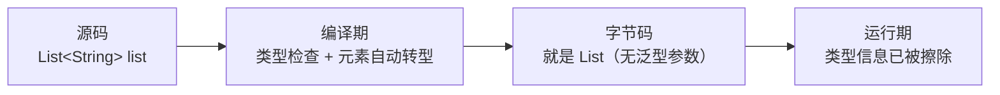

## 泛型解决什么问题

没有泛型的年代，集合装的是 Object，取出来必须强转，类型错误要等到运行期
才爆炸。泛型把类型检查**前移到编译期**，错误在编译时就拦下：

```java
List<String> list = new ArrayList<>();
list.add("hello");
// list.add(42);        // 编译报错，而不是运行期 ClassCastException
String s = list.get(0); // 无需强转
```

## 类型擦除：泛型只活在编译期

Java 泛型是**编译期语法**——编译后类型参数被替换，运行期的字节码里没有
`List<String>`，只有 `List`。证据一：反射绕过编译检查后，运行期照样能塞进去：

```java
List<String> list = new ArrayList<>();
list.getClass().getMethod("add", Object.class).invoke(list, 42);  // 反射调用 add(Object)
System.out.println(list.get(0));   // 42，运行期没有 String 约束
```

证据二：所有参数化类型共享同一个 Class 对象：

```java
new ArrayList<String>().getClass() == new ArrayList<Integer>().getClass()  // true
```



擦除规则：

- 无界类型参数 `<T>` → 擦成 Object。
- 有界 `<T extends Number>` → 擦成边界类型 Number。
- 擦除导致签名冲突时由编译器生成**桥方法**兼容多态。

## 桥方法：擦除后多态怎么保住

```java
class Node<T> {
    void set(T item) {}
}
class StringNode extends Node<String> {
    @Override
    void set(String item) {}   // 子类"真正"重写的是 set(String)
}
```

擦除后父类只剩 `void set(Object)`，而子类是 `void set(String)`——签名不同，
按方法签名规则这是重载不是重写，多态会失效。编译器的解法是给 StringNode
偷偷合成桥方法：

```java
// 编译器生成的桥方法（javap -v 可见）
void set(Object item) { set((String) item); }
```

调用 `node.set(obj)` 时虚方法表命中桥方法，桥方法内部强转再调真正的
`set(String)`——泛型多态在擦除世界里被这套机制完整救了回来。

## 通配符与 PECS

泛型不是协变的：`List<Object>` 不是 `List<String>` 的父类（否则就能把
Integer 塞进"String 列表"）。需要弹性时用通配符，方向遵循 **PECS**：
Producer Extends, Consumer Super。

```java
// src 是生产者：我只从里面读（生产）数据 → extends
static double sum(List<? extends Number> src) {
    double total = 0;
    for (Number n : src) total += n.doubleValue();  // 读出来的至少是 Number
    // src.add(1);  // 编译禁止：不知道具体是什么类型的列表，写入不安全
    return total;
}

// dst 是消费者：我只往里面写（消费）数据 → super
static void fillInts(List<? super Integer> dst) {
    dst.add(1); dst.add(2);   // Integer 可以安全写入 Integer 或其父类的列表
    // Number n = dst.get(0); // 编译禁止：读出来只能保证是 Object
}
```

| 通配符 | 读 | 写 | 场景 |
|---|---|---|---|
| `? extends T` | 返回 T | 禁止 | 从容器取数据（生产者） |
| `? super T` | 返回 Object | 写 T | 往容器放数据（消费者） |
| `?` | 返回 Object | 禁止 | 只关心容器本身，如清空 |

JDK 里的现成例子：`Collections.copy(List<? super T> dest, List<? extends T> src)`
——src 是生产者，dest 是消费者，一次集齐两种通配符。

## 泛型数组与数组协变

数组是协变的（`Object[] objs = new String[1]` 合法），所以运行期存了
错误类型会抛 ArrayStoreException——泛型设计者认为这不安全，因此
**不能创建泛型数组**：`new T[10]`、`new List<String>[10]` 都非法。
工程上用 `List<List<String>>` 或 `(T[]) new Object[10]`（配合注解压制
警告）替代。

## 小结

- 泛型是编译期检查，字节码里没有类型参数——反射与原始类型是漏网之鱼。
- 桥方法补齐了擦除后的多态裂缝，`javap -v` 可以亲眼看到。
- 通配符方向背 PECS：生产者 extends 只读，消费者 super 只写。
