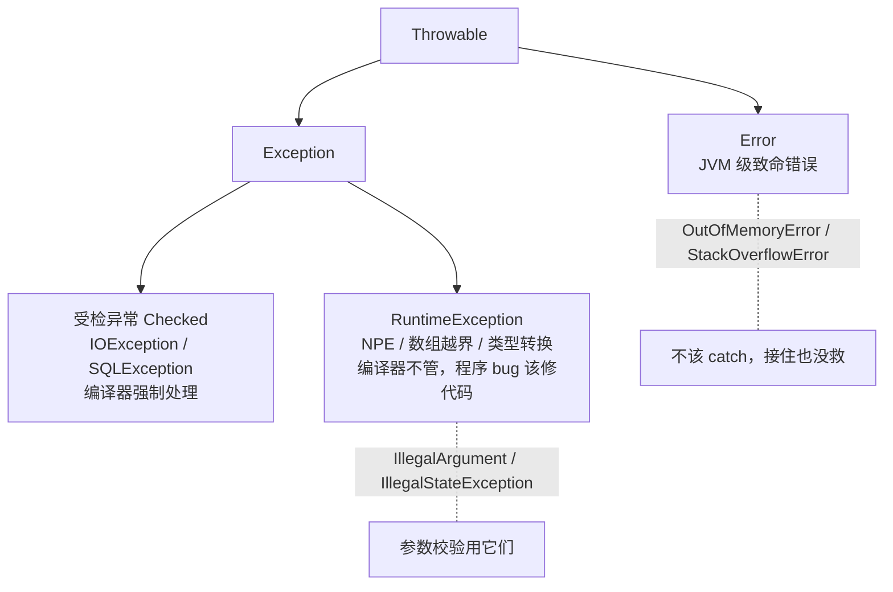

## 异常层次结构



- **Error**：JVM 层面的错误（OOM、栈溢出），应用无法恢复，不要 catch。
- **受检异常**：调用方**有能力恢复**的外部问题（文件不存在、网络断了），
  编译器强制 try/catch 或向上抛。
- **RuntimeException**：程序 bug（NPE、越界、非法参数），修代码而不是接异常。

设计原则：**能恢复就抛受检异常，是 bug 就抛运行时异常，JVM 坏了抛 Error**。

## finally 的执行真相

finally 几乎总会执行，但**精确语义**常被问：

```java
static int test() {
    try {
        return 1;            // 返回值 1 在此处压入操作数栈
    } finally {
        return 2;            // finally 的 return 会覆盖 try 的返回值（反模式）
    }
}
// 结果：2

static int modify() {
    int x = 1;
    try { return x; }        // x=1 已拷贝进返回槽
    finally { x = 3; }        // 改的是局部变量，改不到返回槽
}
// 结果：1（不是 3）
```

顺序：`try return → 计算返回值暂存 → finally 执行 → 用暂存值返回`。
finally 里写 return / throw 会吞掉 try 里原始的返回值或异常，阿里规约
明令禁止。

**唯一不执行 finally 的路径**：`System.exit()` 或 JVM 崩溃（如 OOM 杀进程）。

## try-with-resources

任何实现 `AutoCloseable` 的资源都可以自动关闭，比 finally 手写关闭更安全
（不吞异常、不写错顺序）：

```java
try (var in = new BufferedReader(new FileReader("data.txt"));
     var out = new BufferedWriter(new FileWriter("out.txt"))) {   // 多资源分号分隔
    String line = in.readLine();
    out.write(line);
}   // 无需手写 close：资源按声明的【逆序】自动关闭
```

抑制异常机制：try 块抛出主异常后，close() 再抛异常时，后者作为
suppressed 附在主异常上（`e.getSuppressed()` 可取），而不是顶替主异常
——这正是手写 finally 关闭资源时最容易丢信息的场景。

## 异常性能与最佳实践

- 构造异常要抓取整条调用栈（`fillInStackTrace`），**成本不低**，不要用
  异常做流程控制（比如用异常跳出循环）。
- 需要高频复用同一类异常时，可覆写 `fillInStackTrace()` 返回缓存实例，
  JDK 内部的 NumberFormatException 等就用了类似思路。

实践清单：

| 场景 | 做法 |
|---|---|
| 参数校验 | `IllegalArgumentException` / `IllegalStateException` |
| 调用方能恢复 | 自定义受检异常，携带错误上下文 |
| 丢失原异常信息 | catch 后重新抛出要 `throw new XxxException("msg", e)` 带上 cause |
| 吞异常 | 禁止空 catch；至少记日志并说明为何可以忽略 |
| finally 中 return | 禁止，会覆盖 try 的返回值 |

自定义异常只需选择阵营并保留链路：

```java
// 业务异常：让调用方明确知道该处理什么
public class InsufficientBalanceException extends RuntimeException {
    public InsufficientBalanceException(String msg, Throwable cause) {
        super(msg, cause);   // 带上 cause，异常链不断
    }
}
```

## 小结

- 三分法：Error 不接、受检异常可恢复、运行时异常是 bug 信号。
- finally 在返回值暂存之后执行，里面的 return 会劫持返回值——别这么写。
- try-with-resources 逆序关闭 + 抑制异常机制，是资源管理的默认答案。
