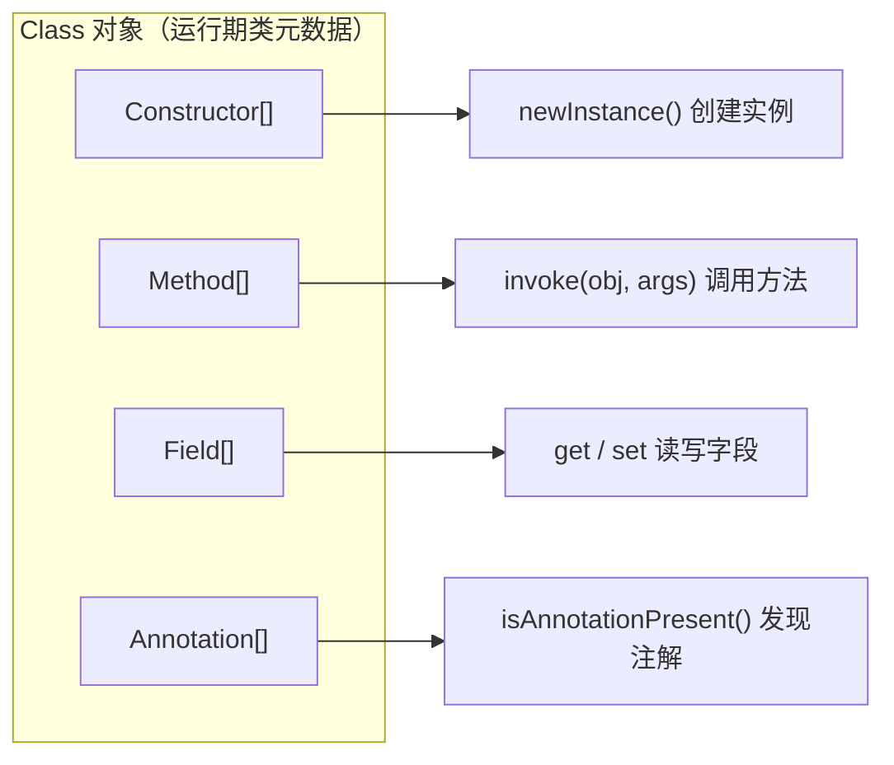
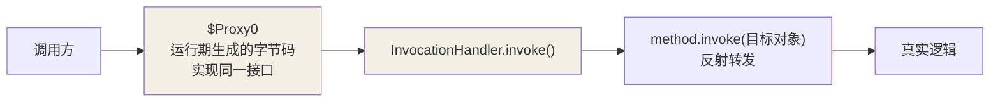

## 反射：运行期解剖类

反射让程序在**运行期**拿到任意对象的类信息并操作成员——框架能力的基石：
Spring 的依赖注入、MyBatis 的 Mapper 接口代理、JUnit 的 @Test 发现，
全部建立在反射之上。

### 获取 Class 的三种方式

```java
Class<?> c1 = String.class;                    // 类字面量：编译期已知，无初始化
Class<?> c2 = "hello".getClass();             // 对象实例：运行期最常用
Class<?> c3 = Class.forName("java.lang.String");  // 全限定名：配置驱动（按名字加载）
```

`Class.forName` 会触发类初始化（执行 static 块），类字面量不会——框架
"按配置类名加载"时用的就是前者。

### 反射 API 全景

```java
Class<?> clazz = Class.forName("com.demo.User");

Constructor<?> ctor = clazz.getConstructor(String.class);   // 构造器
Object user = ctor.newInstance("tom");                        // 创建实例

Method m = clazz.getMethod("getName");                        // 公有方法（含继承）
m.setAccessible(true);                                        // 突破 private（看模块权限）
Object name = m.invoke(user);                                 // 调用方法

Field f = clazz.getDeclaredField("age");                      // 字段（含私有）
f.setAccessible(true);
f.set(user, 18);                                              // 直接写字段
```



`getMethod` 只取公有方法（含继承），`getDeclaredMethod` 能拿到私有但不含
继承——这对方法在类初始化时会解析出所有方法对象的镜像。

代价：反射调用比直接调用慢（早期 JIT 难内联），高频路径可用 `MethodHandle`
或缓存 Method 对象缓解；同时它破坏封装（setAccessible），属于"框架的特权，
业务代码慎用"。

## 注解：给类贴机器可读的标签

注解本身不做事——它只是**贴在代码上的元数据**，等反射或其他工具来读：

```java
@Retention(RetentionPolicy.RUNTIME)   // 保留到运行期（反射可见的前提）
@Target(ElementType.METHOD)          // 只能贴在方法上
public @interface RunTwice {
    int times() default 2;            // 注解属性，带默认值
}
```

| Retention | 存活期               | 消费者                          |
| --------- | ----------------- | ---------------------------- |
| SOURCE    | 只在源码，编译即丢弃        | 编译器 / Lint（如 @Override）      |
| CLASS     | 进 class 文件，运行期不可见 | 字节码工具（ASM、APT 产物）            |
| RUNTIME   | 运行期反射可读           | 框架（Spring / JUnit / MyBatis） |

框架处理注解的标准姿势：

```java
for (Method m : clazz.getDeclaredMethods()) {
    if (m.isAnnotationPresent(RunTwice.class)) {        // 发现标签
        RunTwice cfg = m.getAnnotation(RunTwice.class);  // 读取配置
        for (int i = 0; i < cfg.times(); i++) {
            m.invoke(instance);                          // 反射驱动执行
        }
    }
}
```

## 反射的巅峰应用：动态代理

代理模式在**不改目标类**的前提下织入增强逻辑（日志、事务、缓存）。
JDK 动态代理 = 接口 + `Proxy.newProxyInstance` + `InvocationHandler`：

```java
interface UserService { void save(String name); }

UserService raw = name -> System.out.println("保存用户: " + name);

UserService proxy = (UserService) Proxy.newProxyInstance(
    raw.getClass().getClassLoader(),
    raw.getClass().getInterfaces(),                 // JDK 代理只认接口
    (p, method, args) -> {
        System.out.println("[前置] 调用 " + method.getName());
        Object result = method.invoke(raw, args);   // 反射调真实对象
        System.out.println("[后置] 完成");
        return result;
    });

proxy.save("tom");
// [前置] 调用 save → 保存用户: tom → [后置] 完成
```



- **JDK 动态代理**：基于接口，`$Proxy0` 是运行期生成的类，实现目标接口并把
  每个方法调用转发给 InvocationHandler。

- **CGLIB**：基于继承，生成目标类的子类覆盖方法（final 类/方法不行）。
  Spring 的 `@Transactional` 默认接口用 JDK 代理、无接口时回退 CGLIB。

MyBatis 的 Mapper 没有实现类却能源源不断执行 SQL——正是动态代理：
接口方法调用被拦截到 MapperProxy，方法名与注解被翻译成 SQL 执行。

## 小结

- 反射是运行期解剖类的窗口：Class → Constructor/Method/Field，框架的一切
  "自动化"由此展开。

- 注解是元数据，Retention 决定它活到哪个阶段；RUNTIME + 反射 = 框架标配。

- JDK 动态代理走接口 + InvocationHandler，CGLIB 走继承——Spring 事务、
  MyBatis Mapper 的原理都是这一套。

