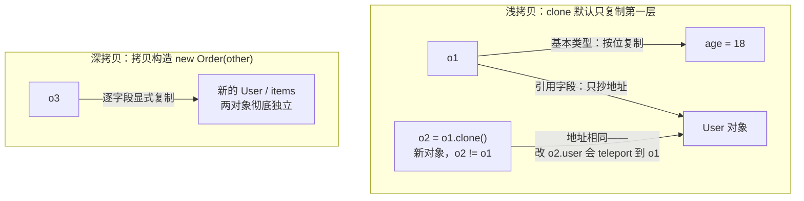

import AlgorithmVizIsland from '../../../../../components/viz/AlgorithmVizIsland.astro';

## Object 的家底：每个方法都可能是考点

所有类隐式继承 `Object`，它的 11 个方法分三派：

| 派系 | 方法 | 一句话 |
|---|---|---|
| 个体识别 | `equals`/`hashCode`/`toString`/`getClass` | 身份契约，[已专篇展开](/java/basic/syntax/03-equals-hashcode/) |
| 并发协作 | `wait`/`notify`/`notifyAll` | 必须在 `synchronized` 块内调（否则 `IllegalMonitorStateException`），monitor 的等待/唤醒 |
| 复制与善后 | `clone`/`finalize` | 本篇主角；finalize 已废弃，善后用 try-with-resources |

`wait/notify` 底层是对象头的 monitor（重量级锁的
`ObjectMonitor`，见[对象布局](/java/advanced/jvm/05-object-layout/)）——
**为什么是"对象的"方法却要配 synchronized**：等待队列挂在对象
monitor 上，不持锁就无权入队。

## 浅拷贝：clone 默认只复制"第一层"

```java
public class Order implements Cloneable {
    User user;                       // 引用字段
    List<Item> items;                // 引用字段

    @Override
    public Order clone() {           // 不覆写则 protected 且抛异常
        try { return (Order) super.clone(); }
        catch (CloneNotSupportedException e) { throw new AssertionError(e); }
    }
}
// Order o2 = o1.clone();
// o2 != o1（新对象），但 o2.user == o1.user、items 是同一个 List！
// 改 o2.items 会" teleport "到 o1 身上
```

浅拷贝 = 按位复制基本类型字段 + **引用字段只抄地址**。`Cloneable`
是个空标记接口（不用 `clone` 的正确性靠运行时检查），设计上广受
诟病。

浅拷贝共享引用的现场，与深拷贝的对照：



## 深拷贝三法

| 方法 | 思路 | 评价 |
|---|---|---|
| 递归 clone | 每个引用字段也 clone，层层覆写 | 可控但代码噪音大，字段一改全链要改 |
| **序列化法** | JSON 或 Java 序列化走一圈，天然全量复制 | 无脑但慢，对象图有环会炸；见[序列化](/java/basic/syntax/08-serialization/) |
| **拷贝构造/工厂** | `new Order(other)` 逐字段显式复制 | **Effective Java 推荐**：不依赖神秘机制，字段可见、可控、可测 |

三法同框——按可控性与成本挑：

<AlgorithmVizIsland demo="deep-copy-ways" />

业务代码默认选第三种，等真正高频调用再考虑手写深拷贝优化。

## 包装类型缓存：== 陷阱的标准出处

自动装箱 `Integer.valueOf()` 对常用小值做了**缓存池**：

```java
Integer a = 127, b = 127;
Integer c = 128, d = 128;
System.out.println(a == b);   // true  ——缓存池里同一个对象（-128 ~ 127）
System.out.println(c == d);   // false ——超出缓存，各自 new
System.out.println(c.equals(d));  // true  ——永远比内容
```

- 缓存范围：`Integer`/`Short`/`Byte`/`Character`(-128~127 或 0~127)、
  `Boolean`（TRUE/FALSE 两个实例）、`Long` 同 Integer；**`Double`/`Float`
  不缓存**（小数无限枚举不了）。
- 缓存上限可以用 `-XX:AutoBoxCacheMax` 调（只对 Integer）。
- 一切包装类型比较**必须 equals**；这也是[对象布局](/java/advanced/jvm/05-object-layout/)
  里包装类型内存开销话题的姐妹篇——小整数装箱既是内存刺客又是
  陷阱制造机。

反方向注意：`int` 与 `Integer` 混合 `==` 时会发生**拆箱**（`Integer` 为
null 直接 NPE），三目运算符里类型不齐也会触发隐式拆箱。

## 小结

- Object 三派方法：身份契约（equals/hashCode 有专篇）、monitor 协作
  （wait/notify 必须持锁）、复制善后（clone/finalize）。
- clone 是浅拷贝：引用字段只抄地址，深拷贝首选**拷贝构造**显式
  写，序列化法方便但有环与性能问题。
- 包装类型 `==` 陷阱来自 -128~127 缓存池：同一池内比地址碰巧 true，
  超池即 false——**包装类型永远 equals**，混合运算防 NPE 拆箱。
