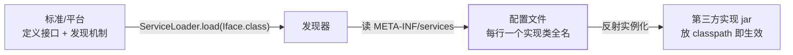

## API 与 SPI：谁来定义，谁来发现

面向接口编程的死角：调用方拿到接口容易，**实现类从哪来**？写死
`new MysqlDriver()` 就把"可插拔"焊死了。SPI（Service Provider
Interface）把答案标准化：

- **API**：服务调用方使用、提供方实现，**接口由提供方定义**的视角；
- **SPI**：接口由**平台/标准定义**，实现由第三方插进来——标准定契约，
  生态填实现。



## JDK ServiceLoader：约定即协议

SPI 全程没有接口、没有 API，只有一个**文件位置约定**：

```java
// 1. 平台/框架定义接口
public interface Serializer { byte[] serialize(Object o); }

// 2. 实现 + 登记文件：META-INF/services/com.demo.Serializer
//    文件内容（每行一个实现类全名）：
//    com.demo.JsonSerializer
//    com.demo.HessianSerializer

// 3. 使用方发现并使用
ServiceLoader<Serializer> loader = ServiceLoader.load(Serializer.class);
for (Serializer s : loader) {          // 懒加载：迭代到才实例化
    System.out.println(s.getClass());
}
```

要点：实现类必须有** public 无参构造器**（ServiceLoader 只会这么
new）；迭代是懒实例化；JDK 9 后可用 `stream()` + `Provider` 静态
工厂绕开无参构造限制。懒加载的本质是**反射按名造对象**
（反射基础见[反射与注解](/java/basic/syntax/06-reflection-annotation/)）。

## 经典现场：JDBC 驱动加载

`Class.forName("com.mysql.jdbc.Driver")` 是老一代写法——JDBC 4.0
起**这行可以不写**：mysql-connector 的 jar 里带着
`META-INF/services/java.sql.Driver`，`DriverManager` 静态初始化时
用 ServiceLoader 扫描 classpath，自动注册所有驱动。

这里藏着[双亲委派](/java/advanced/jvm/01-class-loading/)的经典
死结：`DriverManager` 在 rt.jar（Bootstrap 加载），**看不见**
classpath 里的驱动类。解法是线程上下文类加载器"反向委派"——
SPI 与类加载的交叉点，正是面试最爱追问的闭环。

## Spring Boot：把 SPI 用成了自动配置

Spring 没直接用 JDK SPI，而是自己做了两代"增强版 SPI"：

| 代际 | 机制 | 登记文件 |
|---|---|---|
| Spring Boot 2.7 前 | `SpringFactoriesLoader` | `META-INF/spring.factories` |
| 2.7+ / 3.x | `ImportCandidates` 约定 | `META-INF/spring/org.springframework.boot.autoconfigure.AutoConfiguration.imports` |

与 JDK SPI 的两点差别：**值不是实现类而是配置类/选择器**（配合
条件注解按环境装配），且与 `@Import` 机制打通——完整链路见
[Spring Boot 自动配置原理](/java/intermediate/spring/05-springboot-autoconfig/)。
Spring Cloud（OpenFeign 的编解码器、Gateway 的谓词工厂）、
springdoc 等生态组件的可插拔都走这条路。

## Dubbo SPI：Java SPI 的"重新发明"

JDK SPI 的短板：全量实例化（一个实现坏全链崩）、无按名获取、无
依赖注入。Dubbo 自研 SPI（`META-INF/dubbo/` 目录 + 键值对格式）补齐
**按 key 自适应加载、AOP 包装、IOC 注入**——这是"标准 SPI 不够用就
自建"的代表案例。

## 什么时候自己用 SPI

判断标准：**框架/库作者想让第三方扩展，而不想让扩展点侵入核心
代码**。业务应用内部"多实现选择"优先用 Spring 的
`Map<String, Iface>` 注入或策略模式——SPI 是给"跨 jar 的插件生态"
准备的，业务单体里用它属于过度设计。

## 小结

- SPI = 接口契约 + `META-INF/services` 文件约定 + ServiceLoader
  反射实例化，实现方"放 jar 即接入"。
- JDBC 4 起驱动自动注册靠它，背后是上下文类加载器打破双亲委派的
  配合戏。
- Spring Boot 两代 SPI（spring.factories → AutoConfiguration.imports）
  是自动配置的入口；Dubbo SPI 演示了标准不够用时的自建姿势。
- 用途边界：插件生态用 SPI，应用内多实现用容器注入/策略模式。
