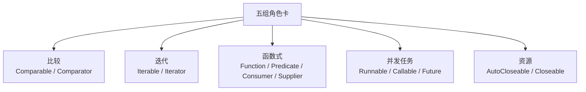

## 为什么单开一篇

JDK 里散布着一批"角色卡"接口：集合、并发、IO、Stream 的设计全是
围绕它们展开的。**认识角色，才能读懂结构**——看懂 `TreeMap` 为什么
要求 Comparable、线程池为什么收 Runnable/Callable、try-with-resources
凭什么自动 close，都在这一篇串起来。



## 比较：Comparable vs Comparator

| | Comparable | Comparator |
| --- | --- | --- |
| 定位 | **自然顺序**（类自己会比） | **外部顺序**（比较器临场定规则） |
| 方法 | `compareTo(T o)` | `compare(T a, T b)` |
| 侵入性 | 实现在类内部，写死 | 实现在类外部，可传多个 |
| 谁在用 | TreeMap、Arrays.sort(默认) | sort 传参、PriorityQueue 传参 |

约定俗成：`o1.compareTo(o2)` 负数表示 o1 排前面，升序写
`Integer.compare(a, b)`。JDK 8 起外部比较器有链式写法：

```java
Comparator<User> c = Comparator.comparing(User::getAge)
        .thenComparing(User::getName).reversed();
```

**一致性问题**：compareTo 与 equals 最好保持一致——TreeSet/TreeMap
去重与排序**只看 compareTo**。经典坑：`BigDecimal("1.0")` 与
`BigDecimal("1.00")` equals 不等但 compareTo 为 0，放进 TreeSet 只剩
一个（对比关系见 [==、equals 与 hashCode](/java/basic/syntax/03-equals-hashcode/)）。

## 迭代：Iterable vs Iterator

- `Iterable<T>`："我**可以被**遍历"，提供 `iterator()`。实现它就能用
  for-each——for-each 本质是编译器生成的 `iterator()` + while(hasNext)。
- `Iterator<T>`："我是**遍历器本身**"，hasNext/next/remove 逐元素游走。

自己写集合容器时，实现 Iterable 并在内部持有一个 Iterator 实现即可
接入整个 for-each 生态。两个必考行为：

- **fail-fast**：ArrayList 的 iterator 记录 modCount，遍历期间结构被改
  （add/remove）就抛 `ConcurrentModificationException`——所以遍历删除
  要用 `iterator.remove()` 或 removeIf，不能 `list.remove()`。
- **fail-safe**：CopyOnWriteArrayList 遍历的是创建时的快照，不抛异常但
  看不到最新修改（对比见[并发工具类](/java/intermediate/concurrent/10-concurrent-tools/)）。

## 函数式：四大接口

`@FunctionalInterface` 只是声明"一个抽象方法"（方便编译器校验），真正
的核心是这四个角色，Stream 的每个参数位都是它们（用法见
[Stream 原理](/java/intermediate/stream/01-stream-principle/)）：

| 接口 | 抽象方法 | 语义 | 例子 |
| --- | --- | --- | --- |
| `Function<T,R>` | `R apply(T)` | 进 T 出 R | `map(String::length)` |
| `Predicate<T>` | `boolean test(T)` | 判断 | `filter(x -> x > 0)` |
| `Consumer<T>` | `void accept(T)` | 只进不出 | `forEach(System.out::println)` |
| `Supplier<T>` | `T get()` | 只出不进 | 工厂、`Optional.orElseGet` |

补充两笔：`UnaryOperator/BinaryOperator` 是 Function 的同型特化；int/
long/double 有 `IntFunction` 等特化版本，热点路径用它避免装箱。方法
引用四种形态（静态、实例绑定、实例未绑定、构造器引用）本质都是
Lambda 的语法糖。

## 并发任务：Runnable vs Callable

| | Runnable | Callable<V> |
| --- | --- | --- |
| 方法 | `void run()` | `V call()` |
| 返回值 | 无 | 有 |
| 受检异常 | 不能抛 | 可以抛 |
| 谁直接收 | `new Thread(r)`、execute | 只能交给 submit（包成 FutureTask） |

`new Thread` 只认 Runnable（没有返回值的概念）；线程池的 `submit`
两个都收，返回 `Future<V>` 用 `get()` 取结果、捕获执行期异常——
`execute` 跑 Runnable 时异常直接进 UncaughtExceptionHandler，`submit`
的异常**藏在 Future 里**，不 get 就没人知道。异步编排的升级版见
[CompletableFuture](/java/intermediate/concurrent/11-completablefuture/)。

## 资源关闭：AutoCloseable vs Closeable

```java
try (var in = new FileInputStream(src);    // 声明即托管
     var out = new FileOutputStream(dst)) {
    in.transferTo(out);
}   // 编译器自动生成 finally + close，且逆序关闭
```

- `AutoCloseable`（JDK 7）：try-with-resources 的入场券，close 可抛
  `Exception`。
- `Closeable`（JDK 5，老的）：extends AutoCloseable，close 收窄为
  `IOException`，并要求 **close 幂等**（多次调用无害）。
- 两个体面细节：资源按声明**逆序**关闭（后开的先关，符合栈语义）；
  try 块和 close 各抛异常时，close 的异常**不会顶掉**主异常而是
  `addSuppressed` 挂在旁边——手写 finally 时代 catch 里吞掉的主异常
  就是这么丢的。

## 抽象类 vs 接口：选型边界

| | 抽象类 | 接口 |
| --- | --- | --- |
| 定位 | **是什么**（is-a，共享骨架） | **能做什么**（can-do，能力契约） |
| 字段 | 任意实例字段（能存状态） | 只能 public static final 常量 |
| 方法 | 可含具体实现与构造器 | 抽象为主，JDK 8 后有 default/static 方法 |
| 继承 | 单继承 | 多实现 |
| 典型 | 模板方法骨架（AbstractList） | 能力标志（Comparable、Iterable、Serializable） |

default 方法让接口有了"部分实现"，但**状态始终是抽象类的专属**——
"子类们共享字段与模板流程"选抽象类，"彼此无关的类拥有同一能力"选
接口。JDK 自己的示范：`AbstractList`（骨架复用）与 `List`（契约）各司
其职，框架里 `HttpServlet` 的 service 模板同样是抽象类套路。

## 小结

- Comparable 是类内自然顺序、Comparator 是类外规则；compareTo 要与
  equals 一致，TreeSet 只认 compareTo。
- Iterable 接入 for-each，Iterator 是遍历器；fail-fast 抛异常护安全，
  fail-safe 拿快照换稳定。
- 四大函数式接口覆盖 Stream 的所有参数位；Runnable/Callable 差在
  返回值与异常，submit 的异常藏在 Future 里要 get 才现形。
- AutoCloseable 驱动 try-with-resources：逆序关闭、异常 suppressed；
  有状态选抽象类，立能力契约选接口。
