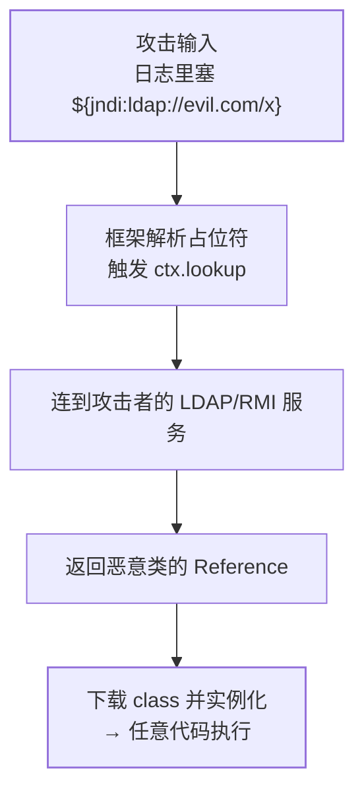

## 两个缩写，一个套路

JNI 和 JNDI 都是 Java 平台的"对外接口"：**JNI 向内对接本地代码**（C/C++
动态库），**JNDI 向外对接命名服务**（按名字找对象）。日常业务很少
手写，但排查性能问题、对接底层库、理解安全漏洞（Log4Shell）都绕不开
这两个名字。

## JNI：Java 与本地代码的桥

**JNI（Java Native Interface）**是 JVM 的官方约定，让 Java 代码调用
C/C++ 实现，也让本地代码回调 Java。JDK 自己就是最大用户：`Object` 的
`hashCode`/`clone`、`Thread` 的底层启动、`Unsafe` 的原子操作，全是
native 方法。

标准四步：

```java
public class HashNative {
    static { System.loadLibrary("hashlib"); }  // ④ 加载 libhashlib.so / .dylib / .dll
    public native long hash(byte[] data);  // ① 声明 native 方法
}
```

```bash
javac -h . HashNative.java      # ② 生成 JNI 头文件（JDK 8+ 用 javac -h）
gcc -shared -fPIC hash.c \      # ③ 按头文件实现，编译成动态库
    -o libhashlib.so
```

运行期 JVM 通过函数表把调用翻译进动态库，本地代码里再用
`JNIEnv` 反过来操作 Java 对象（取字段、回调方法、抛异常）。

**为什么用它**：榨取极致性能（加解密、压缩、编解码）、复用成熟的 C
库（OpenSSL、FFmpeg）、调用操作系统特有能力。**代价也明确**：

| 代价 | 说明 |
| --- | --- |
| 破坏跨平台 | 每个平台要编一份动态库、随包分发 |
| 内存失控 | 本地内存不受 GC 管，忘了 free 就是泄漏 |
| 连坐崩溃 | 本地代码段错误直接挂掉整个 JVM，无堆栈可看 |

## JNA：不写 C 胶水的替代

**JNA（Java Native Access）**把 JNI 的胶水层包掉了：声明一个接口映射
动态库导出函数，运行期靠 libffi 动态绑定，头文件、C 代码全省：

```java
public interface CLib extends Library {
    CLib INSTANCE = Native.load("c", CLib.class);
    long strtol(String s, Pointer[] endp, int base);   // 直接映射 C 函数
}
```

| | JNI | JNA |
| --- | --- | --- |
| 胶水代码 | 头文件 + C 实现，量大 | 无，接口映射 |
| 性能 | 最优 | 略低（多一层动态转发） |
| 适用 | 性能敏感、深度交互 | 快速对接现成 C 库 |

原则：能用 JNA 就不用手写 JNI；只有性能压到极限才下沉。

## JNDI：按名字找对象

**JNDI（Java Naming and Directory Interface）**是一套"给对象起名字、
再按名字查找"的统一 API，底层可对接 RMI、LDAP、DNS 等多种服务：

```java
Context ctx = new InitialContext();
DataSource ds = (DataSource) ctx.lookup("java:comp/env/jdbc/mysql");
```

经典用途是 **Java EE/Tomcat 场景下的数据源**：连接池在容器层配置好，
应用按 JNDI 名查找使用，改数据库配置不用动应用。Spring 里的对应物是
`JndiObjectFactoryBean` / `JndiTemplate`（FactoryBean 模式见
[Spring 扩展点](/java/intermediate/spring/06-extension-points/)）。
微服务时代配置中心接管了这类需求，JNDI 的日常戏份变少，但它作为
** lookup 机制**留在了历史与漏洞史里。

## JNDI 注入：lookup 不可信字符串的代价

`lookup` 的目标如果来自不可信输入，攻击者可以把名字指向**恶意 RMI/
LDAP 服务**：旧版本 JDK 会顺从地按 Reference 下载远程类并实例化——
加载即执行任意代码。



标志性事件是 **Log4Shell（CVE-2021-44228，2021）**：Log4j2 对日志内容
做 `${...}` 占位符解析，一行日志就能触发 JNDI lookup，全网受影响。
加固后的 JDK（8u191+ 默认）关掉了远程 codebase 加载，但原则不变：

- **永远不要把不可信字符串交给 lookup / 日志的 JNDI 解析**；
- 保持日志框架与 JDK 版本更新，能关的 lookup 功能都关掉。

## 小结

- JNI 是官方本地调用桥：native 声明 → javac -h → C 实现 →
  loadLibrary；性能最强但破坏跨平台、内存自管、崩溃连坐。
- JNA 用接口映射 + libffi 省掉胶水代码，是接现成 C 库的首选。
- JNDI 是"按名字查对象"的统一 API，数据源查找是经典用途；lookup
  不可信输入会演变成远程类加载 RCE（Log4Shell），安全底线是
  不信任任何外部拼进 lookup 的字符串。
