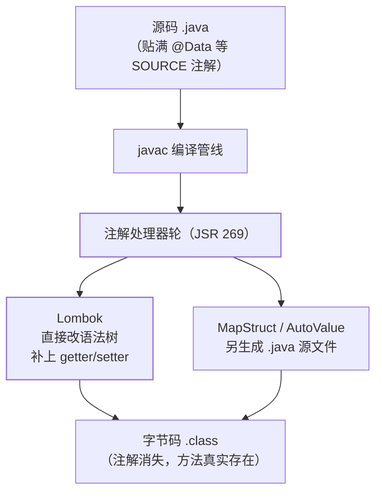

## 注解的第三种消费方式

[反射与注解](/java/basic/syntax/06-reflection-annotation/)讲的是
**RUNTIME 注解**靠反射消费；Lombok 走另一条路——**SOURCE 保留 +
编译期处理**：class 文件里根本没有这些注解，它们在编译时就变成了
真实的字节码。



APT 两派记法：**Lombok 改语法树**（你写的类"凭空多出方法"），
**MapStruct 生成新文件**（编译产物多一个 Impl 类）——效果不同，
原理同源：都是 javac 的注解处理轮。

## 常用注解展开速查

| 注解 | 展开成什么 | 备注 |
| --- | --- | --- |
| `@Getter` / `@Setter` | getter/setter | 可标在字段或类上 |
| `@RequiredArgsConstructor` | final/@NonNull 字段的构造器 | **构造器注入的省略姿势**（见下） |
| `@NoArgsConstructor` / `@AllArgsConstructor` | 空/全参构造器 | 全参顺序按字段声明序，调字段序会破坏调用方 |
| `@Data` | Getter+Setter+ToString+EqualsAndHashCode+RequiredArgsConstructor | 组合拳，JPA 实体上慎用 |
| `@Builder` | 建造者模式的链式 API | 加了它就没有无参构造，需再标 @NoArgsConstructor |
| `@Slf4j` | `private static final Logger log = ...` | 日志门面绑定见[日志体系](/java/intermediate/log/01-logging-system/) |
| `@SneakyThrows` | 把受检异常包装成不检查异常偷偷抛 | 慎用：吞掉了异常的"提示义务" |

构造器注入与 Lombok 的经典组合——字段标 final，注入零样板：

```java
@Service
@RequiredArgsConstructor
public class OrderService {
    private final PaymentService payment;  // 构造器注入（Spring 4.3+ 单构造器免 @Autowired）
    private final OrderRepository repo;
}
```

## 经典坑位

- **@EqualsAndHashCode 与继承**：默认只比较本类字段、不调 super——
  子类和父类"全等"。有继承关系要显式 `@EqualsAndHashCode(callSuper = true)`。
- **@Data 上 JPA 实体**：自动生成的 hashCode 若把关联集合算进去，
  在懒加载/持久化上下文里会出 `LazyInitializationException` 或
  hashCode 不稳定——实体手写 equals/hashCode 或只基于业务主键。
- **@Builder 与无参构造**：@Builder 会生成全参构造、吞掉默认构造器，
  反序列化框架（Jackson/JPA）找不到无参构造就报错——常见解法
  `@Builder + @NoArgsConstructor + @AllArgsConstructor` 三连。
- **IDE 与 JDK 兼容**：Lombok 深度依赖 javac 内部 API（改语法树），
  大版本 JDK 升级常出"IDE 编译报红/编译不过"，需要 Lombok 同步升级——
  这是"改语法树"这一派的原罪。

## 什么时候别用

生成的代码"看不见"：排查问题时打开 class 文件与源码对不上，新人
困惑 getter 从哪来。团队里保持克制——**@Slf4j、@RequiredArgsConstructor、
@Getter/@Setter 是高频安全区；@Data 上实体、@SneakyThrows 是常见
事故源**。Lombok 的价值是消灭纯机械样板，不是消灭"写代码"。

## 小结

- 注解三种消费阶段：SOURCE 编译期处理（Lombok/MapStruct）、CLASS
  字节码工具、RUNTIME 反射（Spring/JUnit）——Retention 决定命运。
- APT 两派：改语法树（Lombok，方法凭空出现）与生成新文件
  （MapStruct，产物多一个 Impl）。
- 高频坑：@Data 继承不调 super、@Builder 吞无参构造、实体上 @Data
  的 hashCode 隐患。
