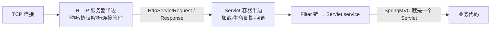

## 先想清楚：Servlet 凭什么跑起来

静态页面时代，HTTP 服务器（Apache）读文件回响应就够了；动态内容
需要**运行在服务端的 Java 程序**——Sun 推出了 Servlet。但 Servlet
有个奇特的设计：**它没有 main 方法**。它只是容器回调的一组接口
（`init`/`service`/`destroy`），需要有"别人"来实例化它、把请求喂
给它。

这个"别人"就是 **Servlet 容器**：负责加载/实例化 Servlet、管理其
生命周期、把 HTTP 请求转成 `HttpServletRequest` 去调用它。而请求
从网卡进来到被转成 Request 对象，又需要解析 HTTP 协议、监听端口
——这半边就是 **HTTP 服务器** 的职责。

**Tomcat / Jetty = HTTP 服务器 + Servlet 容器**，这个组合就叫
**Web 容器**。

一个关键的认知锚点：**SpringMVC 本身就是一个 Servlet**
（`DispatcherServlet`）。不理解 Servlet 与容器的协作，就永远只能
把 Spring 当黑盒——容器的 Filter 链、Listener、异步 Servlet
（`AsyncContext`）这些能力都从这套契约长出来。

## 为什么微服务时代人人都在用嵌入式 Tomcat

传统部署是"一台 Tomcat 跑多个 war"，微服务下反过来：**每个应用
自己内嵌一个 Web 容器**（Spring Boot 默认嵌入 Tomcat，也支持换
Jetty/Undertow），打包成可执行 fat jar，`java -jar` 直接起服务。

驱动这一变化的是成本账：服务数量暴涨后，独立容器进程的内存/CPU
开销、以及"应用与容器版本绑定"的部署复杂度都变得刺眼——嵌入式
让容器退化成一个库，随应用一起发布（Spring Boot 内嵌 Tomcat 已
支持 Servlet 4.0 规范）。代价是失去容器级集中管理（JNDI、虚拟
主机、管理控制台），换来的是每个服务自包含、边界清晰。

## 学容器前，把地基打牢

Web 容器是 Java 语言的"集大成者"，它的每一层都压在一块前置知识上：

| 前置领域 | 具体内容 | 在容器里的落点 |
|---|---|---|
| 操作系统 | 进程/线程与同步、内核态/用户态、虚拟内存 | 线程模型、内存映射、零拷贝 |
| I/O 模型 | BIO/NIO/AIO、阻塞与非阻塞、同步与异步 | 连接器（Connector）的一切 |
| 网络协议 | TCP/IP、HTTP 协议 | Keep-Alive、协议解析器 |
| Java 并发 | 线程池、锁、并发容器 | Executor、Acceptor/Poller 线程分工 |
| JVM | 类加载机制、内存模型、GC | WebappClassLoader 隔离、内存泄漏排查 |

（延伸书目：《UNIX 环境高级编程》《Java 并发编程实战》《深入理解
Java 虚拟机》）

## 小结

- Servlet 无 main 方法，靠容器回调驱动：**Web 容器 = HTTP 服务器 +
  Servlet 容器**，Tomcat/Jetty 都是这套组合。
- SpringMVC 是一个 Servlet——理解容器契约是理解 Spring 的前置。
- 微服务时代容器被嵌入应用进程（Spring Boot），从"平台"退化为
  "库"，换取部署边界清晰。
- 容器知识是 OS/I-O/并发/JVM 四块地基上的应用题，缺哪块补哪块。

## 延伸阅读

- [深入拆解Tomcat&Jetty(一)——r09er，掘金](https://juejin.cn/post/5e869b7f51882573a5099dc8)——本篇母本，系列学习路线
- [深入剖析 Tomcat（极客时间专栏）](https://time.geekbang.org/column/intro/100010001)——李双飞主理的同源体系课
- [Tomcat 官方 · Architecture Overview](https://tomcat.apache.org/tomcat-9.0-doc/architecture/overview.html)
