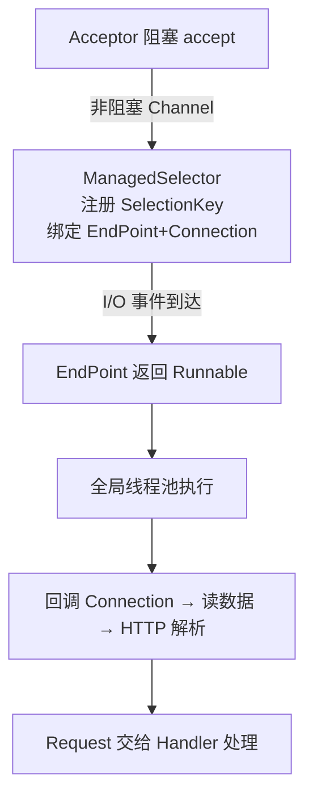

## 先想清楚：Jetty 凭什么"更轻"

Servlet 容器不止 Tomcat。Jetty 与 Tomcat 同样是
**HTTP 服务器 + Servlet 容器**，架构大量相似，但定位不同：
Jetty 更轻量、更容易定制（按 Handler 自由组装），被 Google App
Engine 选作 Web 容器。理解两者结构差异，比记住"谁更快"有用得多。

Jetty 的整体骨架只有三样东西：

```text
Jetty Server = 多个 Connector + 多个 Handler + 一个全局线程池
```

- **Connector**（连接器）：承担"HTTP 服务器半边"——封装 I/O 模型
  与应用层协议；
- **Handler**（处理器）：承担"Servlet 容器半边"——可以是一个或
  多个，甚至可以不配置；
- **线程池**：全局唯一，Connector 与 Handler 共享；
- `Server` 类负责协调上述组件。

与 Tomcat 的两大结构差异：

| | Tomcat | Jetty |
|---|---|---|
| 多端口组织 | 多个 **Service** 对应不同端口请求 | 无 Service 概念，Connector 被多个 Handler 共享 |
| 线程池 | **每个连接器有自己的线程池** | 所有 Connector **共享一个全局线程池** |

## Connector 三件套

Jetty 9 只支持 NIO，Connector 底层全是 NIO 实现，分工三件事：
**接收连接、I/O 事件查询、数据读写**——分别对应 Acceptor、
SelectorManager、Connection。

### 1. Acceptor：阻塞地接客

`ServerSocketChannel.accept()` 是阻塞的——Acceptor 用线程池跑
阻塞式 accept；连接建立后把 SocketChannel 设为**非阻塞**，转交
Selector 处理后续。和 Tomcat 的 Acceptor 线程同款思路：接入期
阻塞简单可靠，接入后转事件驱动。

### 2. SelectorManager：下单与取货

Jetty 把 Selector 封装为 **ManagedSelector**（SelectorManager
内部用数组管理多个）。注册流程像一次下单：

1. Channel 注册到 Selector，拿到 `SelectionKey`——**相当于下单
   返回订单号**；
2. 创建 `EndPoint` 与 `Connection`，与 SelectionKey 三者绑定；
3. I/O 事件触发时，凭 SelectionKey 找到 EndPoint——**凭订单号
   通知取货**。

注意 ManagedSelector 自己不干活：它让 EndPoint 返回一个
`Runnable` 交线程池执行——**事件检测与业务处理解耦**。

### 3. Connection：Jetty 版 Processor

Connection 对应 Tomcat 的 Processor：负责协议解析。`HttpConnection`
实现了 Runnable，Endpoint 上的数据到达时回调 Connection → 从
Endpoint 读字节流 → HTTP 解析器解析 → 包装成 `Request` 对象交给
Handler。响应路径相反：Handler 写 `Response` → HttpConnection 经
Endpoint 写回 Channel。



一个精辟的总结：**Jetty Connector 用回调函数模拟异步 I/O**。

## 与 Tomcat 线程模型对照

Jetty 的线程模型与 Tomcat 的 `NioEndpoint` 同构：Acceptor 数组
接连接、Selector 监听 I/O 事件做派发、线程池执行请求。最大的
不同是**全局唯一线程池**——所有多线程任务（连接管理、I/O 事件、
请求处理）共享同一池；而 Tomcat 各 Connector 各自持有线程池。

这个差异的取舍：Jetty 省资源（微服务/嵌入式场景友好），Tomcat
隔离性好（连接风暴不会饿死请求处理线程，反之亦然）——和"Jetty
轻量可定制、Tomcat 稳健全面"的产品定位互为因果。

## 小结

- Jetty = Connector + Handler + **一个全局线程池**，Server 类协调；
  无 Service 概念。
- Connector 三件套：Acceptor（阻塞接连接）→ SelectorManager/
  ManagedSelector（事件注册与派发，返回 Runnable）→ Connection
  （协议解析出 Request 交 Handler）。
- 与 Tomcat 的核心分野：线程池归属（共享 vs 按连接器独立），
  各自服务于"轻量可嵌入"与"独立部署稳健"两种场景。

## 延伸阅读

- [深入拆解Tomcat&Jetty(八)——r09er，掘金](https://juejin.cn/post/5e89403251882573af79a362)——本篇母本，含 Jetty Connector 工作流程图
- [Jetty 官方 · Architecture](https://www.eclipse.org/jetty/documentation/current/architecture.html)
- [Java NIO 系列教程（ifeve）](http://ifeve.com/java-nio-all/)——Connector 的底层语言
