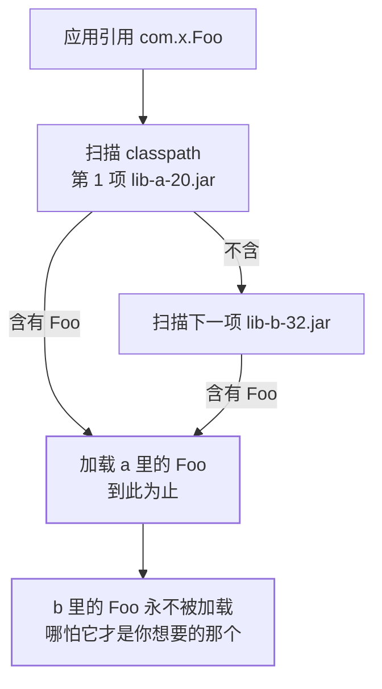

## 问题：本地跑得好，线上抛 NoSuchMethodError

```java
// 调用 guava 的新 API，编译期一切正常，运行期炸：
// java.lang.NoSuchMethodError:
//   com.google.common.base.Strings.repeat(I)Ljava/lang/String;
```

编译用的是 32 版本的签名，运行期加载进来的类却是 20 版本的。**编译期
选版本靠 POM 声明，运行期选版本靠 classpath 顺序**——这两件事一旦不一致，
就出现了「代码没问题、包有问题」的一类故障。本篇讲清三件事：谁赢、怎么查、
怎么让它在 CI 里就查不出来。

## 一、运行期只有一句话：classpath 里第一个命中即加载

JVM 按 classpath（或 fat jar 的 `Class-Path` / `BOOT-INF/lib` 顺序）
**从左到右找**，找到第一个能提供该类的条目就停止，后面的同名类**静默失效**。



注意这条规则和「双亲委派」是**两个正交的维度**：双亲委派决定
**哪个类加载器**去加载（见[类加载机制与双亲委派](/java/advanced/jvm/01-class-loading/)），
classpath 顺序决定**同一个加载器在多个 jar 里挑哪个**。
依赖冲突属于后者，所以「换个 ClassLoader 试试」通常救不了它。

怎么确认到底加载了谁（不改代码的三种看法）：

```bash
# ① JDK 9+：打印每个类的加载来源（JDK 8 用 -verbose:class）
java -Xlog:class+load:file=cl.log -jar app.jar
grep 'com.google.common.base.Strings' cl.log

# ② 已上线进程：Arthas attach 后看 code-source
#    sc -d com.google.common.base.Strings   →  见诊断篇
sc -d com.google.common.base.Strings

# ③ 直接解剖产物：谁是重复类的提供方
unzip -l app.jar | grep -c 'BOOT-INF/lib/guava'
```

（②的完整配方在[Arthas、JFR 与 jcmd 在线诊断](/java/advanced/jvm/10-arthas-jfr/)。）

## 二、Maven 的版本仲裁：nearest wins

打包期决定"classpath 里放哪个版本"，Maven 用两条规则：

1. **最短路径优先（nearest definition wins）**：`A → B → C → fastjson 1.2.x`
   与 `A → D → fastjson 1.4.x`，后者深度 2 赢——**它可能根本不是最新的**。
2. **同深度先声明优先**：路径长度相同时，POM 里**先写的那个 dependency** 赢。
3. **`dependencyManagement` 凌驾于以上两条**：它直接把版本钉死；
   父 POM 里自己的 `<dependencyManagement>` 优先于 `<scope>import</scope>`
   引入的 BOM。

被放弃的那些节点不是报错，而是被记成 `omitted for conflict with ...`：

```bash
mvn dependency:tree -Dverbose -Dincludes=com.alibaba:fastjson
# [INFO] +- com.x:starter:1.0:compile
# [INFO] |  \- (f:1.2.83:compile - omitted for conflict with 1.4.7)
# [INFO] \- com.y:legacy:2.0:compile
# [INFO]    \- f:1.4.7:compile        ← 深度更近，它赢
```

**nearest 最大的隐患是"降级"**：某个组件按新 API 写的，却被另一个
间接依赖拽到旧版本——于是有了第①节那个 `NoSuchMethodError`。
治理手段是让构建**判红而不是静默选**（见第五节 `requireUpperBoundDeps`）。

顺带两个常混淆的开关：

| 手段 | 生效范围 | 常见误解 |
|---|---|---|
| `<exclusions>` | 只剪掉**该 dependency 子树**里的传递依赖 | 别处路径仍能引入同一个包 |
| `<optional>true</optional>` | 该依赖**不再向下游传递** | 不影响本工程自己的编译与运行 |
| `provided` | 编译期可见、不打进产物 | 容器没提供就 `NoClassDefFoundError` |

## 三、定位三板斧（命令固定顺序）

```bash
# ① 谁把 guava 拖进来的、解成了哪个版本
mvn dependency:tree -Dverbose -Dincludes=com.google.guava

# ② 继承 + import 之后，真实的版本声明是什么
mvn help:effective-pom | grep -A 2 'guava'

# ③ 声明与使用是否错位（用了没声明 / 声明了没用）
mvn dependency:analyze
```

第③步查出的 **used undeclared** 是隐蔽事故源：代码直接 `import` 了
只靠传递依赖进来的类，上游一升版本你的编译就断。正确姿势是显式声明。

## 四、不是版本冲突的那一类：同一个包名被两个 groupId 提供

典型是**别人 shade 过的 jar 没改包名**（把 protobuf、netty 原封不动打进
自己的 uber-jar），或历史包名迁移（`javax.*` → `jakarta.*`、
`org.apache.commons.logging` 系）。这类冲突改版本号无效，因为两份**版本相同
但来源不同**。

解法只有两条路：把重复的一方排除干净，或者用 relocation 让它们不撞名：

```xml
<!-- maven-shade-plugin：把内嵌依赖整体改名，彻底避开撞包 -->
<relocations>
  <relocation>
    <pattern>com.google.protobuf</pattern>
    <shadedPattern>my.app.protobuf</shadedPattern>
  </relocation>
</relocations>
```

代价要清楚：relocation 是**改字符串**，反射里写死的类名、序列化后的
`@class` 字段、配置文件里的全限定名都会指向不存在的类。

Spring Boot 3 / Jakarta EE 9 是这一类里当下最高频的：`groupId` 与包名一起换，
混用一套 `javax.servlet-api` 和一套 `jakarta.servlet-api` 会出现
"类找得到、但类型不是同一个"的 `ClassCastException`——本质是同一个类被
两个 ClassLoader 各自加载了一份。JDK 9 之后 `javax.*` 被从 JDK 移除
那一档事见[Java 9~11](/java/intermediate/version/02-java9-11/)，两者不是一回事。

## 五、shade 打平之后的静默事故：资源文件被覆盖

uber-jar 是 zip，**同路径条目只能留一个**。多个依赖都带
`META-INF/services/xxx`，打平时后者把前者挤掉，于是
[SPI 机制](/java/basic/syntax/10-spi/)里那个"放 jar 即生效"的约定
突然只剩一个实现——**不报错，只是行为变了**。Spring 的自动配置清单同理
（见[自动配置原理](/java/intermediate/spring-boot/01-autoconfig/)）。

```xml
<transformers>
  <!-- 合并 META-INF/services/*，而不是互相覆盖 -->
  <transformer implementation=
    "org.apache.maven.plugins.shade.resource.ServicesResourceTransformer"/>
  <!-- 合并指定文本资源（Spring 旧版 spring.factories 等） -->
  <transformer implementation=
    "org.apache.maven.plugins.shade.resource.AppendingTransformer">
    <resource>META-INF/spring.factories</resource>
  </transformer>
</transformers>
```

这也解释了为什么 Spring Boot 的 fat jar **不用 shade**：它把依赖原样放进
`BOOT-INF/lib/`，由 `LaunchedClassLoader` 逐个嵌套 jar 加载，
每个 jar 的 `META-INF` 都是独立条目（见
[嵌入式部署与 fat jar](/java/intermediate/spring-boot/04-embedded-deploy/)）。

## 六、Gradle 与 Maven 的默认策略**相反**

| | 版本冲突时默认选 | 想钉死版本 | 查冲突 |
|---|---|---|---|
| Maven | **nearest**（可能降级） | `dependencyManagement` | `dependency:tree -Dverbose` |
| Gradle | **最高版本**（highest wins） | `constraints` / `resolutionStrategy.force` | `dependencyInsight` |

后果很具体：一份 `build.gradle` 和一份被 IDE/Maven 侧解析的 `pom.xml`
共存时，同一个传递依赖能解出不同版本，"CI 能跑本地不能跑"就来自这里。
第二个差异源是 Gradle Module Metadata（`.module` 文件）——它记录了
变体与完整排除信息，Gradle 据此解析，而 Maven 只读 `pom.xml`。

```bash
./gradlew app:dependencies --configuration runtimeClasspath
./gradlew dependencyInsight --dependency guava \
  --configuration runtimeClasspath   # 看谁要了哪个版本
./gradlew build --refresh-dependencies  # 强制重解析
```

## 七、SNAPSHOT：不稳定的版本声明

SNAPSHOT 是**同一个版本号指向不断变化的内容**，本地仓库靠
`maven-metadata.xml` 的时间戳决定用哪个：

```bash
mvn clean package -U          # 强制检查远端更新的 SNAPSHOT
mvn versions:display-dependency-updates
```

两个典型坑：**上游今天重新发布了 SNAPSHOT**，你没 `-U` 于是本地仍是旧的
（表现为"同事能跑我不能跑"）；反之你天天拉，产物不可重现（表现为
"昨天能跑今天不行"）。所以发布链路上要求依赖必须是 release 版本，
由闸门判红而不是靠人记：

```xml
<!-- maven-enforcer-plugin：三条最常用的规则 -->
<rules>
  <requireUpperBoundDeps/>   <!-- 禁止仲裁结果低于任一请求版本 -->
  <requireReleaseDeps>       <!-- 发布版里不许有 SNAPSHOT -->
    <onlyWhenRelease>true</onlyWhenRelease>
  </requireReleaseDeps>
  <bannedDependencies/>      <!-- 拉黑名单：如已知漏洞的 fastjson 1.x -->
</rules>
```

`requireUpperBoundDeps` 是专治第②节"nearest 导致降级"的那条规则；
`DependencyConvergence` 更严格（同一依赖要求全树收敛到一版本），
在大型多模块工程里通常太吵，慎开。

## 八、还有一类"包对了但行为不对"：注解处理器

Lombok、MapStruct 这类靠 `annotationProcessorPaths` 生效，
**没进依赖树、只进编译期**。`dependency:tree` 查不到它，漏配的表现是
"编译期突然找不到 setter"。写法与原理见
[Lombok 与注解处理器](/java/basic/syntax/13-lombok-apt/)。

## 小结：一条收敛路线

- **先问"谁在 classpath 前面"**：`-Xlog:class+load` 或 `sc -d` 坐实
  加载来源，别靠猜；这一层永远优先于改 POM。
- **再问"仲裁选错了还是包名撞了"**：前者是版本冲突（nearest/先声明），
  后者是 split package（改版本无效，只能排除或 relocation）。
- **shade 要显式合并资源**：`ServicesResourceTransformer` 漏配会让
  SPI 与自动配置静默丢实现；能用 Boot 的嵌套 jar 就别打平。
- **Gradle 与 Maven 策略相反**：混用构建工具时要各自验一遍版本；
  差异来自 highest-vs-nearest 与 `.module` 元数据。
- **把纪律交给闸门**：`requireUpperBoundDeps` 治降级、
  `requireReleaseDeps` 治 SNAPSHOT、`bannedDependencies` 治黑名单——
  人记不住的，让 CI 判红。
- 依赖树干净了但 mapper 仍报 `Invalid bound statement`，那是 XML
  没被打包，不是版本冲突（见
  [MyBatis 实战](/java/intermediate/spring/09-mybatis-in-practice/)）。

## 延伸阅读

- [Maven Dependency Mechanism（官方：nearest 与 dependencyManagement 规则）](https://maven.apache.org/guides/introduction/introduction-to-dependency-mechanism.html)
- [maven-enforcer-plugin Built-in Rules 列表](https://maven.apache.org/enforcer/enforcer-rules/index.html)
- [Gradle：Dependency Variants / Resolution 策略](https://docs.gradle.org/current/userguide/dependency_management.html)
- [maven-shade-plugin：Filtering / resource transformers](https://maven.apache.org/plugins/maven-shade-plugin/)
