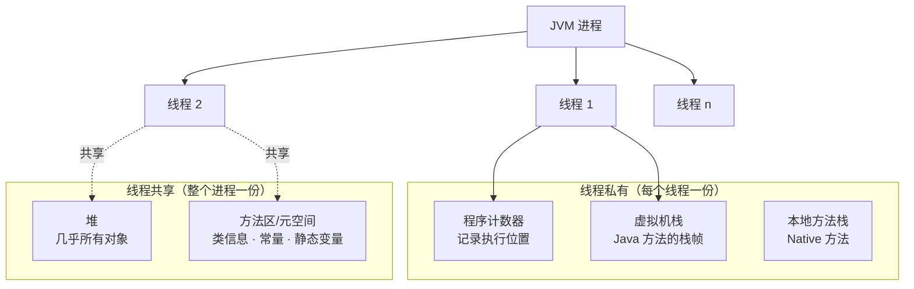
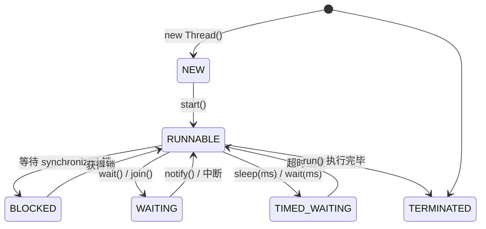

## 进程与线程

**进程**是程序的一次执行过程，是系统运行程序的基本单位；**线程**是比进程
更小的执行单位，一个进程在执行过程中可以产生多个线程。

| 维度 | 进程 | 线程 |
|---|---|---|
| 地位 | 系统资源分配的基本单位 | CPU 调度的基本单位 |
| 内存 | 基本独立 | 同进程内共享堆和方法区 |
| 私有 | 整个地址空间 | 程序计数器、虚拟机栈、本地方法栈 |
| 切换开销 | 大 | 小（轻量级进程） |
| 影响 | 各进程基本独立 | 同进程线程相互影响 |

一个 Java 程序天生就是多线程的——用 JMX 直接可以验证：

```java
ThreadMXBean threadMXBean = ManagementFactory.getThreadMXBean();
ThreadInfo[] threadInfos = threadMXBean.dumpAllThreads(false, false);
for (ThreadInfo threadInfo : threadInfos) {
    System.out.println("[" + threadInfo.getThreadId() + "] "
                       + threadInfo.getThreadName());
}
// 输出（JVM 自带线程，main 只是其中之一）：
// [5] Attach Listener    [4] Signal Dispatcher
// [3] Finalizer          [2] Reference Handler
// [1] main               ← 程序入口
```

## 从 JVM 内存区域看线程私有与共享



**为什么程序计数器私有**：线程切换后要能恢复到正确的执行位置——每个线程
必须各自记住"执行到哪条指令了"。

**为什么虚拟机栈/本地方法栈私有**：保证线程中的局部变量不被其他线程访问到
（栈帧中的局部变量表是线程隔离的天然屏障）。

**Java 线程与操作系统线程**：传统 `new Thread()` 创建的平台线程以 1:1 方式
映射到操作系统线程；Java 21 的虚拟线程由 JVM 调度、复用少量平台线程。一句话
概括：**平台线程映射到 OS 线程，虚拟线程由 JVM 调度到平台线程上执行**。

## 线程的 6 种状态

`Thread.State` 定义了 6 种状态，生命周期中随代码执行不断切换：



| 状态 | 含义 |
|---|---|
| NEW | 创建出来但没调 `start()` |
| RUNNABLE | 调用了 `start()`，等待或正在运行 |
| BLOCKED | 等待 synchronized 锁释放 |
| WAITING | 等待其他线程通知或中断（`wait()`、`join()`） |
| TIMED_WAITING | 有超时上限的等待（`sleep(ms)`、`wait(ms)`） |
| TERMINATED | 运行完毕 |

注意：**JVM 层面只有 RUNNABLE 一个运行态**——操作系统层面的 READY 和
RUNNING 由调度器管理，`Thread.State` 不反映 OS 调度器内部状态，因此统称
RUNNABLE。

## 上下文切换

线程执行有自己的运行条件和状态（上下文：程序计数器、栈信息等）。以下情况
线程会退出占用 CPU 的状态：

- 主动让出：调用 `sleep()`、`wait()` 等
- 时间片用完：OS 防止单个线程长期霸占 CPU
- 阻塞型中断：请求 IO 被阻塞
- 被终止或运行结束

切换时需要**保存当前线程上下文、加载下一个线程的上下文**，这个动作本身消耗
CPU 和内存——频繁切换会造成整体效率低下。这正是不停新建线程不如使用
[线程池](/ascension/java/intermediate/concurrent/02-thread-pool/)的根本原因。

## sleep() vs wait()

| 维度 | `Thread.sleep()` | `Object.wait()` |
|---|---|---|
| 所属类 | Thread 的静态本地方法 | Object 的本地方法 |
| 释放锁 | **不释放** | **释放** |
| 苏醒 | 超时后自动苏醒 | 需 notify()/notifyAll()（或超时版本） |
| 用途 | 暂停执行 | 线程间交互/通信 |

**为什么 wait() 定义在 Object 而不是 Thread**？wait 的语义是"让获得对象锁的
线程等待并**释放该对象锁**"——锁属于每一个对象，操作对象锁的wait 自然要定义
在 Object 上，而不是当前线程。sleep 不涉及锁，所以放在 Thread。

## 要点备忘

- 线程私有：程序计数器、虚拟机栈、本地方法栈；共享：堆、方法区（衔接
  [JVM 运行时数据区](/ascension/java/advanced/jvm/02-memory/)）
- 严格来说 Java 创建线程只有一种方式：`new Thread().start()`，其余都是使用
  多线程的**方法**（Runnable、Callable、线程池……）
- BLOCKED 只与 synchronized 相关；JUC 的锁等待是 WAITING 状态
- 上下文切换有真实成本——线程池的复用本质上是在摊销这笔成本

## 延伸阅读

- [JavaGuide · Java 并发常见面试题总结（上）](https://javaguide.cn/java/concurrent/java-concurrent-questions-01.html)（本文素材出处）
- [JavaGuide · Java 并发常见面试题总结（下）](https://javaguide.cn/java/concurrent/java-concurrent-questions-02.html)（JMM、AQS、锁）
