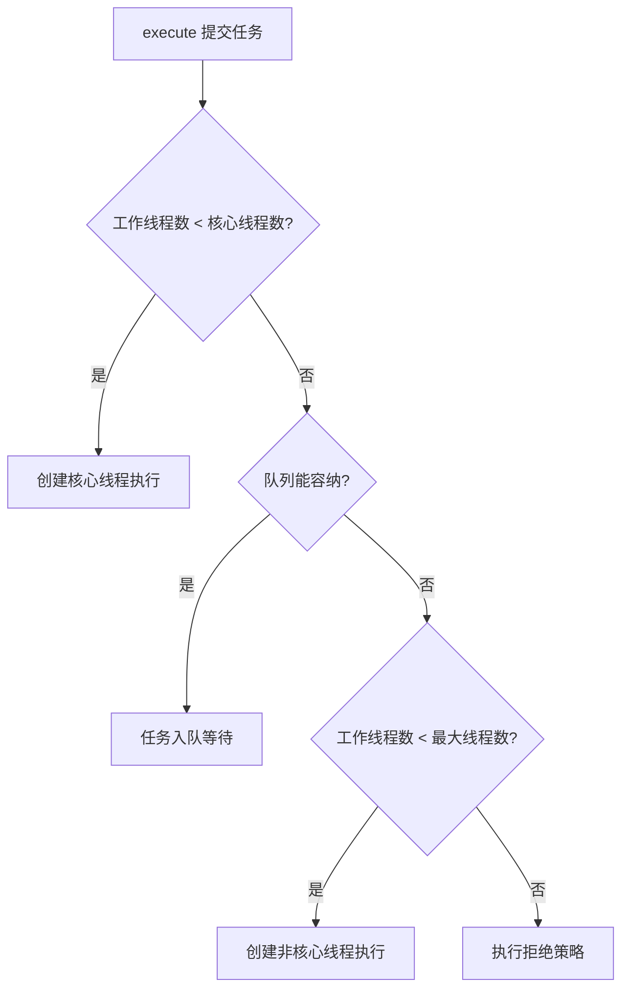
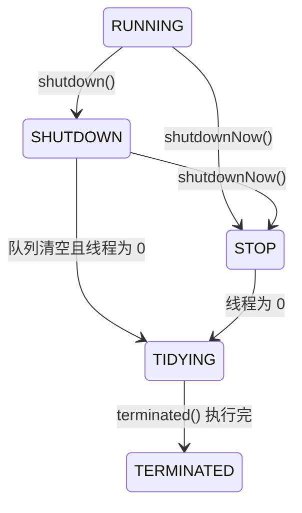

## 为什么需要线程池

线程池是**池化技术**在多线程上的应用（同类：数据库连接池、HTTP 连接池）——
减少每次获取资源的消耗，提高资源利用率。

| 好处 | 说明 |
|---|---|
| 降低资源消耗 | 线程完成任务后不销毁，回到池里等下一个任务 |
| 提高响应速度 | 核心线程常驻，任务来了直接执行，省去创建时间 |
| 提高可管理性 | 统一配置线程数、队列、拒绝策略，可监控、可调优 |

对应 [线程基础](/ascension/java/intermediate/concurrent/01-thread-basics/)一篇的
结论：线程创建有成本、上下文切换有成本——线程池把这两笔成本都摊销掉了。

## Executor 框架的三大部分

1. **任务**：`Runnable` / `Callable` 接口实现
2. **执行**：`Executor` → `ExecutorService` → `ThreadPoolExecutor` /
   `ScheduledThreadPoolExecutor`（核心实现类）
3. **结果**：`Future` / `FutureTask`——`submit()` 返回 Future，主线程可以
   `get()` 等待结果或 `cancel()` 取消任务

## 七个核心参数

```java
public ThreadPoolExecutor(int corePoolSize,      // 核心线程数
                          int maximumPoolSize,    // 最大线程数
                          long keepAliveTime,     // 非核心线程空闲存活时间
                          TimeUnit unit,          // 时间单位
                          BlockingQueue<Runnable> workQueue, // 任务队列
                          ThreadFactory threadFactory,        // 线程工厂
                          RejectedExecutionHandler handler)  // 拒绝策略
```

三个最重要的参数：

- **corePoolSize**：线程池优先维持的工作线程数量。工作线程数达到该值后，
  新任务通常先进入队列
- **maximumPoolSize**：队列满了之后，可以同时运行的线程数量上限
- **workQueue**：核心线程满时，新任务被存放在这里等待

## 任务执行流程



一个反直觉的细节：**先入队，队列满了才开新线程（直到最大线程数）**——扩容
是队列满之后的第二选择，不是第一选择。

## 生命周期五状态

`ctl`（AtomicInteger）同时编码运行状态与工作线程数，状态**只能单向流转**：



| 状态 | 接受新任务 | 处理队列任务 |
|---|---|---|
| RUNNING | 是 | 是 |
| SHUTDOWN | 否 | 是（"温和关闭"） |
| STOP | 否（中断执行中任务） | 否（"强制关闭"） |
| TIDYING | — | 触发 terminated() 钩子 |
| TERMINATED | 终态 | 终态 |

`shutdownNow()` 会把队列中未执行的任务以 `List<Runnable>` 返回，由调用方
决定怎么处置。

## Worker 工作线程机制

每个工作线程封装为内部类 `Worker`（继承 AQS 并实现 Runnable）。**为什么
继承 AQS**：Worker 实现了一个**不可重入的独占锁**，配合 shutdown() 区分
"空闲"还是"正在工作"——正在执行任务的 Worker 持有锁，shutdown() 对其
tryLock() 失败，就不会被中断。

Worker 的运行是个 `while` 循环：`runWorker()` 不断通过 `getTask()` 取任务。

**没有"核心线程"这个身份标记**：Worker 不被永久标记为核心或非核心。当允许
核心线程超时、或当前线程数大于 corePoolSize 时，`getTask()` 用带超时的
`poll(keepAliveTime)`，超时返回 null 则该 Worker 退出；否则用 `take()`
一直阻塞。

## 四种拒绝策略

触发条件：线程池已关闭，或工作线程达到上限且队列无法接收新任务。

| 策略 | 行为 | 适用场景 |
|---|---|---|
| AbortPolicy（默认） | 抛 RejectedExecutionException | 核心业务零容忍丢任务，调用方捕获后补偿 |
| CallerRunsPolicy | 调用者线程直接 run | 允许降速、任务必须执行——天然反压 |
| DiscardPolicy | 静默丢弃 | 非关键路径（日志、监控上报） |
| DiscardOldestPolicy | 丢弃最早的未处理任务 | 只关心最新数据（行情推送、传感器） |

```java
// CallerRunsPolicy 源码：核心就一行 r.run()
public void rejectedExecution(Runnable r, ThreadPoolExecutor e) {
    if (!e.isShutdown()) {
        r.run();   // 直接在调用者线程执行，形成反压
    }
}
```

生产实践（美团、Dubbo 的做法）：内置策略往往不够用——自定义策略把被拒任务
写入 MQ/数据库补偿、递增监控计数器告警，或 `workQueue.put(r)` 阻塞等待空位
（Netty 类似实现）。注意 CallerRunsPolicy 的坑：提交线程若是 Tomcat Worker
线程，会直接拖长请求响应时间。

## 为什么不推荐 Executors 工厂方法

《阿里巴巴 Java 开发手册》强制要求手动 new ThreadPoolExecutor：

| 工厂方法 | 隐患 |
|---|---|
| FixedThreadPool / SingleThreadExecutor | 无界队列 LinkedBlockingQueue——任务堆积无上限，**OOM** |
| CachedThreadPool / ScheduledThreadPool | 最大线程数 Integer.MAX_VALUE——线程无限创建，**OOM** |

正确姿势——明确每个参数的含义：

```java
ThreadPoolExecutor executor = new ThreadPoolExecutor(
    8,                                       // corePoolSize
    16,                                      // maximumPoolSize
    60L, TimeUnit.SECONDS,                   // keepAliveTime
    new ArrayBlockingQueue<>(1000),          // 有界队列！
    new ThreadFactoryBuilder()
        .setNameFormat("biz-pool-%d").build(), // 线程命名，便于排查
    new ThreadPoolExecutor.CallerRunsPolicy() // 显式拒绝策略
);
```

## 要点备忘

- 执行顺序：核心线程 → **队列** → 非核心线程 → 拒绝（队列优先于扩线程）
- Worker 靠"不可重入锁 + tryLock"区分空闲/工作中，shutdown 不中断工作线程
- 有界队列 + 显式拒绝策略是生产底线；Executors 的无界队列是 OOM 温床
- 线程数经验值：CPU 密集 ≈ N+1，IO 密集 ≈ 2N 起步压测定型
- 监控：已完成任务数、活跃线程数、队列长度（`getPoolSize()` /
  `getQueue().size()`）配合告警

## 延伸阅读

- [JavaGuide · Java 线程池详解](https://javaguide.cn/java/concurrent/java-thread-pool-summary.html)（本文素材出处，含 10372 字完整版）
- [美团 · Java 线程池实现原理及其在美团业务中的实践](https://tech.meituan.com/2020/04/02/java-pooling-pratice-in-meituan.html)（动态线程池）
