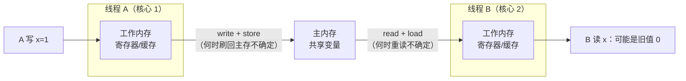
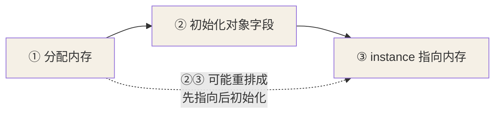

## 为什么需要 JMM

CPU 速度远快于内存，硬件层引入**寄存器 + 多级缓存**救场，代价是：每个核心
看到的主存内容不再一致。JMM（Java Memory Model）就是 Java 层面给这套
混乱定规矩——保证**可见性、有序性**，原子性靠锁与 CAS。



JMM 规定：所有共享变量存在主内存，每线程有自己的工作内存，线程对变量的
操作都在工作内存进行，何时同步回主存不确定——**这就是可见性问题的根源**。

```java
// 经典死循环：主线程改了 flag，工作线程却看不到
static boolean flag = true;

new Thread(() -> { while (flag) { } }).start();   // JIT 甚至把它提升成 if(flag) while(true)
Thread.sleep(100);
flag = false;    // 线程可能永远不退出
```

## volatile 的两个语义

```java
static volatile boolean flag = false;
```

1. **可见性**：写 volatile 变量 = 把工作内存的值强制刷回主存 + 让其他
   核心的缓存行**失效**（MESI 缓存一致性协议在硬件层配合）；读 volatile
   = 强制从主存重新读。
2. **禁止指令重排**：编译器和 CPU 都会重排指令优化流水线，volatile 通过
   **内存屏障**（mfence 等）禁止跨越该变量的读写重排。

### volatile 不保证原子性

```java
static volatile int count = 0;
// 10 个线程各执行 1000 次 count++：
// count++ 实际是三步：读值 → +1 → 写回（read-modify-write）
// 两个线程同时读到旧值、各自 +1、先后写回 —— 丢一次更新
```

`count++` 是复合操作，volatile 只保证每次读写的可见性，挡不住"读改写"
之间的交错。计数用 `AtomicInteger`（CAS）或加锁。

## happens-before 原则

JMM 用 happens-before 回答"上一个操作的结果对下一个操作是否可见"。核心
规则：

| 规则 | 含义 |
|---|---|
| 程序顺序 | 单线程内按代码顺序前面的写对后面可见 |
| 监视器锁 | 解锁 happens-before 后续加锁 |
| volatile | **volatile 写 happens-before 后续的 volatile 读** |
| 传递性 | A→B、B→C 则 A→C |
| 线程启动/终止 | start() 前的写对线程内可见；线程内的写在 join() 后可见 |

volatile 的 happens-before 是**双向辐射**的：volatile 写之前的所有普通写，
对 volatile 读之后的读都可见——这是 DCL 能成立的理论根基。

## 经典应用：DCL 双重检查锁单例

```java
public class Singleton {
    private static volatile Singleton instance;   // 没有 volatile 就是半成品 bug

    public static Singleton getInstance() {
        if (instance == null) {                  // ① 第一次检查：无锁快路径
            synchronized (Singleton.class) {
                if (instance == null) {          // ② 第二次检查：防止重复创建
                    instance = new Singleton();
                }
            }
        }
        return instance;
    }
}
```

`new Singleton()` 字节码分三步：



若 ②③ 重排：线程 A 刚执行完"③ 指向"（对象还没初始化），线程 B 在 ① 处
看到 `instance != null` 直接返回——拿到**半个初始化的对象**。volatile
禁止这次重排，DCL 才安全。

更省心的替代：静态内部类（类加载机制保证初始化安全）或 enum 单例。

```java
private static class Holder {
    static final Singleton INSTANCE = new Singleton();  // 类初始化由 JVM 加锁保证只一次
}
public static Singleton getInstance() { return Holder.INSTANCE; }
```

## volatile 的适用场景

判断标准：**写操作不依赖当前值**（一写多读），且变量不与其他共享变量
构成需要原子组合的状态。

- 状态标志位（`volatile boolean running`）：优雅停机、轮询开关。
- 一次性发布：配置对象加载完成后 volatile 引用发布，读者看到完整对象。
- 不适合：计数器（count++）、多变量不变式（lower <= upper）。

## 内存屏障与缓存伪共享（深入）

"volatile 是可见性"背后落到硬件是**内存屏障 + 缓存一致性协议**，再往深
一点你还可能遇到**伪共享**——两者一起讲，把它们解耦清楚。

**内存屏障（Memory Barrier）**：volatile 写/读在汇编层会插入屏障指令，
禁止跨越该变量的重排并强制刷读：

```text
volatile 写   → 前插 StoreStore 屏障（前面普通写先落盘）
              → 后插 StoreLoad 屏障（本写对其他核可见，不再被重排到后面）
volatile 读   → 前后各插 LoadLoad / LoadStore 屏障
```

**缓存一致性（MESI）**：写 volatile 会让其他核心对应**缓存行失效**，下次
读到强制从主存/发共享请求重取。这两层协作，才是"改一个 volatile，别的核
立刻能看到"的完整机制。

**伪共享（False Sharing）**：缓存一致性的最小单位是**缓存行（64 字节）**，
不是单个变量。两个**无关**变量若被放到同一缓存行，一个被写会使整行失效、
另一个的下次读也要重取——明明不共享，却因"同一行"互相拖慢：

```java
static class Counter {
    volatile long a;              // 高并发热写
    // (填补 padding 或 @Contended) 让 b 不与 a 同缓存行
    volatile long b;              // 另一个热写，却受 a 牵连
}
// Java 8+ 可用 sun.misc.Contended（需 JVM 参数 --add-exports）或手动 padding
```

**实战判断**：多核高并发热写多个长整型，若出现"两个互不相干的字段 QPS 一起掉"
且卡在缓存一致性上，就往 `@Contended`/padding 方向排查——普通业务极少遇到，
但秒杀计数器、Disruptor 这类才有意义。

## 小结

- JMM 立规矩：主内存 + 工作内存，可见性与有序性问题由此而生。
- volatile = 可见性 + 禁止重排，**不含原子性**；count++ 该用 Atomic。
- happens-before 里 volatile 写→读的传递性是 DCL 单例安全的前提。
