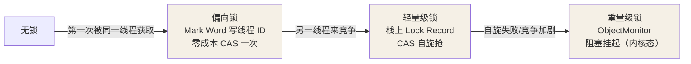

## 三种用法与锁对象

```java
public class SyncDemo {
    public void method() {
        synchronized (this) { }              // 锁实例：同类不同实例互不阻塞
    }
    public synchronized void m2() { }          // 等价于 synchronized(this)
    public static synchronized void m3() { }   // 锁 Class 对象：所有实例共享
    public static void m4() {
        synchronized (Synchronized.class) { } // 等价于 static synchronized
    }
}
```

锁的是**对象**，不是代码——实例锁管这个实例自己的方法，类锁（Class 对象）
管所有实例的静态方法。

## 底层：monitor 与对象头

synchronized 的字节码是 `monitorenter` / `monitorexit`（方法同步则编译为
ACC_SYNCHRONIZED 标志），JVM 层面对应 HotSpot 的 ObjectMonitor（C++ 实现）：

```cpp
ObjectMonitor() {
    _count  = 0;        // 计数
    _owner  = NULL;     // 持锁线程
    _EntryList = NULL;  // 阻塞的竞争线程（自旋失败后排队）
    _WaitSet   = NULL;  // wait() 挂起的线程
    _recursions= 0;     // 重入计数
}
```

每个 Java 对象都关联一个 monitor。锁的信息就存在**对象头 Mark Word** 里
（64 位 JVM 布局）：

```
|--------------------------------------------------------------|------------------|
|         Mark Word (64 bits)                    | 锁状态 (2bit) |
|--------------------------------------------------------------|------------------|
| 无锁：hashCode(31) | 分代年龄(4) | 偏向位(1)=0 | 锁标志(2)=01 |   无锁          |
| 偏向锁：线程ID(54) | epoch(2)      | 偏向位(1)=1 | 锁标志(2)=01 |   偏向锁        |
| 轻量级锁：指向栈中 Lock Record 的指针(62)        | 锁标志(2)=00 |   轻量级锁      |
| 重量级锁：指向 ObjectMonitor 的指针(62)          | 锁标志(2)=10 |   重量级锁      |
| GC 标记信息                                      | 锁标志(2)=11 |   GC            |
```

JDK 6 之前加锁只能找 ObjectMonitor——要**操作系统互斥量（mutex）**，
用户态切内核态，挂起/唤醒开销大，这就是"重量级锁"名字的由来。

## JDK 6 的重大优化：锁升级

HotSpot 发现大多数锁**不仅没有竞争，甚至总是同一线程反复拿**，全上
monitor 太浪费，于是造出升级链条（JDK 15 起偏向锁已废弃，但原理仍值得懂）：



### 偏向锁（Biased Locking，JDK 15 移除）

- 只有**第一个**拿到锁的线程：CAS 把线程 ID 写进 Mark Word，之后该线程
  再进入**连 CAS 都不用**——判断 Mark Word 里是自己就进。
- 第二个线程出现才撤销偏向（等到全局安全点，检查原线程是否还在同步块中）。
- 场景：单线程反复访问（如早期 StringBuffers）。
- 移除原因：现代应用普遍多线程，撤销偏向要 safepoint STW，得不偿失。

### 轻量级锁

- 加锁：栈帧里建 Lock Record，把 Mark Word 复制进去（Displaced Mark Word），
  然后 CAS 让 Mark Word 指向 Lock Record。
- 解锁：CAS 把 Displaced Mark Word 换回去。
- 竞争失败：**自旋**重试，自旋超限（自适应自旋）后膨胀为重量级锁。
- 场景：多线程**交替**执行（真正并发窗口很小），自旋一会儿就能等到。

### 重量级锁

- 自旋也抢不到 → 膨胀：分配 ObjectMonitor，Mark Word 指向它，竞争线程
  进入 EntryList 阻塞（依赖操作系统 mutex，用户态→内核态切换）。
- 场景：真实并发竞争激烈、临界区长。

**锁只能升级不能降级**（理论上 STW 下可降级，实际极少触发）。

## 锁粗化与锁消除

```java
// 锁粗化：连续 append 各自带锁，JIT 合并成一个大同步块
sb.append(a); sb.append(b); sb.append(c);   // StringBuffer.append 都是 synchronized
// 等效于 synchronized(sb){ a+b+c 一起做 }

// 锁消除：逃逸分析发现 sb 不出方法，锁对象没有竞争者 → 直接删锁
public String concat(String a, String b) {
    StringBuffer sb = new StringBuffer();  // 局部变量，未逃逸
    sb.append(a); sb.append(b);
    return sb.toString();
}
```

JIT 的逃逸分析证明对象不逃出线程 → 锁没意义 → 消除；反复相邻的加锁解锁
→ 粗化成一次。**写业务代码时不必为"性能"手动合并锁，先写对再让 JIT 优化**。

## wait / notify 为什么必须在 synchronized 内

wait/notify 操作的是 ObjectMonitor 的 `_WaitSet`（把线程从 EntryList 挪到
WaitSet 挂起），没拿锁就操作 monitor 数据结构等于裸改共享状态：

```java
synchronized (lock) {          // 必须先持有 lock 的 monitor
    while (!condition) {       // 用 while 防止虚假唤醒
        lock.wait();           // 释放锁 + 进 WaitSet + 挂起
    }
    // 条件成立，干活
}

synchronized (lock) {
    condition = true;
    lock.notifyAll();          // 唤醒 WaitSet 全部线程去重新竞争锁
}
```

wait 会**释放锁**（对比 sleep 抱着锁睡）——这是生产者消费者能跑起来的
前提。

## synchronized vs ReentrantLock

| 维度 | synchronized | ReentrantLock |
|---|---|---|
| 层面 | JVM 内置（关键字） | JDK 类库（AQS） |
| 释放 | 异常/退出自动释放 | 必须手动 unLock（finally） |
| 公平锁 | 非公平 | 可选公平/非公平 |
| 条件队列 | 一个（wait/notify） | 多个 Condition 分队列 |
| 超时/可中断 | 不支持 | tryLock(timeout)、lockInterruptibly |
| 性能 | JDK 6 后基本持平 | 持平 |

简单场景默认 synchronized（不漏释放、JIT 持续优化）；需要超时、可中断、
公平性、多条件队列才上 ReentrantLock。

## 小结

- synchronized 锁对象：实例锁 this、静态锁 Class；本质是对象头 Mark Word
  指向的 monitor。
- 升级链：偏向（单线程重入）→ 轻量级（CAS 自旋）→ 重量级（内核阻塞），
  只升不降。
- 锁粗化/消除是 JIT 送的；wait/notify 必须配 synchronized，且 wait 释放锁。
