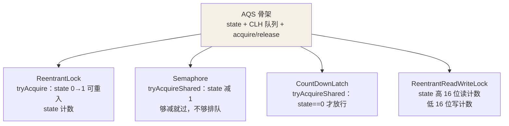
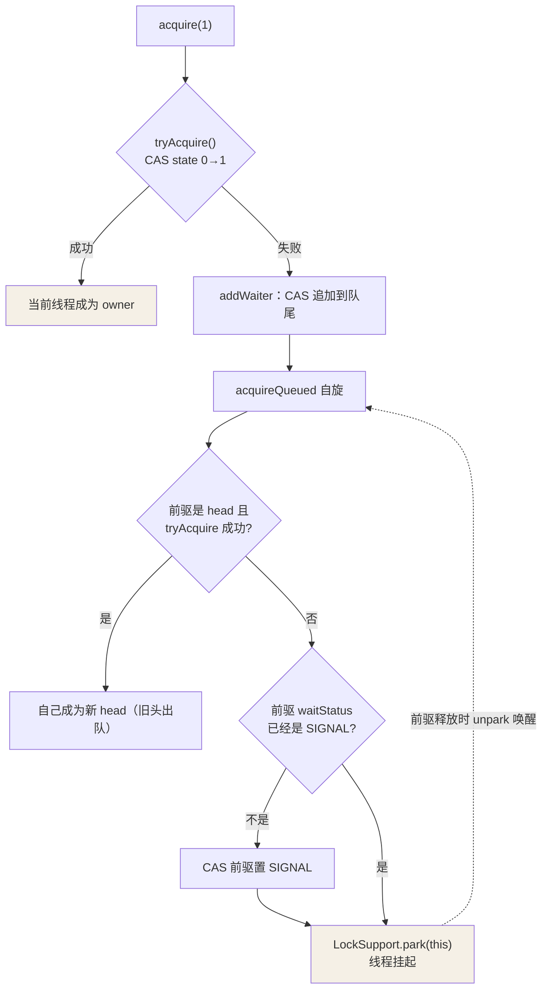

## AQS 的三块基石

AbstractQueuedSynchronizer 是 JUC 的半壁江山——ReentrantLock、
Semaphore、CountDownLatch、ReentrantReadWriteLock 全构建在它上面。它把
"线程排队抢锁"这件脏活累活全部包了，子类只需回答"状态怎么变"：

```java
// AQS 的三个核心成员
private volatile int state;                    // 同步状态：含义由子类定义
private transient volatile Node head;          // CLH 同步队列头（虚拟哨兵）
private transient volatile Node tail;          // 队列尾

// 子类需要覆写的模板方法（默认全抛 UnsupportedOperationException）
protected boolean tryAcquire(int arg) { ... }  // 独占获取：怎么算拿到？
protected boolean tryRelease(int arg) { ... }  // 独占释放：怎么算放手？
protected int tryAcquireShared(int arg){ ... } // 共享获取
protected boolean tryReleaseShared(int arg){ ... } // 共享释放
protected boolean isHeldExclusively() { ... }  // 是否被独占持有
```

**模板方法模式**：acquire/release 排队逻辑是写死的骨架，tryXxx 是子类
填的肉。



## CLH 队列：虚拟双向链表

抢不到锁的线程包装成 Node 挂到队列，核心字段全 volatile：

```java
static final class Node {
    volatile Node prev;        // 前驱
    volatile Node next;        // 后继
    volatile Thread thread;   // 排队的线程
    volatile int waitStatus;  // CANCELLED(1) / SIGNAL(-1) / CONDITION(-2) / 0
}
```

队列头是**虚拟哨兵节点**（不存线程），真正的排队者从第二个节点开始。
每个节点盯着前驱的 waitStatus——**前驱释放锁时会唤醒我**（SIGNAL），
而不是全队列广播，这是 CLH 队列自旋锁思想在阻塞锁上的变体。

## acquire 独占获取全流程

```java
public final void acquire(int arg) {
    if (!tryAcquire(arg) &&                         // ① 子类逻辑：CAS state
        acquireQueued(addWaiter(Node.EXCLUSIVE), arg))  // ③ 入队自旋
        selfInterrupt();                             // ④ 补上排队期间的中断
}
```



关键细节：

- **入队用 CAS，挂起前必先把前驱置 SIGNAL**——否则自己刚 park、前驱就
  释放了，唤醒信号丢失，线程永远睡着（丢失唤醒问题）。
- unpark 后从 park 点继续自旋，重新尝试 tryAcquire——**被唤醒 ≠ 拿到锁**，
  还得看 CAS。
- park 对中断不敏感（不抛异常只设标志），返回后检查并 selfInterrupt 补上，
  这就是"不可中断模式"；lockInterruptibly 走可中断版本。

## release 独占释放

```java
public final boolean release(int arg) {
    if (tryRelease(arg)) {                 // 子类逻辑：state 清零（可重入要减到 0）
        Node h = head;
        if (h != null && h.waitStatus != 0)
            LockSupport.unpark(h.next.thread);   // 唤醒后继
        return true;
    }
    return false;
}
```

释放只做一件事：**唤醒 head 的后继**，被唤醒者自己再去 CAS 抢——公平性
由此而来：队头排在最前的先被叫醒，但新来的线程也可能插队（非公平模式）。

## 公平 vs 非公平

```java
// 非公平（默认）：上来直接抢
final boolean nonfairTryAcquire(int acquires) {
    if (c == 0 && compareAndSetState(0, acquires)) return true;   // 不看队列
}
// 公平：先检查队列里有没有前驱在等
protected final boolean tryAcquire(int acquires) {
    if (c == 0 && !hasQueuedPredecessors()          // 队列有人排队就乖乖去排队
        && compareAndSetState(0, acquires)) return true;
}
```

非公平吞吐高（唤醒线程的空窗期不浪费），公平不饿死但多一次队列检查 +
上下文切换。**默认非公平**是吞吐与公平的务实折中。

## 共享模式：Semaphore 视角

```java
// Semaphore 的 tryAcquireShared：state 是剩余令牌数
protected int tryAcquireShared(int acquires) {
    for (;;) {
        int available = getState();
        int remaining = available - acquires;
        if (remaining < 0 ||                    // 不够：返回负数 → 入队等待
            compareAndSetState(available, remaining))
            return remaining;                   // 够：扣减成功
    }
}
// doReleaseShared 传播唤醒：唤醒后若还有余量，后继也被叫醒（级联）
```

CountDownLatch 同理：countDown 把 state 减到 0，等待线程全部放行；
await 就是 tryAcquireShared 要 state == 0。**一套骨架，两种模式，四个
明星工具类**——这就是 AQS 的复用威力。

## 动手实现一个互斥锁

```java
class MyMutex extends AbstractQueuedSynchronizer {
    @Override
    protected boolean tryAcquire(int arg) {
        return compareAndSetState(0, 1);          // state: 0 空闲，1 被占
    }
    @Override
    protected boolean tryRelease(int arg) {
        setState(0);                               // 只有持锁者会调，无需 CAS
        return true;
    }
    @Override
    protected boolean isHeldExclusively() {
        return getState() == 1;
    }
}
// 25 行不到：排队、挂起、唤醒、重试全部由 AQS 骨架代劳
```

## 小结

- AQS = volatile state（语义子类定）+ CLH 双向队列 + acquire/release
  模板方法。
- 独占模式一套流程：tryAcquire 失败 → 入队 → 前驱置 SIGNAL → park →
  被唤醒重试；释放只 unpark 后继。
- 公平与非公平就差一个 hasQueuedPredecessors 检查；共享模式多了级联传播。
