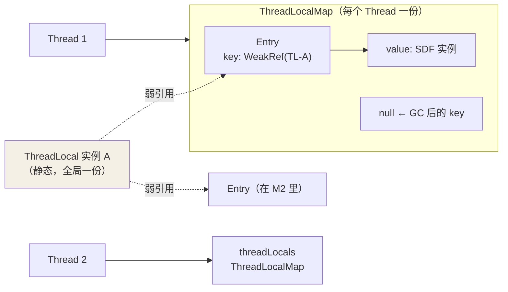
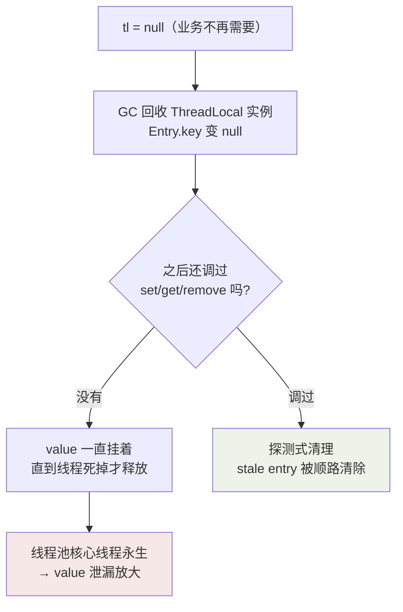

## 定位：线程内部的私有变量

synchronized 解决"多个线程抢一个变量"，ThreadLocal 直接**给每个线程发一份
变量**——空间换并发，读写都不用同步：

```java
static final ThreadLocal<SimpleDateFormat> SDF =
    ThreadLocal.withInitial(() -> new SimpleDateFormat("yyyy-MM-dd"));

SDF.get().format(new Date());   // 每个线程各自持有一个 SimpleDateFormat 实例
```

典型场景：SimpleDateFormat 非线程安全（共享实例会解析错乱）、数据库连接
绑定会话、用户上下文透传（登录信息塞进 ThreadLocal，整条调用链随取随用）。

## 数据结构：Thread 持有 Map，ThreadLocal 是 key



关键反转：**Map 挂在 Thread 身上，而不是 ThreadLocal 里**。

```java
// Thread 的字段
ThreadLocal.ThreadLocalMap threadLocals = null;

// ThreadLocalMap.Entry：key 是弱引用，value 是强引用
static class Entry extends WeakReference<ThreadLocal<?>> {
    Object value;
    Entry(ThreadLocal<?> k, Object v) { super(k); value = v; }
}
```

读写路径：`tl.get()` → `Thread.currentThread().threadLocals` → 用
`tl` 的 hash 定位 Entry → 取 value。

## 为什么 key 用弱引用：防更大面积的泄漏

假设 key 是强引用：静态 ThreadLocal 变量置 null 后，Entry 仍强链到
ThreadLocal 对象，**连同它带过的所有 value 一起陪葬**到线程结束。

弱引用的效果：ThreadLocal 实例只剩 Entry 里这根弱链时，**下次 GC 直接
回收 key**，Entry 变成 stale（key = null）——泄漏范围从"key + value"
缩小到"value"，且清理机制有机会回收（见下）。**弱引用不是泄漏的原因，
是止血带**。

## 内存泄漏的真实链路



泄漏成立需要**两个条件同时满足**：ThreadLocal 实例被回收（key = null），
**且**线程长期存活（典型：线程池）。核心线程永不退出，没人再碰那个
Entry，value 就一直占着堆。

JDK 的自救：`expungeStaleEntry` 在 set/get/rehash 顺路清理 key 为 null
的 Entry——但它是"路过才扫"，不调用就永远等不到。

## 正确姿势

```java
try {
    CONTEXT.set(user);
    doBusiness();            // 全链路 CONTEXT.get() 取值
} finally {
    CONTEXT.remove();        // 用完立刻清，线程池下唯一可靠方案
}
```

父线程传子线程：`InheritableThreadLocal` 在 `new Thread()` 时复制父线程
的 Map——但**线程池复用线程，不会重新复制**（复制只发生在 Thread 构造时），
跨池传递要用阿里的 `TransmittableThreadLocal`（提交任务时捕获快照，执行
前重放）。

## 哈希设计：魔数 0x61c88647

ThreadLocalMap 是开放寻址（不是拉链），每个 ThreadLocal 有个
`threadLocalHashCode`，相邻实例间隔 `0x61c88647`（黄金分割数 × 2^32）：

```java
private static final int HASH_INCREMENT = 0x61c88647;
private static int nextHashCode() {
    return nextHashCode.getAndAdd(HASH_INCREMENT);  // 每新建一个 TL 实例 +固定增量
}
```

这个增量让连续创建的 ThreadLocal 在 2^n 长度的数组里**均匀散开**
（斐波那契散列），冲突概率极低——一个线程通常也就几个 ThreadLocal，
开放寻址足够快。

## 小结

- Map 挂在 Thread 上；Entry 的 key 弱引用、value 强引用。
- 泄漏 = key 被回收后线程永生（线程池）+ 无人触发改 Entry；remove 是唯一
  可靠解，finally 里必须写。
- 跨线程池传值 InheritableThreadLocal 会失灵，要 TransmittableThreadLocal。
