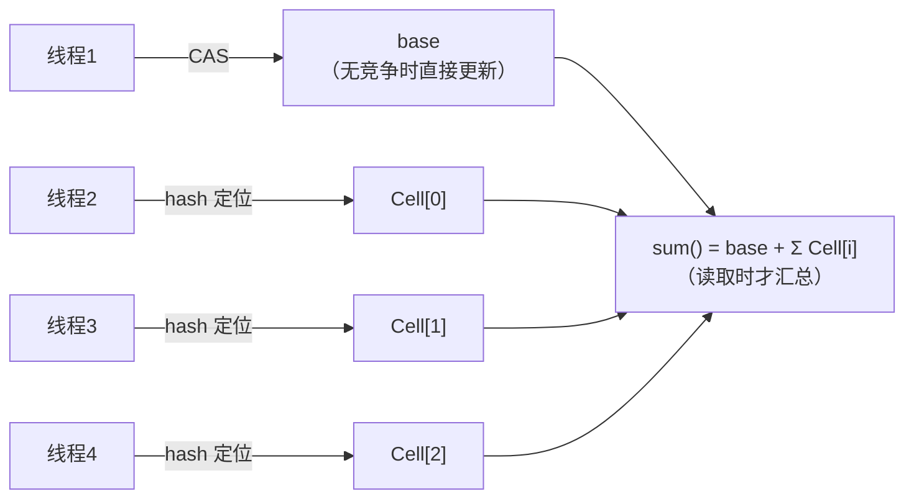

## AtomicLong 的瓶颈：全员抢一个变量

[volatile](/java/intermediate/concurrent/03-volatile/) 保证可见性，
AtomicLong 用 CAS 保证原子性——但高并发下它们都卡在同一处：

```java
// AtomicLong.incrementAndGet 的本质
do {
    prev = get();            // 读最新值
    next = prev + 1;
} while (!compareAndSet(prev, next));   // 抢不到就自旋重试
```

同一时刻只有一个线程 CAS 成功，其余全部自旋空转——**线程越多，失败
率越高，CPU 时间片大量烧在重试上**。JDK 8 里 Doug Lea 给出的解法是
LongAdder：别让所有人挤一个门。

## 分段思想：base + Cell[]



- **无竞争**：直接 CAS 更新 base，与 AtomicLong 等价；
- **有竞争**：初始化 Cell 数组（长度为 2 的幂），每个线程按
  `hash & (n-1)` 定位到自己的 Cell 分段累加；
- **CAS 再失败**：换一个 Cell 下标重试（probe 重新散列），而不是原地
  自旋——冲突概率被"分段 + 换槽"双重稀释。

代价也直白：**N 个 Cell 就是 N 份内存**（空间换并发），且 `sum()` 是
"弱一致"快照——统计瞬间可能有线程正在写入，适合计数监控，不适合
做精确的同步控制（比如用它做版本号）。

## Striped64 骨架

LongAdder 继承 Striped64，核心成员就四个：

```java
abstract class Striped64 extends Number {
    @Contended static final class Cell {
        volatile long value;      // 分段的累加值
        // cas：VarHandle 实现的 compareAndSet
    }
    static final int NCPU = Runtime.getRuntime().availableProcessors();
    transient volatile Cell[] cells;   // 分段表，2 的幂
    transient volatile long base;      // 基准值：无竞争 / cells 未初始化时用
    transient volatile int cellsBusy;  // 0/1 锁：初始化与扩容 cells 用
}
```

两个细节值得记住：

1. **`@Contended` 伪共享填充**：Cell 是热点变量，若相邻 Cell 落在
   同一 CPU 缓存行（64B），互相失效缓存行会让分段白做——注解让每个
   Cell 独占缓存行；
2. **cellsBusy 自旋锁**：只保护 cells 的**初始化与扩容**（创建新 Cell
   时），不保护数据写入——写路径仍然全 CAS，无锁。

## add 的决策流（核心逻辑）

```java
public void add(long x) {
    Cell[] cs; long b, v; int m; Cell c;
    if ((cs = cells) != null || !casBase(b = base, b + x)) {
        // ① cells 未初始化 且 base CAS 成功 → 结束（快路径）
        // ② 否则进入 longAccumulate：竞争出现了，考虑分段
        int index = getProbe();     // 线程的 hash 探针
        boolean uncontended = true;
        if (cs == null || (m = cs.length - 1) < 0 ||
            (c = cs[index & m]) == null ||
            !(uncontended = c.cas(v = c.value, v + x)))
            longAccumulate(x, null, uncontended);
    }
}
```

`longAccumulate` 的三段处理（记框架不背代码）：

| 情况 | 动作 |
|---|---|
| 定位到的 Cell 为空 | cellsBusy 加锁，乐观创建新 Cell 塞进去 |
| Cell 存在但 CAS 失败 | 重新散列 probe 换槽重试；反复失败且未到上限（`n >= NCPU`）则**扩容 cells**（翻倍） |
| cells 未初始化 | 加锁初始化（长度 2），竞争失败的线程先累加到 base |

扩容上限是 CPU 核数——**同一时刻真正并行的线程就这么多**，再多分段
只是浪费内存，之后全靠换槽重试。

## 选型：什么时候用哪个

| | AtomicLong | LongAdder |
|---|---|---|
| 低并发 | 两者无差别 | 两者无差别 |
| 高并发计数 | 自旋浪费严重 | **分段后接近线性扩展** |
| 精确瞬时值 / CAS 语义（版本号、限流阈值） | **必选**（get 即时准确、compareAndSet 可用） | 不适合（sum 弱一致、无 CAS） |
| 内存 | 一个 long | base + N 个 Cell（含缓存行填充） |
| 需要初值/自定义运算 | 有 | 用 LongAccumulator（同机制，可传运算与初值） |

典型场景：QPS/调用次数等**监控统计**用 LongAdder；**ABA 敏感的状态
机、分布式序号**用 AtomicLong。同族的 `LongAccumulator` 支持自定义
二元运算（如求最大值），机制完全一致。

## 小结

- AtomicLong 的病灶是"所有线程 CAS 同一个变量"；LongAdder 用
  **base + Cell 分段**把冲突概率摊薄，读时求和。
- 关键设计：Cell 的 @Contended 缓存行填充、cellsBusy 只锁结构变化、
  扩容上限 = CPU 核数、失败换槽重试。
- 代价：内存放大 + sum 弱一致——计数器场景赚，同步控制场景亏。

## 延伸阅读

- [LongAdder 原理浅析（CSDN）](https://blog.csdn.net/liulianglin/article/details/126361550)——本篇母本，含 longAccumulate 完整源码逐段分析
- JavaDoc · java.util.concurrent.atomic.LongAdder（官方对 sum 弱一致性的说明）
