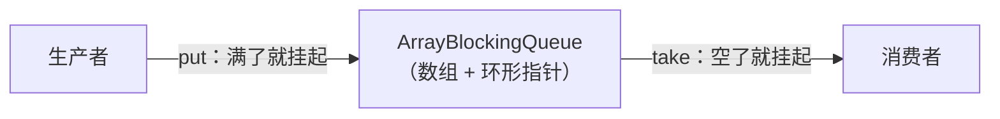

## 阻塞队列解决什么

生产者-消费者最原始的写法是"共享变量 + wait/notify"——易错（虚假
唤醒、漏通知）。BlockingQueue 把"满了阻塞生产者、空了阻塞消费者"
封装进队列本身：



它是 [线程池](/java/intermediate/concurrent/02-thread-pool/) 的任务
蓄水池（`new ThreadPoolExecutor(..., workQueue, ...)` 的 workQueue），
也是 [AQS](/java/intermediate/concurrent/05-aqs/) 之外条件变量最经典的
应用场景。

## 四组 API：抛异常 / 返回特殊值 / 阻塞 / 超时

| 操作 | 抛异常 | 特殊值 | **阻塞** | 超时放弃 |
|---|---|---|---|---|
| 入队 | `add(e)` | `offer(e)`→false | **`put(e)`** | `offer(e, time, unit)` |
| 出队 | `remove()` | `poll()`→null | **`take()`** | `poll(time, unit)` |
| 查看队首 | `element()` | `peek()`→null | — | — |

背口诀：**add/remove 激进（满/空直接 IllegalStateException/
NoSuchElementException），offer/poll 温和，put/take 死等，带时间参数
的等不起就走**。线程池用的是 offer——队列满了拒绝策略接手，而不是
让提交任务的线程无限阻塞。

## ArrayBlockingQueue 的结构

```java
public class ArrayBlockingQueue<E> extends AbstractQueue<E>
        implements BlockingQueue<E>, java.io.Serializable {
    final Object[] items;          // 有界数组，容量构造时定死，不扩容
    int takeIndex;                 // 下一个取走的位置（环形前进）
    int putIndex;                  // 下一个放入的位置
    int count;                     // 当前元素数
    final ReentrantLock lock;      // 全队唯一一把锁，读写共用
    private final Condition notEmpty;   // 消费者等待队列
    private final Condition notFull;    // 生产者等待队列
}
```

三个要点：

1. **有界 + 环形**：容量构造时确定，`takeIndex/putIndex` 到尾回绕
   （`if (++i == items.length) i = 0;`）——不搬数组、不扩容；
2. **单锁双条件**：一把 `ReentrantLock` 管住所有读写（可以选公平/
   非公平，默认非公平），配合**两个 Condition** 分别唤醒"等空"的
   消费者和"等满"的生产者——对比 Object.wait/notifyAll 的"一锅端
   唤醒"，精确得多；
3. **不支持 null**：`poll()` 返回 null 是"队列空"的语义，存 null
   就有歧义了。

## put / take 的阻塞逻辑

```java
public void put(E e) throws InterruptedException {
    checkNotNull(e);
    final ReentrantLock lock = this.lock;
    lock.lockInterruptibly();          // 可被中断的加锁
    try {
        while (count == items.length)  // 注意是 while 不是 if！
            notFull.await();           // 满：挂到"非满"条件上
        enqueue(e);                    // 空位可用：放元素
        // enqueue 内部：items[putIndex]=e; 环形前进; count++;
        //            if (count == 1) notEmpty.signal();  ← 有货了，叫醒消费者
    } finally {
        lock.unlock();
    }
}
```

`take()` 完全对称：空了 `notEmpty.await()`，取走后
`notFull.signal()`。

两个必问细节：

- **为什么用 while 判断条件**：被唤醒后条件可能又被其他线程抢先
  消费掉（虚假唤醒 / signal 后又满），醒来必须**重查条件**再决定
  是干活还是继续等——这是 Condition 使用的铁律；
- **signal 的时机是"状态刚刚变好"**：put 成功后队列从 0→1 才
  signalNotEmpty；ArrayBlockingQueue 只在跨过边界时 signal 一次，
  不做 signalAll（减少惊群），够用是因为每个 put/take 都持锁，
  状态变化串行。

## 和兄弟实现怎么选

| 实现 | 结构 | 锁 | 特点/适用 |
|---|---|---|---|
| **ArrayBlockingQueue** | 数组环形 | 单锁双条件 | 有界、预分配内存零 GC 抖动；读写互斥吞吐有上限 |
| LinkedBlockingQueue | 链表 | **读写两把锁** | 可无界（默认 Integer.MAX_VALUE，慎用）；两锁分离吞吐更高 |
| SynchronousQueue | 零容量 | CAS + 栈/队列 | 不存元素，手递手传递——`Executors.newCachedThreadPool` 用它 |
| PriorityBlockingQueue | 堆 | 单锁 | 按优先级出队，无界 |
| DelayQueue | 堆 + Delayed | 单锁 | 到期才能取——延迟任务 |

**有界优先**：无界队列在生产快于消费时会无限堆积，最终 OOM——
这正是阿里巴巴规约禁用 `Executors.newFixedThreadPool`（其队列无界）
的根源。

## 小结

- BlockingQueue 四组 API 按"激进/温和/死等/限时"分档，线程池选
  offer、生产者消费者常用 put/take。
- ArrayBlockingQueue = 有界环形数组 + 单把 ReentrantLock +
  notEmpty/notFull 两个 Condition——条件判断永远 while 重查。
- 选型口诀：要吞吐选 Linked（双锁），要稳定有界选 Array，要传递
  选 Synchronous，无界队列等于埋 OOM。

## 延伸阅读

- [阻塞队列 — ArrayBlockingQueue 源码分析（掘金 · 一角钱技术）](https://juejin.cn/post/6896490427219312648)——本篇母本，含全部方法的逐行源码
- JavaDoc · java.util.concurrent.BlockingQueue（四组 API 语义对照表官方版）
