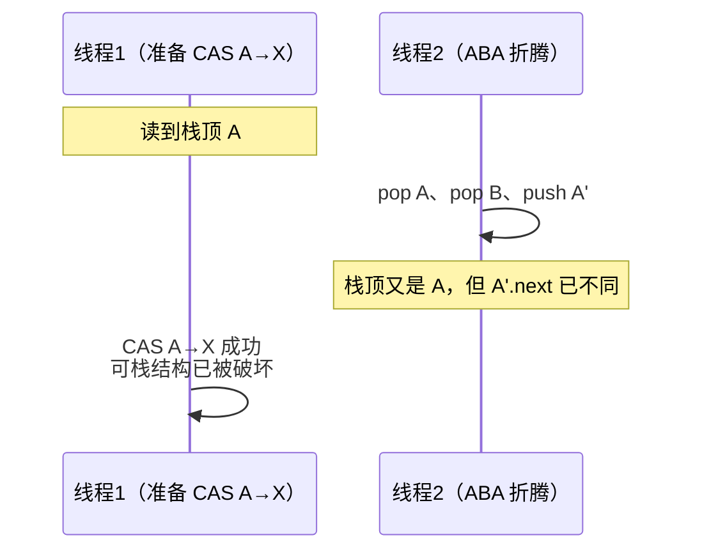

## 一句话定位

CAS（Compare-And-Swap）：**"这个位置的值还是旧值吗？是就换成新值，
否则失败"——用一条 CPU 指令把"读-判断-写"做成原子动作**，无锁地
改共享变量。它是整个 J.U.C 无锁化（AQS 的 state 更新、Atomic 全家、
ConcurrentHashMap 计数）的地基，[volatile](/java/intermediate/concurrent/03-volatile/)
解决"看得见"，CAS 解决"改得原子"，两者配合才完整。

## 底层与 Unsafe

```java
// AtomicBoolean 的核心（JDK9 后经 VarHandle，语义不变）
public final boolean compareAndSet(boolean expect, boolean update) {
    return value == 1 ? unsafe.compareAndSwapInt(this, valueOffset, 1, 0)
                      : unsafe.compareAndSwapInt(this, valueOffset, 0, 1);
}
```

- `Unsafe.compareAndSwapInt(obj, offset, expect, update)`：按**内存偏移量**
  定位字段，调 CPU 的 `cmpxchg` 指令（多核下加 `lock` 前缀锁缓存行，
  缓存一致性协议保证其他核看到失效）。
- **原子性由硬件保证，不靠操作系统锁**——失败不挂起，只返回 false，
  调用方决定重试（自旋）还是放弃。
- CAS 隐含 volatile 语义：写入带全量刷新/失效效果，所以 AtomicXxx
  内部字段都是 volatile。

## Atomic 原子类家族

| 家族 | 代表 | 说明 |
|---|---|---|
| 基本型 | `AtomicInteger`/`AtomicLong`/`AtomicBoolean` | getAndIncrement、accumulateAndGet |
| 引用型 | `AtomicReference<V>` | CAS 只能管一个变量，**把多变量封进对象再 CAS 引用** |
| 数组型 | `AtomicIntegerArray` | 元素级 CAS，不复制数组 |
| 字段更新器 | `AtomicIntegerFieldUpdater` | 不改类定义，反射 CAS 某个 volatile 字段 |
| **戳记型** | `AtomicStampedReference` | 解 ABA；带版本号（stamp）一起 CAS |
| 累加型 | `LongAdder`/`LongAccumulator` | 高并发计数分流，见[LongAdder](/java/intermediate/concurrent/07-longadder/) |

## ABA：值没变 ≠ 世界没变

CAS 只问"值相等吗"，不问"中途被改过几轮"。线程 1 读到 A，线程 2
把它 A→B→A，线程 1 的 CAS 照样成功——但链表头、节点next 这些**带
结构的场景**里，"看起来是 A"的节点可能早已不是原来那个：



解法：**CAS 值 + 版本号**（戳）——`AtomicStampedReference.compareAndSet(expectedRef, newRef, expectedStamp, newStamp)`，
A→B→A 会让 stamp 从 1→2→3，对不上就失败。不需要防 ABA 时普通
AtomicReference 即可（计数器类场景值本身单调，天然无 ABA）。

## 代价与边界

| 问题 | 场景 | 对策 |
|---|---|---|
| **自旋开销** | 竞争激烈时反复失败重试，空转烧 CPU | 换锁（挂起而不空转）或 LongAdder 分流 |
| **只能一个变量** | `a = b` 要一起原子更新 | 封装成不可变对象 CAS 引用（不可变对象引用 CAS 才安全） |
| 失败重试逻辑外露 | 业务要自己写循环 | `getAndUpdate` 等已封装自旋 |

**选型心法**：竞争低、操作简单（计数、置位、换引用）→ CAS 原子类；
竞争高且临界区复杂 → 锁。[锁升级](/java/intermediate/concurrent/04-synchronized/)
解决的是"轻量阶段也用 CAS"，与原子类是一套思想的两个应用层。

## 小结

- CAS = 一条 CPU 指令的原子"比较并交换"，失败不阻塞由调用方自旋；
  与 volatile 配合构成无锁并发的两条腿。
- 原子类家族按需选型；多变量原子性靠封对象 CAS 引用；高并发计数
  用 LongAdder 而不是死磕 AtomicLong。
- ABA 是"值相等陷阱"，带结构的数据结构必须用版本戳
  （AtomicStampedReference）封口。
- 边界感：CAS 适合低竞争短临界区，激烈竞争时它是 CPU 火葬场。
