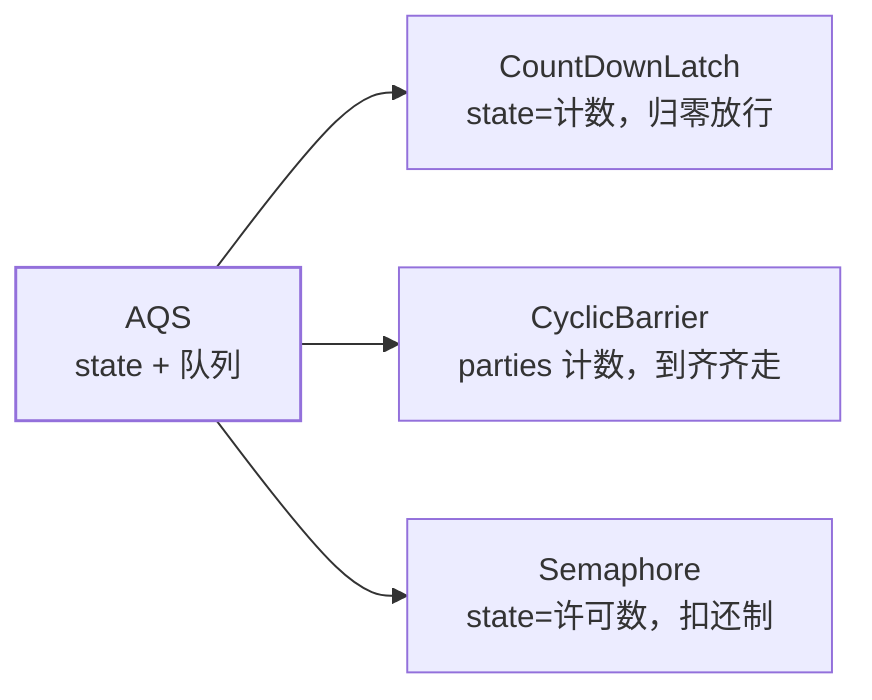

## 三件套：都是 AQS 的应用层

[上一篇 AQS](/java/intermediate/concurrent/05-aqs/) 讲过：共享/独占
两种模式 + state 计数 + CLH 队列，J.U.C 工具三件套就是三种 state
语义的封装——**理解它们只要问三个问题：state 代表什么、谁减它、
减到 0 发生什么**。



## CountDownLatch：倒计时门闩

state 是**剩余计数**，`countDown()` 减一，`await()` 卡到归零。**一次性**，
归零后不可重置。

```java
CountDownLatch latch = new CountDownLatch(services.length);
for (String s : services) {
    executor.submit(() -> {
        try { check(s); } finally { latch.countDown(); }   // finally 里减，异常也减
    });
}
latch.await(10, TimeUnit.SECONDS);   // 主线程等全部就绪；带超时防死等
```

典型场景：**主任务等 N 个子任务全部完成**（并行初始化、聚合多个
下游）。注意 `countDown` 必须放 finally，否则异常路径计数永远归不了
零，`await` 死等。

## CyclicBarrier：到齐再走

state 是**还差几个人**，`await()` 自己也是参与者（计数 +1 并阻塞），
凑满放行全员，**屏障可循环复用**（故名 cyclic），可挂"到齐动作"：

```java
CyclicBarrier barrier = new CyclicBarrier(players, () -> System.out.println("开赛"));
// 每个线程：barrier.await();  ← 各自到起点等其他人
```

| | CountDownLatch | CyclicBarrier |
|---|---|---|
| 角色 | 参与**者与等待者分离**（别人减、我等） | **人人参与**（自己也是计数者） |
| 复用 | 一次性 | 自动重置可循环 |
| 失败传导 | — | 一人打破（超时/异常）全员 BrokenBarrierException |
| 底层 | AQS 共享模式 | ReentrantLock + Condition |
| 场景 | 等结果聚合 | 分批同步、迭代计算到齐 |

## Semaphore：许可扣还制

state 是**剩余许可数**，`acquire()` 扣、`release()` 还，扣不到就排队。
本质是**并发配额**：

```java
Semaphore permits = new Semaphore(20);   // 最多 20 并发
permits.acquire();
try { callDownstream(); } finally { permits.release(); }
```

场景：限流保护脆弱下游（DB 连接、第三方接口）、资源池化。虚拟线程
时代的正确限流姿势也是它——[线程不池化，用信号量限流](/java/intermediate/version/04-java18-21/)。

## 读写锁：读多写少的分治

`ReentrantReadWriteLock`：**读读共享、读写/写写互斥**，读写各持
AQS state 的高低 16 位（读共享计数 + 写独占重入计数）：

```java
ReentrantReadWriteLock rw = new ReentrantReadWriteLock();
rw.readLock().lock();    // 读缓存：大家同时读
try { return cache.get(k); } finally { rw.readLock().unlock(); }

rw.writeLock().lock();   // 写：独占
try { cache.put(k, v); } finally { rw.writeLock().unlock(); }
```

**锁降级**（写→读，同线程持有写锁时再拿读锁然后放写锁）是官方
背书的安全姿势：保证写完的数据立刻能被自己读到、期间不被他人
插入写。反过来**读锁升级成写锁不允许**（双方都不放读锁 → 死锁）。

`StampedLock`（JDK 8）更进一步——**乐观读**：读前拿 stamp、读完
`validate(stamp)` 验证期间没写发生；失败再升级悲观读。读线程完全不
入队，吞吐更高，代价是不可重入、API 复杂，用错很难查。常规业务
ReadWriteLock 足够，极致读性能（缓存元数据类）再上 StampedLock。

## 小结

- 三件套都是 state 语义封装：倒计时归零放行（CDL）、到齐齐走可循环
  （Barrier）、许可扣还制配额（Semaphore）。
- CDL 用 finally 减计数、await 带超时；Barrier 会因一人失败全员打破；
  Semaphore 是下游保护与虚拟线程限流的标配。
- 读写锁读共享写互斥，支持降级不支持升级；StampedLock 乐观读更狠
  但不可重入，常规场景不必上。
