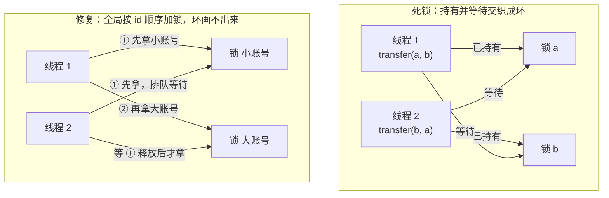

## 死锁是怎么炼成的

线程 1 持锁 A 等锁 B，线程 2 持锁 B 等锁 A——双方互相等对方的持有物，
谁也不撒手。经典事故现场是**转账**：

```java
// 线程1：transfer(a, b)    线程2：transfer(b, a)
synchronized (from) {            // 1: 锁 a   2: 锁 b
    synchronized (to) {          // 1: 等 b  2: 等 a  → 双双冻结
        from.debit(amount);
        to.credit(amount);
    }
}
```

单个线程"拿一把锁"永远不会死锁；**死锁是并发环境下"持有并等待"
交织出的环**。

环是怎么画出来的、顺序加锁后为什么画不出来：



## 四个必要条件与对应破坏法

死锁成立必须**同时**满足四条件，破坏任意一个即免疫：

| 条件 | 含义 | 破坏手段 |
|---|---|---|
| 互斥 | 资源同一时刻只能被一个线程持有 | 资源无共享化（不可变对象/CAS，见[CAS 篇](/java/intermediate/concurrent/09-cas-atomics/)） |
| 持有并等待 | 拿着已有的，还要等新的 | **一次性申请全部资源**：拿不到全量就全放 |
| 不可剥夺 | 别人不能抢走已持有的 | **tryLock 超时放弃**：J.U.C 锁可超时，拿不齐就释放重来 |
| 循环等待 | 等待关系成环 | **全局顺序加锁**：所有人按同一序号申请 |

实战首选是**破坏循环等待**——给锁定全序（按 id 排序）：

```java
// 转账修复：永远先锁"小账号"，环就画不出来
synchronized (System.identityHashCode(a) < System.identityHashCode(b) ? a : b) { ... }
```

或**破坏持有并等待**——用 tryLock + 回退：

```java
while (true) {
    if (from.lock.tryLock(1, SECONDS)) {          // 拿 A
        try {
            if (to.lock.tryLock(1, SECONDS)) {    // 拿 B
                try { doTransfer(); return; }
                finally { to.lock.unlock(); }
            }
        } finally { from.lock.unlock(); }         // 拿不齐 → 全放，稍后重试
    }
}
```

活锁就在这个回退循环里等你：两个线程都拿 A 成功、都拿 B 失败、都
释放、都重来——**不阻塞但永不前进**。解法是引入**随机退避**（重试
前随机 sleep），打破同步节拍。

## 死锁 / 活锁 / 饥饿：三兄弟对比

| | 表现 | 状态 | 典型成因 | 对策 |
|---|---|---|---|---|
| 死锁 | 相关线程全部冻结 | `BLOCKED`（互相等锁） | 加锁顺序不一致 | 顺序加锁 / tryLock |
| 活锁 | 都在跑但没进展 | `TIMED_WAITING`/`RUNNABLE` 循环 | 失败重试节奏完全同步 | 随机退避 |
| 饥饿 | 个别线程永远排不上 | 一直 `RUNNABLE` 被插队 | 非公平锁 + 高竞争、低优先级饿死 | 公平锁（牺牲吞吐）/ 提高资源配额 |

## 怎么发现：检测与预防

```bash
jstack <pid> | grep -A 20 deadlock
# "Found one Java-level deadlock:"  直接打印环上的线程与锁
```

- **事后检测**：jstack 自带死锁环分析（排查实战见
  [JVM 排查篇](/java/advanced/jvm/08-troubleshooting/)）；程序内可用
  `ThreadMXBean.findDeadlockedThreads()` 定期巡检。
- **事前预防**：代码评审盯三件事——多把锁的**获取顺序**是否全项目
  一致、锁内是否调用**外部方法**（回调可能再拿别的锁）、锁粒度是否
  可以缩小。

> 锁内调外部代码是隐形死锁高发区：你持有 this 锁去调 listener，
> listener 内部又拿别的锁，而另一条线程反着来——约定：**调用"未知
  代码"时绝不持锁**（开放调用）。

## 数据库里的同款问题

死锁不是 JVM 专属：两个事务互相等对方的行锁（`update a` 后 `update b`
vs 反序），MySQL 会回滚代价小的一个并抛 `Deadlock found`。解法同款
——**多行更新按主键排序**、小事务短事务。数据库有自动死锁检测，
Java 代码里的死锁反而更隐蔽。

## 小结

- 死锁四条件（互斥/持有等待/不可剥夺/循环等待）同时满足才成立，
  工程上破坏"循环等待"（全局顺序加锁）最简单可靠。
- tryLock 超时 + 回退破坏"持有等待"，但要加随机退避防活锁。
- 死锁冻着、活锁空转、饥饿挨饿；jstack `Found deadlock` 与
  ThreadMXBean 是检测两板斧。
- 锁内不调外部代码、锁定全序、事务按主键序——三条铁律覆盖 90%
  死锁事故。
