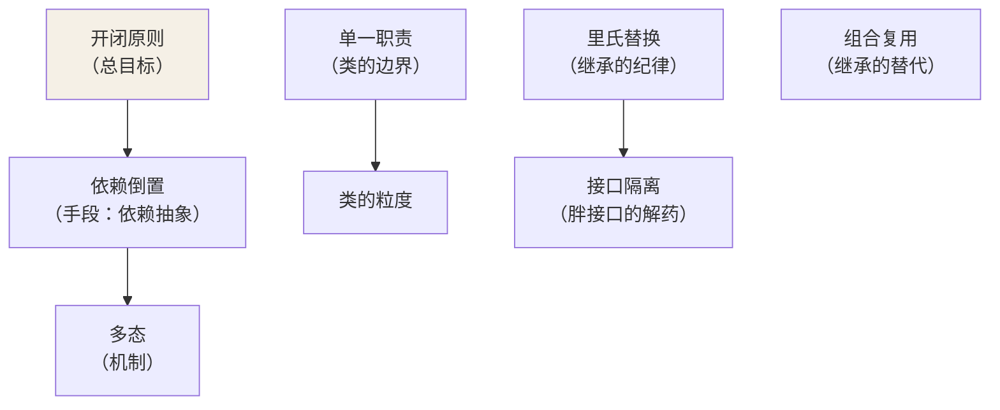

## 原则 vs 模式

**原则是价值观，模式是案例**。23 个 GoF 模式全部是下面五条原则在
具体场景的落地——面试问"为什么用工厂模式"，标准答案永远是原则
（"依赖倒置，调用方只依赖抽象"），而不是"书上这么写"。

## S：单一职责（SRP）

**一个类只有一个变化的理由**——注意不是"只做一个功能"，而是"引起
它修改的原因只有一类"：

```java
// 反面：一个类背着三个变化方向
class OrderService {
    void createOrder() {}        // 业务规则变
    void saveToDb() {}            // 存储结构变
    void sendSms() {}             // 通知渠道变
}
// 三个方向各自演化，任何一处改动都要回归测试整个类
```

判断技巧：**描述这个类时如果用到了"和"字，多半违反了 SRP**。

## O：开闭原则（OCP）

**对扩展开放，对修改关闭**——加功能靠加代码，不靠改老代码：

```java
// 反面：每加一种会员价都要改这里（改老代码 = 老逻辑可能被改坏）
double calcPrice(String type) {
    if (type.equals("VIP")) return price * 0.8;
    if (type.equals("SVIP")) return price * 0.6;   // 新增 = 修改
    return price;
}

// 正面：新会员类型 = 新增一个子类，老代码纹丝不动
interface PriceStrategy { double apply(double price); }
class VipPrice implements PriceStrategy { public double apply(double p) { return p * 0.8; } }
class SvipPrice implements PriceStrategy { public double apply(double p) { return p * 0.6; } }
```

开闭是其余原则的"总目标"：**多态（依赖倒置的实现机制）给了"不改
就扩展"的能力**。

## L：里氏替换（LSP）

**子类必须能无感替换父类**——约定：凡是父类出现的地方，换成任何
子类，程序行为不变坏。

```java
// 经典反例：父类的语义被子类悄悄改掉
class Rectangle { void setWidth(int w) {...} void setHeight(int h) {...} }
class Square extends Rectangle {
    void setWidth(int w)  { /* 正方形：改宽必须同步改高！ */ }
}
// 调用方按 Rectangle 的语义写：
Rectangle r = new Square();
r.setWidth(5); r.setHeight(4);
assert r.getArea() == 20;   // 失败——Square 破坏了父类的行为约定
```

LSP 说的是**契约**：子类可以加强行为，不能削弱/改变父类承诺的语义。
违反 LSP 的信号：子类抛出父类没声明过的异常、子类把父类方法空实现
（NotImplementedException）、调用方被迫 `instanceof` 判断子类。

## I：接口隔离（ISP）

**客户端不被迫依赖它用不到的方法**——大接口按使用者拆小：

```java
// 反面：一个胖接口逼游泳的鸟实现飞
interface Bird { void fly(); void swim(); }
class Penguin implements Bird {
    public void fly() { throw new UnsupportedOperationException(); }  // LSP 也破了
}

// 正面：按能力拆
interface Flyable { void fly(); }
interface Swimmable { void swim(); }
class Penguin implements Swimmable { public void swim() {} }   // 只背自己的
```

ISP 常与 LSP 联动：**胖接口是里氏替换违反的温床**。

## D：依赖倒置（DIP）

**高层与低层都依赖抽象，而不是高层直接依赖低层**：

```mermaid
flowchart LR
    subgraph BAD["正依赖"]
        A["OrderService"] -->|"直接 new"| B["MySqlOrderDao"]
    end
    subgraph GOOD["倒置后"]
        C["OrderService"] -->|"依赖"| I["«interface» OrderDao"]
        I -.->|"实现".-> D1["MySqlOrderDao"]
        I -.-> D2["MongoOrderDao"]
    end

    style I fill:#f5f0e6
```

"倒置"倒的是什么：**编译期依赖方向与运行期调用方向解耦**——调用
还是 A 调 B，但 A 的代码只认识接口（Spring 的 @Autowired 注入的就是
这条抽象边界，见 IoC 篇）。换数据库 = 换实现类，OrderService 一行
不改——这就是开闭的兑现。

## 组合/聚合复用原则（附加的第六条）

**优先用组合，少用继承**（面向对象篇的 Stack 反面教材是它的展开）：
继承是白箱复用（暴露父类细节）、编译期绑定；组合是黑箱复用、运行期
可换。**GoF 原话：多用组合，少用继承**。

## 一张总图



## 小结

- 模式是答案，原则是理由——五个字回答一切"为什么用这个模式"。
- 速记：S 管粒度、O 管扩展、L 管继承纪律、I 管接口大小、D 管依赖
  方向。
- 开闭是纲，纲举目张：多态给能力、依赖倒置给方向、组合给灵活性。
