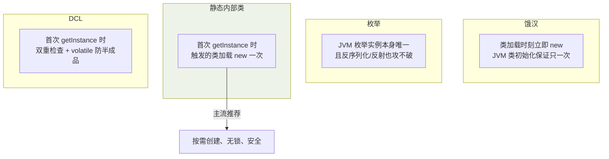
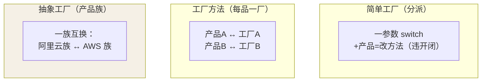

## 为什么创建型单独成类

`new` 把**"用什么"和"怎么造"焊死在一起**：`new MySqlOrderDao()`
意味着换实现必须改调用方。创建型模式统一在做一件事——**把对象构造
的过程封装起来，让调用方只表达"要什么"**。

## 单例（Singleton）

四种形态对比（volatile 篇讲过 DCL 的内存可见性，这里收全）：

```java
// ① 饿汉：类加载即创建，天生线程安全，缺点是不管用不用都占内存
public class Config { private static final Config INSTANCE = new Config(); }

// ② 枚举（Effective Java 首选）：防反射攻击 + 防反序列化破单例
public enum Registry { INSTANCE; }

// ③ 静态内部类：懒加载 + 无锁（类初始化由 JVM 保证只一次——见类加载篇）
public class Config {
    private static class Holder { static final Config INSTANCE = new Config(); }
    public static Config getInstance() { return Holder.INSTANCE; }
}

// ④ DCL：需要延迟 + 高并发场景
public class Config {
    private static volatile Config instance;          // volatile 防"半成品"（volatile 篇）
    public static Config getInstance() {
        if (instance == null) {
            synchronized (Config.class) {
                if (instance == null) instance = new Config();
            }
        }
        return instance;
    }
}
```

单例四形态的真正差异在**实例何时创建**与**靠什么保证唯一**：



**Spring 的 singleton scope 不是单例模式**：它一个容器里"每个
BeanDefinition 一个对象"，你自己 new 出来的同类对象不受它管理——
概念上别混。

## 工厂三件套

```java
// 简单工厂：一个静态方法按参数分派（不是 GoF 23 个之一，但最常用）
public static Payment of(String type) {
    return switch (type) {
        case "alipay" -> new AlipayPayment();
        case "wechat" -> new WechatPayment();
        default -> throw new IllegalArgumentException(type);
    };
}

// 工厂方法：把"造哪个"下放给子类——每加一个产品加一个工厂
interface PaymentFactory { Payment create(); }
class AlipayFactory implements PaymentFactory { public Payment create() { return new AlipayPayment(); } }
class WechatFactory implements PaymentFactory { public Payment create() { return new WechatPayment(); } }

// 抽象工厂：造"一族"相关产品——一次性换掉整个产品族
interface CloudFactory {
    Compute createCompute();      // 阿里云族：Ecs + Oss + Slb
    Storage createStorage();     // AWS 族：Ec2 + S3 + Alb
    LoadBalancer createLb();
}
```

三件套的"扩展方向"决定了什么时候用哪个：



| | 简单工厂 | 工厂方法 | 抽象工厂 |
|---|---|---|---|
| 加新产品 | 改工厂方法（违反开闭） | 加工厂类（开闭友好） | 加产品族成员要改所有工厂 |
| 维度 | 单一 | 单一 | 产品族 |

Spring 的 `BeanFactory` 是工厂模式家族的集大成者（getBean 按名/类型
取对象），配合 DI 后业务代码里几乎不再手写工厂——**工厂被容器接管，
是"工厂模式的工业化"**。

## 建造者（Builder）

**参数多、可选参数多、构造顺序有约束**的场景：

```java
// 灾难现场：重叠构造器——第 4 个 boolean 是什么来着？
new HttpRequest("api", 5000, true, false, null, "gzip", null, 3);

// 建造者：可读 + 可选参数自由组合 + 一次 build 校验
HttpRequest req = HttpRequest.builder()
    .url("https://api")
    .timeout(Duration.ofSeconds(5))
    .retry(3)
    .build();

// Lombok @Builder / Java record 的紧凑构造器都源于这个模式
```

与工厂的分工：**工厂关心"造哪个"，建造者关心"怎么一步步造"**——
StringBuilder、Stream 的链式调用（惰性拼接最后 collect）、OkHttp
Request.Builder 全是它。

## 原型（Prototype）

**克隆已有对象代替从头构造**（构造昂贵：DB 查询/大对象初始化）：

```java
class Report implements Cloneable {
    private List<Row> data;   // 100w 行，来自慢查询
    @Override
    public Report clone() {
        Report r = (Report) super.clone();   // 浅拷贝！
        r.data = new ArrayList<>(this.data); // 需要深拷贝的字段手动复制
        return r;
    }
}
// 注：Cloneable 是 JDK 设计失败的经典（super.clone 的浅拷贝陷阱），
// 工程上更常用「拷贝构造器」或序列化反序列化（JSON round-trip）
```

浅拷贝 vs 深拷贝是它的必考细节：`super.clone()` 只复制引用——内部
可变对象仍然共享，改克隆体会影响原型。

## 小结

- 创建型 = 把 new 封装成"表达意图"：单例管唯一、工厂管选型、建造者
  管步骤、原型管克隆。
- 单例首选枚举/静态内部类；工厂三件套按"加产品的成本"分层。
- Spring 容器本质是工厂 + 原型（BeanDefinition 图纸 + 反射实例化）的
  超集——见 IoC 篇互相印证。
