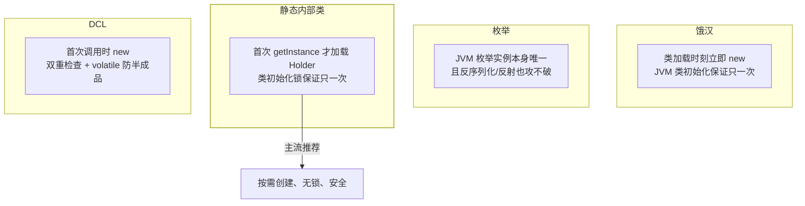

## 意图：全局唯一，还得是真唯一

单例管两件事：**这个类在进程里只有一个实例**，以及**给这个实例一个
全局访问点**。配置中心客户端、运行时对象（`Runtime`）、线程池管理器
都属此类——多造一个就会出事（重复建连、状态打架）。

真正的难点不是"只 new 一次"，而是**在并发、反射、序列化围攻下仍然
唯一**。四种形态的差距全在这里。

## 四种形态

```java
// ① 饿汉：类加载即创建，天生线程安全，缺点是不管用不用都占内存
public class Config { private static final Config INSTANCE = new Config(); }

// ② 枚举（Effective Java 首选）：防反射攻击 + 防反序列化破单例
public enum Registry { INSTANCE; }

// ③ 静态内部类：懒加载 + 无锁（类初始化由 JVM 保证只一次——见类加载篇）
public class Config {
    private static class Holder { static final Config INSTANCE = new Config(); }
    public static Config getInstance() { return Holder.INSTANCE; }
}

// ④ DCL：需要延迟加载 + 高并发场景
public class Config {
    // volatile 防"半成品"（volatile 篇）
    private static volatile Config instance;
    public static Config getInstance() {
        if (instance == null) {  // 第一次检查：避免每次都抢锁
            synchronized (Config.class) {
                // 第二次检查：防重复创建
                if (instance == null) instance = new Config();
            }
        }
        return instance;
    }
}
```

四种形态的真正差异在**实例何时创建**与**靠什么保证唯一**：



选型口诀：**实例轻、必用到 → 饿汉；要懒加载 → 静态内部类；要扛反射
和序列化 → 枚举；面试手写 → DCL（顺便讲 volatile）**。

## DCL 为什么必须 volatile

`new Config()` 不是原子操作，它是三步：**分配内存 → 执行构造方法 →
把引用赋给 instance**。CPU 可能对 2、3 重排序（构造没执行完，引用
先出去了）——另一个线程在第一次检查时看到非 null 的"半成品"，直接
用就炸。volatile 禁止这个重排序，同时保证写后的可见性（volatile 篇
的 happens-before）。

第一次检查看似多余，实为性能关键：**单例创建之后，绝大多数调用都
是无锁直返**，锁只发生在初始化竞争的那一瞬。

## 单例的三种破坏与防护

```java
// ① 反射：拿到私有构造器硬造
Constructor<Config> c = Config.class.getDeclaredConstructor();
c.setAccessible(true);
c.newInstance();                       // 第二个实例诞生

// ② 反序列化：readObject 绕过构造器，凭空还原对象
ObjectInputStream.readObject(...);

// ③ 克隆：实现 Cloneable 后 clone() 绕过构造器
```

防护手段：

```java
public class Config implements Serializable {
    private static final Config INSTANCE = new Config();
    private Config() {
        if (INSTANCE != null) {  // 防反射：第二次调用构造器就抛
            throw new IllegalStateException("已存在实例");
        }
    }
    // 防反序列化：还原时直接返回真身
    private Object readResolve() { return INSTANCE; }
}
```

枚举是唯一**从 JVM 层免疫这三种破坏**的形态：反射调用枚举构造器直接
抛 `IllegalArgumentException`，反序列化按名字查枚举常量，clone 直接
不支持。这就是 Effective Java 把它列为首选的原因——代价是不能懒加载、
也无法继承。

## Spring 的 singleton 不是这个单例

**Spring 的 singleton scope 是"每容器每 BeanDefinition 一个实例"的
注册表管理，不是单例模式**：你自己 `new Config()` 出来的对象不受容器
管辖，同一个类完全可以"容器里一个、外面随便 new"。单例模式的唯一性
是类级别的、构造器私有的；Spring 的唯一性是容器级别的、由
SingletonBeanRegistry 保证（IoC 篇）。面试时把两者混为一谈，比答不出
DCL 更减分。

工程上的正确姿势：**需要单例就交给 Spring 托管**，并保持 Bean 无状态
——有状态的单例在并发下是隐藏的共享可变状态（ThreadLocal 篇的线程
封闭是它的解药）。

## JDK 现场

| 现场 | 说明 |
|---|---|
| `Runtime.getRuntime()` | 进程内唯一的运行时句柄（饿汉） |
| `Spring SingletonBeanRegistry` | 容器级单例注册表（概念辨析用） |
| `java.lang.System` 全静态 | 单例思想的另一种实现：干脆不让你建实例 |

## 小结

- 四形态按"创建时机 × 唯一性保证"记：饿汉靠类加载、静态内部类靠
  初始化锁、DCL 靠 volatile + 双检、枚举靠 JVM。
- DCL 的 volatile 不是可有可无——它堵的是"半成品"引用。
- 反射、序列化、克隆都能破单例；枚举天然免疫。
- Spring 的 singleton scope 是容器级注册，与单例模式不是一回事。
